# 优化AE+kmeans进行空间转录组单细胞测序数据聚类

###### 201300086史浩男

### 项目结构

- model文件中存储了所有python代码
- save_model文件中保存了AE训练出的模型结果
- spca_dat文件中是12个h5数据集


### 代码测试说明

请进入model文件中的k_means.py中的主函数部分


指定读取的数据集、读取已训练好的模型

如果需要重新训练模型，将参数train_model设为True

如果不用AE提取特征直接进行聚类，设置参数AE=False


### 摘要

算法使用spca_dat中已经过处理的h5文件作为数据集。特征提取时，算法首先对基因表达矩阵X进行平均池化，随后用深度神经网络实现自编码器AE，对X进行降维与特征提取。聚类时，结合使用空间坐标矩阵pos和基因表达矩阵X共同作为距离度量函数，通过预聚类学习了大致的分布规律后，把图像的特征传递给kmeans再进行第二次聚类。最后利用ground truth矩阵y，使用ARI和NMI评估聚类结果。


### 创新点

#### 1、对基因表达矩阵X进行平均池化

我们发现，真实的细胞分布往往比较规律，即相邻的细胞大概率属于相同类别。所以为了减少噪声影响，突出特征，在用AE进行特征提取之前，我先对每个细胞对应的基因表达向量都进行了一次平均池化：每个细胞的基因表达替换为附近k*k个基因表达向量的均值

```python
def pooling_data(X,pos,k,alpha):
    """
    :param X: 对X矩阵作k*k的平均池化
    :param alpha: 池化矩阵扩大倍数，用于放大基因影响（减少位置影响）
    :return: 池化后的X矩阵
    """
    Y=copy.deepcopy(X)
    #字典存储位置和X值的对应关系
    dic={}
    for i in range(len(X)):
        dic[tuple(pos[i])]=X[i]

    for i in range(len(X)):#针对每个点计算一圈近邻
        x,y=pos[i][0],pos[i][1]
        count=1#近邻个数,包括自己
        for p in range(x-k+1,x+k):
            for q in range(y-k+1,y+k):
                if tuple((p,q)) in dic.keys():#近邻真实存在
                    count+=1
                    Y[i]+=dic[tuple((p,q))]
        Y[i]*=alpha
        Y[i]/=count
    return Y
```

下图对比了池化前和池化后直接进行聚类的显著效果对比图

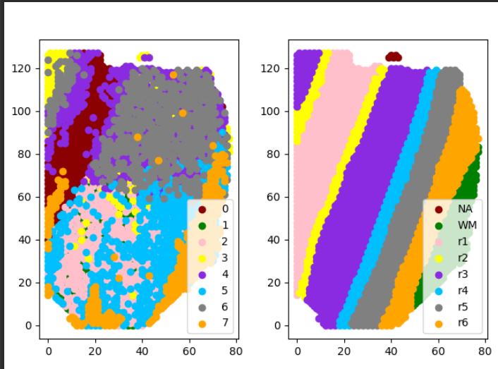

3  8  15

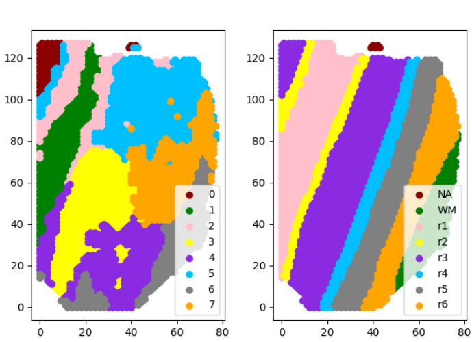


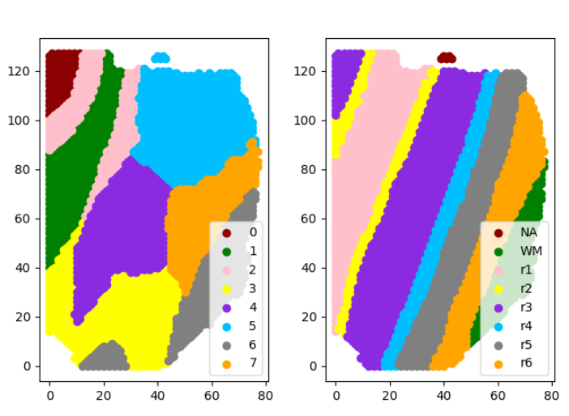


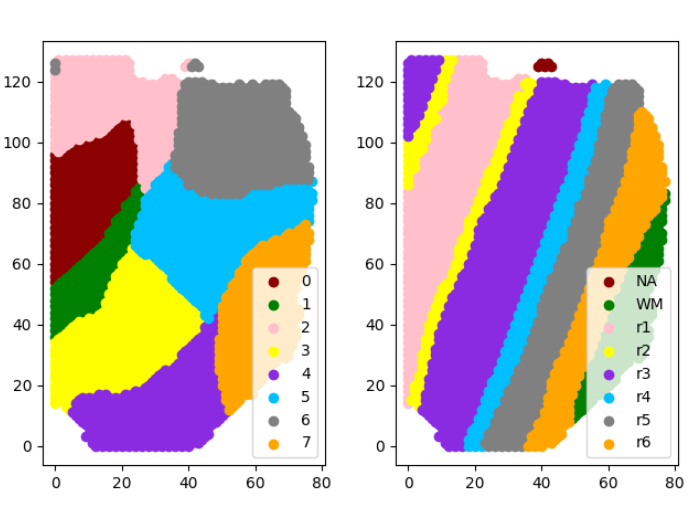


#### 2、距离度量函数的创新

我结合使用空间坐标矩阵pos和基因表达矩阵X共同作为距离度量函数，并增加权重参数，优化了pos与X在距离度量中的占比

```python
dataset = list(np.hstack((pos, X)))# 拼接
```

把池化与AE重构后的X矩阵接在真实位置pos矩阵后面，整体进行欧式距离计算

以下展示在拼接向量后（将pos与X拼接），用不同权重参数扩大X值倍数进行距离度量，得到的不同聚类效果

 6,2    6,5  6,20


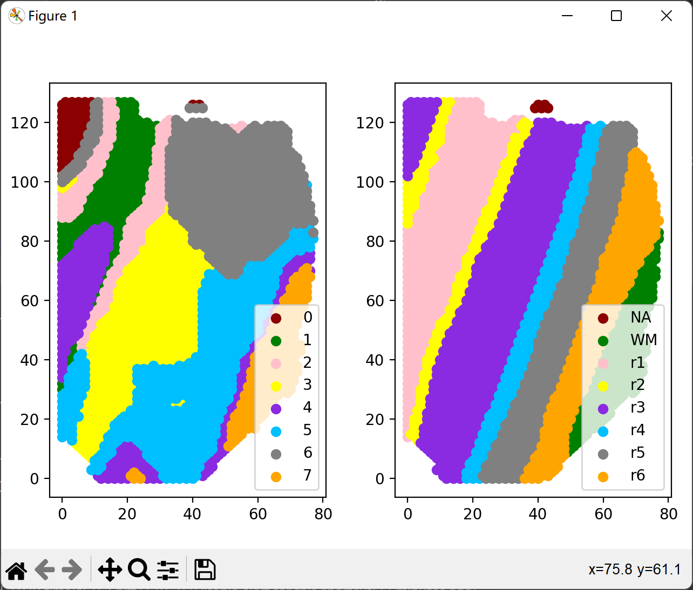


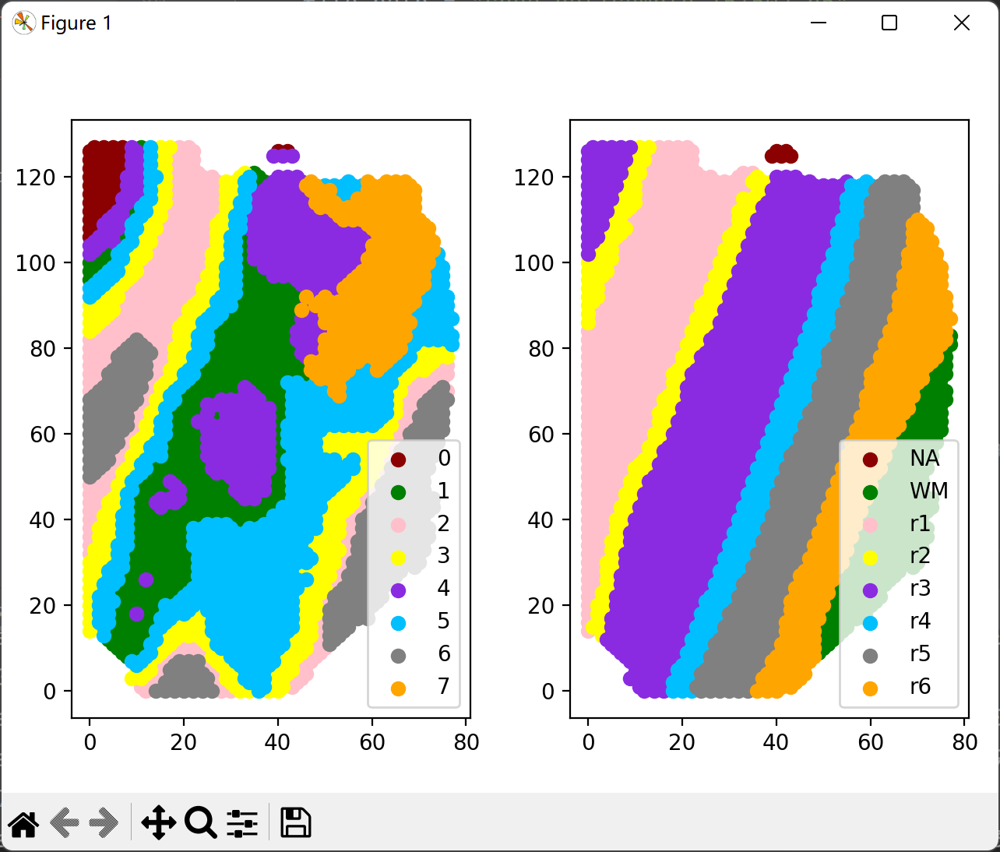


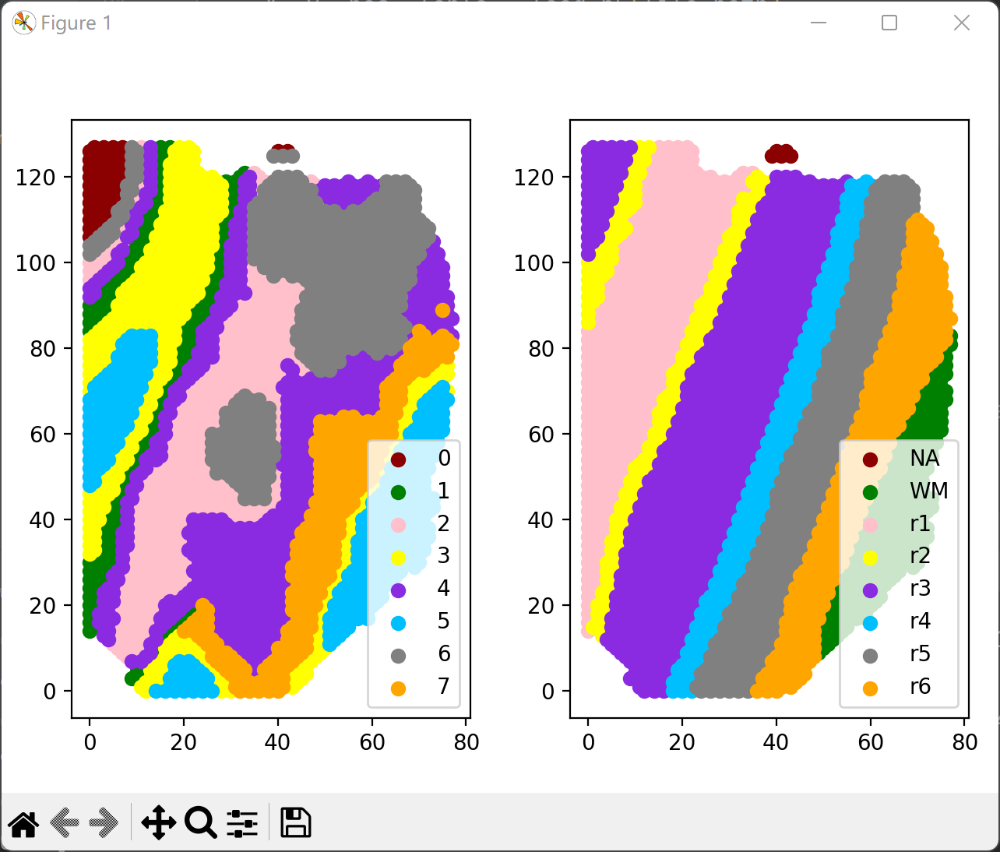

#### 3、预聚类提取特征

据观察，多数细胞分界线都大致平行。因此我使用预聚类的结果计算出这些细胞分界线（大致平行线）偏离xy平面坐标系的角度，并用得出的角度修正距离度量函数，即缩小两个细胞间的在这个角度上的距离度量，保留垂直于这个角度上的距离度量。

具体在计算中，相当于把细胞的x和y坐标绕原点旋转一定角度后，保持x方向距离测算，缩小y方向距离测算，以此达到修正聚类的目的。

```python
def rotate_angle(angle, pos_list):#旋转xy坐标的函数
    new_pos=pos_list.copy()
    valuex = pos_list.T[0].copy()
    valuey = pos_list.T[1].copy()
    new_pos.T[0] = math.cos(angle) * valuex - math.sin(angle) * valuey
    new_pos.T[1] = math.cos(angle) * valuey + math.sin(angle) * valuex
    return new_pos

# 计算欧拉距离,返回每个点到质点的距离len(dateSet)*k的数组
def L2(dataSet, centroids, k,rotate=None):
    clalist = []
    for data in dataSet:
        diff = np.tile(data, (k,1)) - centroids#沿y方向复制k倍
        if rotate!=None:#将前两维实际坐标旋转，用于削弱非平行线方向的距离影响
            diff=rotate_angle(rotate,diff)
            diff[::,1]=diff[::,1]*0#丢掉第二列y方向坐标
        clalist.append(np.sum(diff ** 2, axis=1) ** 0.5)#axis=1表示行
    clalist = np.array(clalist)
    return clalist
```

进行预聚类前后的效果对比如下，可以发现在聚类效果更加贴近于”长条型“而不是”方块型“

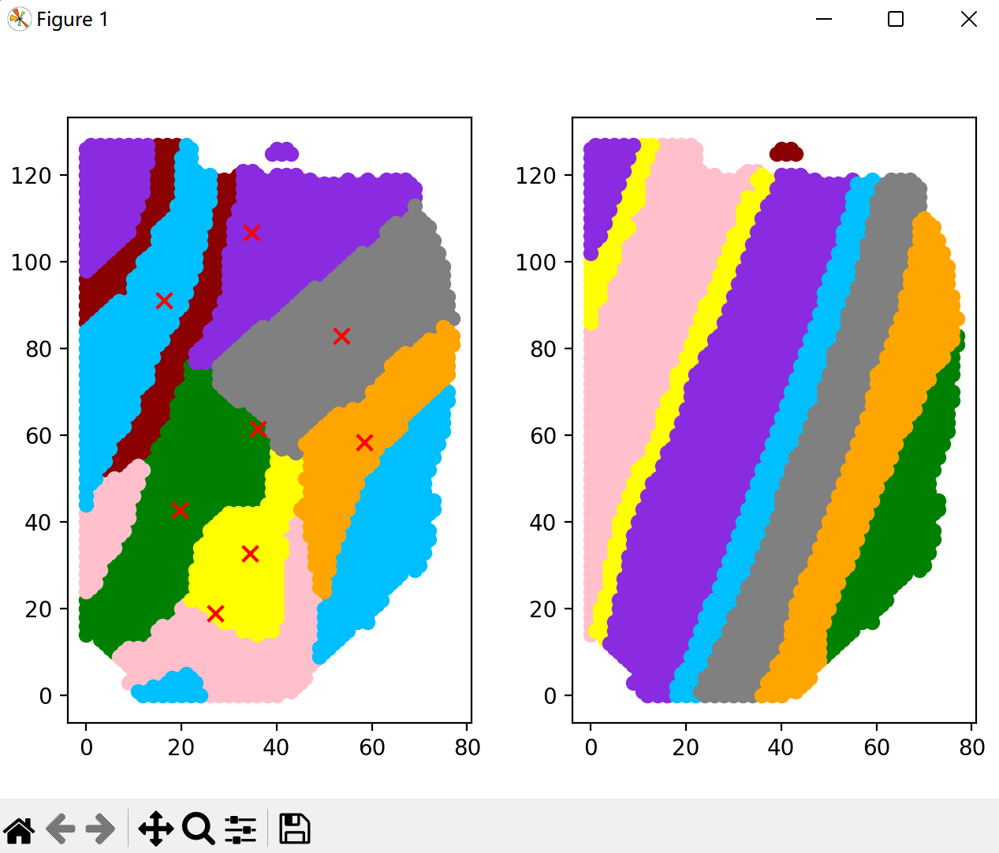

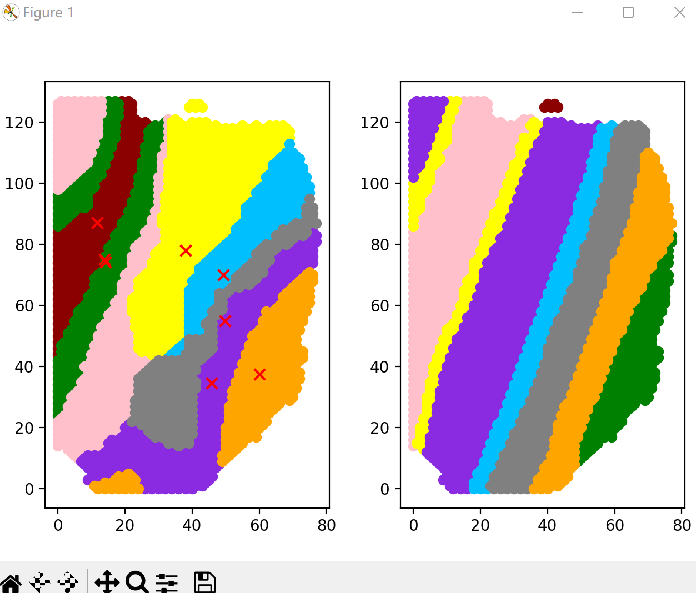


### 算法流程

1、读取并预处理h5数据

```python
def load_h5(file_path):
    data = dd.io.load(file_path)
    X = data["X"]
    Y = data["Y"]
    pos = data["pos"].T
    y = []
    y_dic = {}
    for i in Y:
        i = str(i)[-3:-1]
        y.append(i)
        if i in y_dic.keys():
            y_dic[i] += 1
        else:
            y_dic[i] = 1
    y = np.array(y)
    lable = list(y_dic.keys())
    lable.sort()
    print("load data success!", file_path)
    return X, y, pos, lable
```

2、对基因表达矩阵X进行平均池化（创新点）

3、使用AE提取特征

```python
def AE_train(X, model_path, max_epoch):
    batch_size = 128
    lr = 1e-2
    weight_decay = 1e-5
    epoches = max_epoch
    model = autoencoder(init_size=X.shape[-1])
    X = X.astype("float32")
    train_X = DataLoader(X, shuffle=False, batch_size=batch_size, drop_last=True)
    criterion = nn.MSELoss()
    # criterion =nn.L1Loss()

    optimizier = optim.Adam(model.parameters(), lr=lr, weight_decay=weight_decay)

    for epoch in range(epoches):
        if epoch in [epoches * 0.25, epoches * 0.5]:
            for param_group in optimizier.param_groups:
                param_group['lr'] *= 0.1
        for i, img in enumerate(train_X):
            img = img.reshape(1, batch_size, -1)

            # forward
            _, output = model(img)
            loss = criterion(output, img)

            # backward
            optimizier.zero_grad()
            loss.backward()
            optimizier.step()
        print("epoch=", epoch, loss.data.float())
    # 保存模型
    torch.save(model.state_dict(), model_path)
```

4、预聚类再次提取特征（创新点）

5、使用改良距离度量的kmeans聚类（创新点）

6、使用ARI与NMI评估聚类结果

```python
def ARI(labels_true,labels_pred ):
    return adjusted_rand_score(labels_true, labels_pred)

def NMI(labels_true,labels_pred ):
    return normalized_mutual_info_score(labels_true,labels_pred, average_method='arithmetic')

```

7、画出散点图对比聚类结果和ground truth


### 结果展示

以数据集spca_dat/sample_151508.h5为例，算法运行三次

左图为算法结果，右图为ground truth画出的实际结果

（由于kmeans初始质心的选取不同，导致每次运行的结果不同）

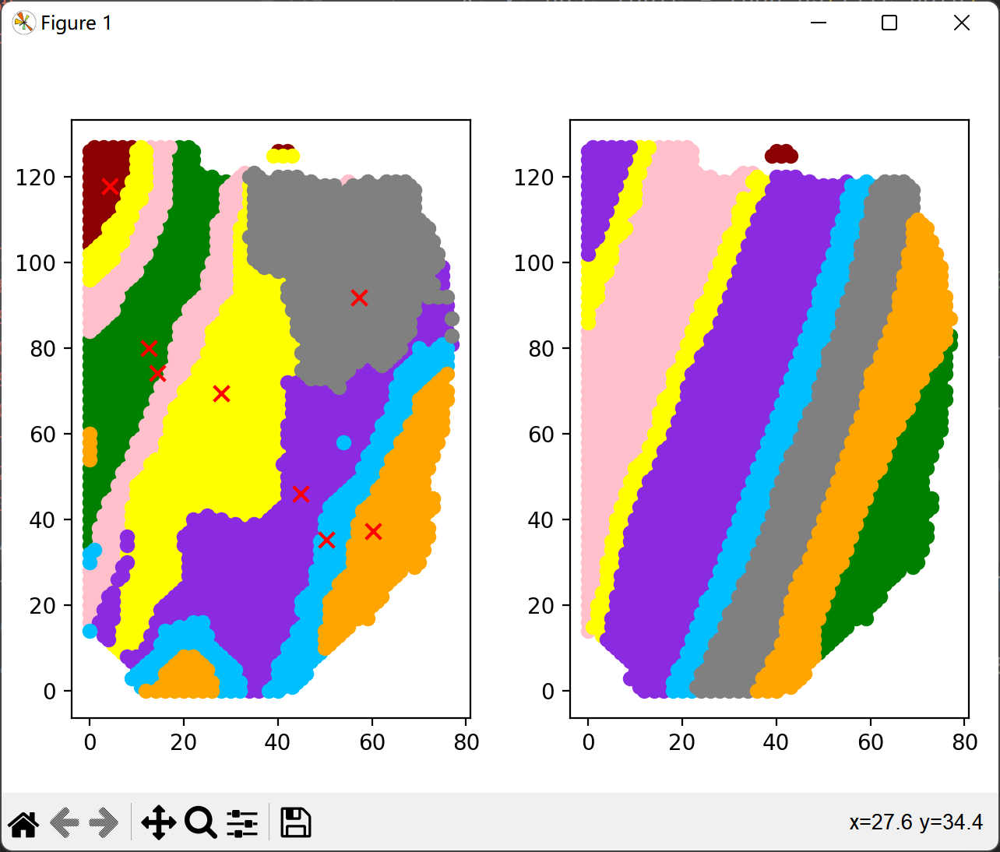

ARI= 0.3594421481784392   NMI= 0.5139078403796112


ARI= 0.3592853206893324   NMI= 0.5092611423596228

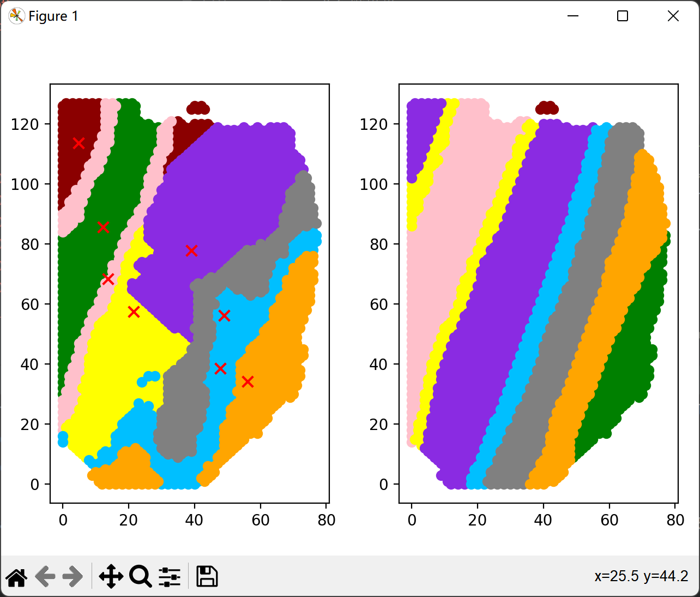

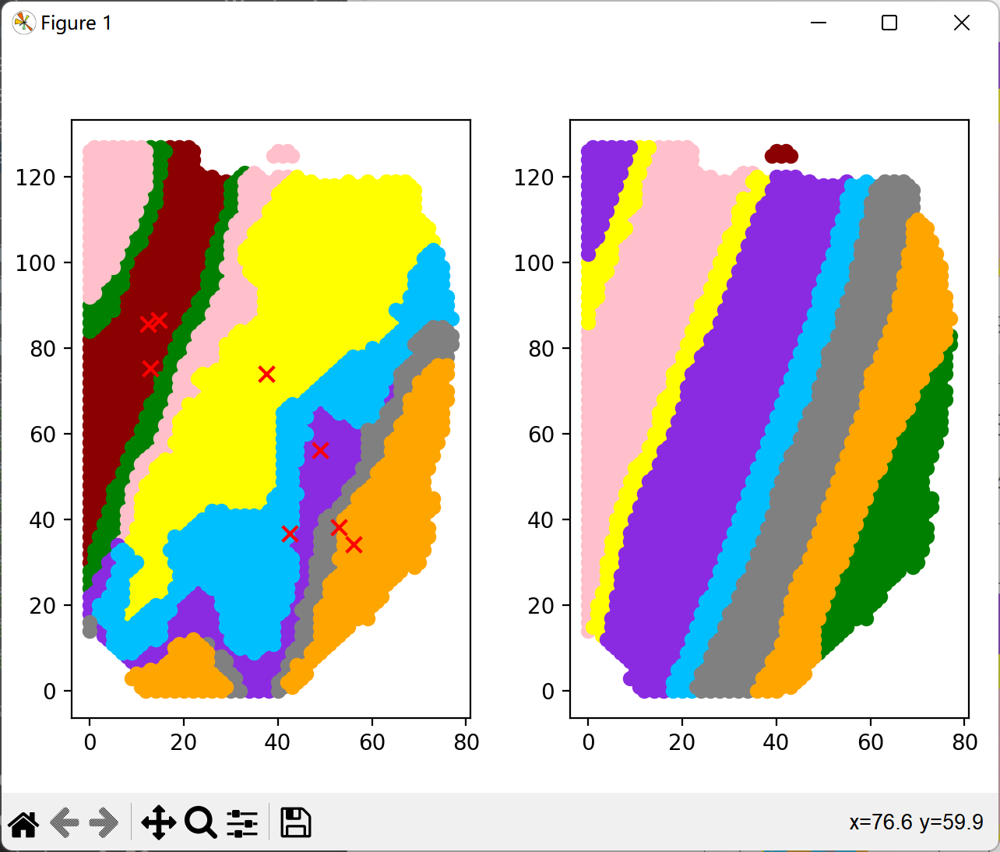

损失为:ARI= 0.37436075267424523   NMI= 0.4955961070642688


