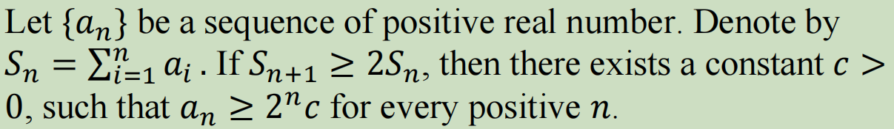
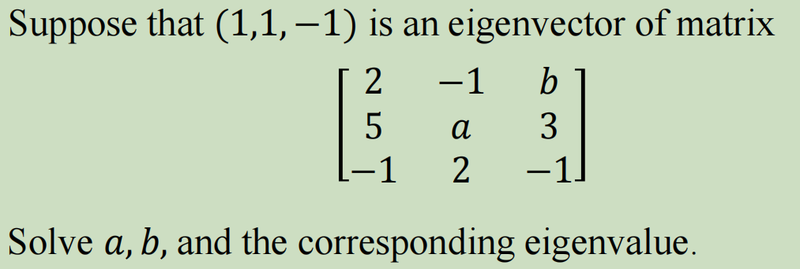
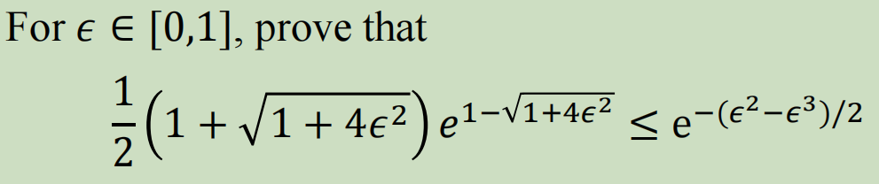
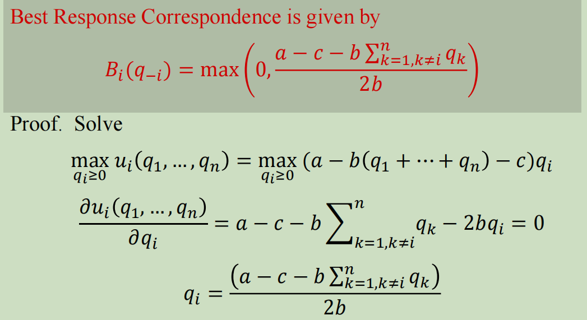

# 博弈论作业一

###### 201300086史浩男

$$
S_{n+1}-2S_{n}=a_{n+1}-\sum_{i=1}^na_i\ge0
$$
采用归纳法证明

1. n=1时

   $S_{n+1}-2S_{n}\ge0\ 等价于\ a_2\ge a_1$

   令$c=a_1/2$，则满足$a_2\ge a_1 \ge2c$对任意$n\le2$成立

2. 假设$n\le k$时

   $a_n\ge2^nc$对任意$n\le k+1$成立

3. 当$n=k+1$时

   $S_{n+1}-2S_{n}\ge0\ 等价于\ a_{k+1}\ge \sum_{i=1}^ka_i$，由归纳假设，存在非负常数c满足：

   ​	
   $$
   a_{k+1}&\ge &\sum_{i=1}^ka_i\\
   &\ge&\sum_{i=1}^k2^ic\\
   &=&c(2^{k+1}-2)\\
   &=&2^{k+1}\frac{2^{k+1}-2}{2^{k+1}}c
   $$
   于是令$c'=\frac{2^{k+1}-2}{2^{k+1}}c$，得到$a_{k+1}\ge2^{k+1} c'$

   即$a_n\ge2^nc$对任意$n\le k+2$成立

由归纳假设，原问题对于任意正整数n成立

$$
(A-λ)α=0\\
\begin{bmatrix}
  2-λ& -1 &b \\
  5& a-λ &3 \\
 -1 & 2 &-1-λ
\end{bmatrix}
\begin{bmatrix}
  1 \\
  1\\
 -1
\end{bmatrix}=\begin{bmatrix}
  1-λ-b \\
  2+a-λ\\
 2+λ
\end{bmatrix}=0
$$
解得$λ=-2,a=-4,b=3$

$$
由于e^x\ge x+1\\
因此e^{\sqrt{1+4ε^2}-1-\frac{ε^2-ε^3}{2}}\ge\sqrt{1+4ε^2}-\frac{ε^2-ε^3}{2}\\
为证明原不等式，只需证明\sqrt{1+4ε^2}-\frac{ε^2-ε^3}{2}\ge\frac{1+\sqrt{1+4ε^2}}{2}\\
即只需证明\sqrt{1+4ε^2}\ge1+ε^2-ε^3\\
$$

$$
由泰勒展开\sqrt{1+x}\ge1+\frac{1}{2}x-\frac{1}{8}x^2\\
\sqrt{1+x^2}\ge1+\frac{1}{2}x^2-\frac{1}{8}x^4\\
\sqrt{1+4ε^2}\ge1+2ε^2-2ε^4\ge1+ ε^2-ε^4\ge1+ε^2-ε^3
$$

由于对每个$q_i$表达式都等价对称，因此达到NE状态时应满足
$$
q_1=q_2=...=q_n
$$
因此解得：
$$
q_i=\frac{a-c-b(n-1)q_i}{2b}\\
q_i=\frac{a-c}{(n+1)b}
$$
