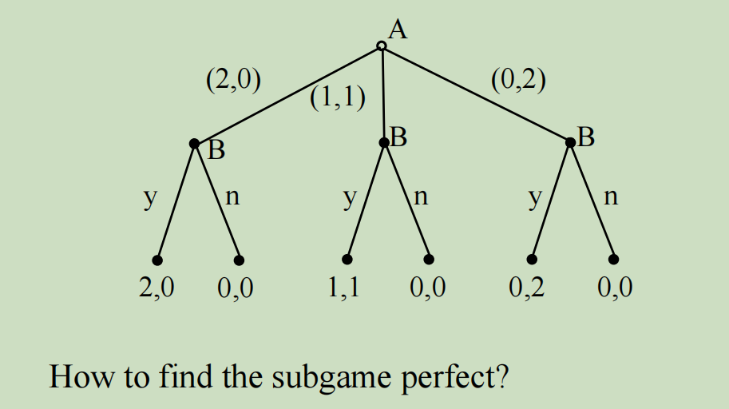

# 博弈论作业三

###### 201300086史浩男

$$
G=\left\{N, H, P,\left\{u_{i}\right\}\right\} \\
N=\{1,2\} 
\\H=\{\emptyset, \mathrm{A}, \mathrm{B}, \mathrm{AC}, \mathrm{AD}, \mathrm{BE}, \mathrm{BF}, \mathrm{BFG}, \mathrm{BFH}\} 
\\P: P(\emptyset)=1 ; P(A)=2  ; P(B)=2 ; P(BF)=1  
\\u_{1}(AC)=3, u_{1}(A D)=8, u_{1}(BE)=5 , u_{1}(BFG)=2 , u_{1}(BFH)=1
\\u_{2}(AC)=8, u_{2}(A D)=3, u_{2}(BE)=5 , u_{2}(BFG)=10 , u_{2}(BFH)=0
$$

|  A\B   | yyy  | yyn  | yny  | nyy  | ynn  | nyn  | nny  | nnn  |
| :----: | :--: | :--: | :--: | :--: | :--: | :--: | :--: | ---- |
| (2, 0) | 2, 0 | 2, 0 | 2, 0 | 0, 0 | 2, 0 | 0, 0 | 0, 0 | 0, 0 |
| (1, 1) | 1, 1 | 1, 1 | 0, 0 | 1, 1 | 0, 0 | 1, 1 | 0, 0 | 0, 0 |
| (0, 2) | 0, 2 | 0, 0 | 0, 2 | 0, 2 | 0, 0 | 0, 0 | 0, 2 | 0, 0 |
|        |      |      |      |      |      |      |      |      |

所以全部NE：

（yyy，（2，0）），（yny，（2，0）），（ynn，（2，0）），（yyn，（2，0））

（nyy，（0，2））

（nyy，（1，1））,（nyn，（1，1））

#### subgame perfect

G（$\empty$）：A

G（A）：C

G（B）：FG

G（BF）：G

#### NE

采用后向归纳

在G（BF）中玩家1选择G

在G（B）中玩家2选择F

在G（A）中玩家2选择C

在G（$\empty$）中玩家1选择A

所以PNE：（AG，CF）

玩家B可能选择的纯策略：yyy，nyy

B选yyy时，玩家1选（2，0）

B选nyy时，玩家1选（1，1）

因此SPE共2个：（yyy，（2，0）），（nyy，（1，1））

在G（lnA）中玩家K选择F

在G（lnF）中玩家K选择A

在G（ln）中玩家P选择F

在G（$\empty$）中玩家K选择ln

所以SPE：（lnAF,F）