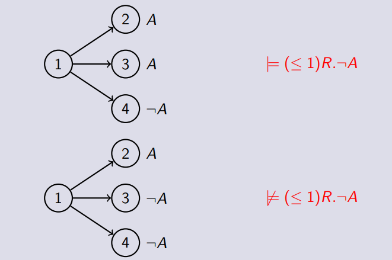
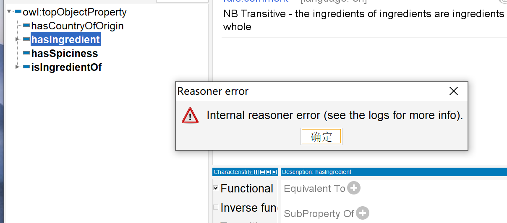
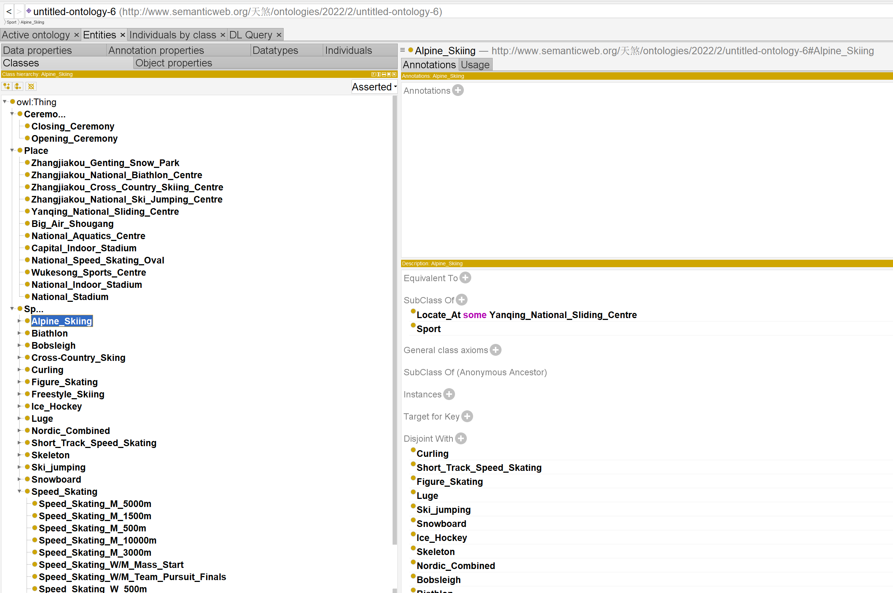
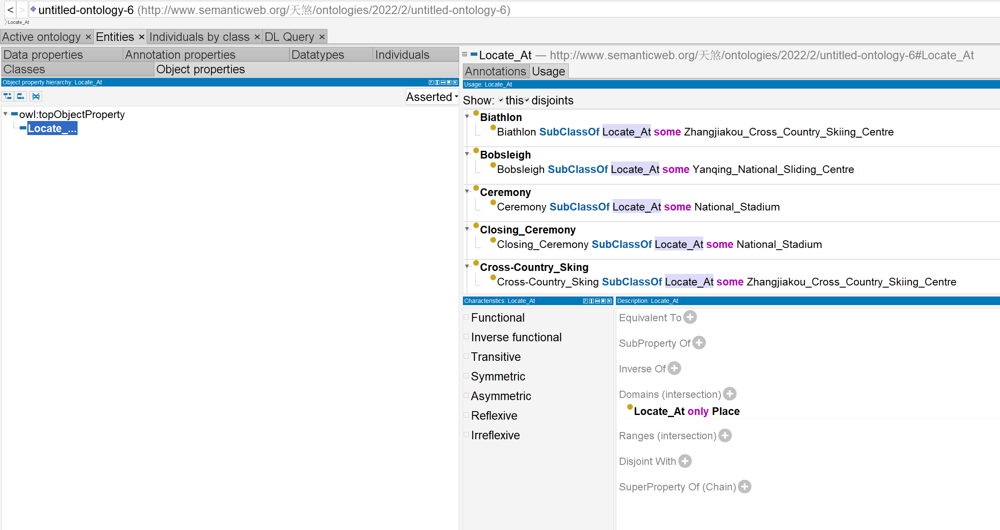
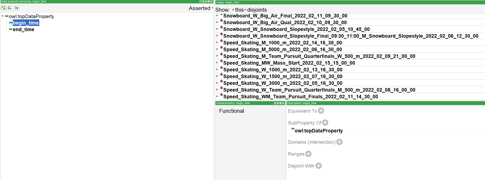

## 1、KR & Ontology4.5

Logic-based ontology, specified in formal logic langugages, which are decidable and reasonable,share a common understannding of the information between human and agent. The knowledge can be represented by limited words and meanwhile reasoned in formal logic syntax.  If we intepret the domain and concepts as a set and elements in the set, we can compute the KR model with set theory in semantics.  It is so computational that we can interpret the logic words and write programs for computers to analyze and process.

## 2、Expressivity & Computability5

##### My sentence: "Where are you from?" 

This question is unable to be modelled in the formal languages.

##### Disagree：

If a logic-based KR language is designed as expressive as possible, it will loss so many useful properties such as decidability , soundness and completeness and result in too complex structure. On the other hand, natural language should be as expressive as possible in any circumstances  for the reason that it is not a computational model and should always be the most expressive one as the main communication method. 

## **3、Manchester Syntax**8

(1)Timo is a cow haslivestocked by Tom.

Timo is an animal.

(2)No,Fido must be a sheep.

(3)No, just owning is not enough.

(4)None

## **4、SHOIQ&FOL**9.6

#### (1)

1.

$ \forall \ Couple.Chinese\ \sqcap \le 3has\_child.\top$

- consept name:Couple
- role name: has_chlid

> role后必跟$.\top$

2.

$\{ML\}\sqsubseteq Course\ \sqcap \ \exists taught\_by.\{SFM\}$

$\{SFM\} \sqsubseteq professor\,\sqcap\,\exists work\_at .\{NJU\}$

- consept name:Course,professor
- role name: taught_by,work_at
- nominals:{ML},{SFM},{NJU}

3.

$\{NJU\}\sqsubseteq university \ \sqcap\ \exists contain\_member.\{school,department\}$

- consept name:university
- role name: contain_member
- nominals:{school,department},{NJU}

> 2选1有其他表示方法？

4.

$\{NJU\}\ \sqcap\ \ge30000has\_student.Student$

- consept name:Student

- role name: has_student

- nominals:{NJU}

- > role后必跟

5.

$\forall\ member\_of\ .AI\_School\ \sqsubseteq\{undergraduate,graduate,teacher\} $

- consept name:AI_School,undergraduate,graduate,teacher
- role name:member_of

6.

$"citizenOf" \sqsubseteq \ relation $

$"citizenOf".domain\ \sqcap\ consist\_of.countries$

- consept name:"citizenOf", relation
- role name: consist\_of

#### (2)

5.

$\forall x(membersOf(x,AI\_school) \ \longrightarrow\ (undergraduates(x)\or graduates(x)\or teachers(x))$

6.

$\exists relation((relation\approx"citizenOf")\ \and\ (countries\sqsubseteq domain \_of\_ realatoin))$

## 5、DL Semantics12

1.True

when $\mathcal{O} \models \top \sqsubseteq \perp$

2.False

Assume that an ontology has only finite models, we can always replace any current element in its $\triangle^{\mathcal{I}}$ with any new element which hasn't exist in all current finite models. It's practical because new element is always infinte.

3.True

According to the proof of (1) and the disapprove of (2)

4.true

Proof from definition: Class C  is satisfiable with respect to $ \mathcal{T}$  if there exists a model  $\mathcal{I} $ of  $\mathcal{T}$  and some $  d \in \Delta^{\mathcal{I}}$  with  $d \in C^{\mathcal{I}} $;

5.false

If there is an unsatisfiable class have a non-empty interpretation in some model, it also satisfy the definition of satisfiable class, which conflicts to its original statement.

6.True

From the disapprove of (5), we know an unsatisfiable class is actually $\emptyset$,then it will be a subclass of any other class.

## 6、Interpretation as Graph12

$△^I=\{d,e,f,g,h,i\}$

$A^I=\{d,e,g\}\ C^I=\{h\}\ D^I=\{g,i\}$

$r^I=\{(d,e),(e,f),(f,g)\}\ s^I=\{(d,d),(e,d),(d,f),(d,h),(h,i)\}$

1.$\neg A=\{f,h,i\}$

2.$\exists r.(A\sqcup B)=\{d,f\}$

3.$\exists s.\neg A=\{d,h\}$$\ \ \ \ \exists s.\exists s.\neg A=\{d,e\}$

4.$\neg A\sqcap \neg B=\{f,h,i\}$

5.$\forall r.(A\sqcup B)=\{d,f,g,h,i\}$不必一定在A中

6.$\le 1s.\top=\{e,h,f,g,i\}$记得包括0

## 7、DL  Semantics15

#### (1)

1.$(Q\sqcap \ge2r.P)^I=\emptyset$

2.$(\forall r.Q)^I=\{b,c,d,e\}$

3.$(\neg \exists r.Q)^I=\{b,c,e\}$

4.$(\forall r.\top \sqcap \exists r^-.P)^I= \{b,d,e\}$

5.$(\exists r^-.\bot )^I=\emptyset$

#### (2)

1.$A\sqcap B=\emptyset$

2.$\exists r.B=\{1,2\}$

3.$\exists r.(A\sqcap B)=\emptyset$

4.$\top=\{1,2,3,4,5,6\}$

5.$A\sqcap \exists r.B=\{1,2\}$

6.True

7.True

8.True

9.False

10.False

## 8、DL Semantics10

#### (1)True

$\forall$ "a" in $\exists r.C$, there must exist some b that satisfies (a,b) in r and b in C.

According to $C\sqsubseteq D$,b must be in D,then we get"a" in$\exists r.D$ which means $\exists r.C \sqsubseteq \exists r.D$

#### (2)False

Counter example:

$&\top=\{a,b,c\}\\&r=\{(a,b),(a,c)\}\\&C=\{a,b,c\}$

Then we have:

$\exists r.C=\{a\}\ \ \le1r.\top=\emptyset$

#### (3)True

Both are $\left\{x \in \Delta^{\mathcal{I}} \mid \text { forall y }\in\Delta^{\mathcal{I}}\ \text{there is no }(x, y) \in r^{I}\right\}$

#### (4)False

Counter example:

$&\top=\{a,b,c,d\}\\&r=\{(a,b),(a,c)\}\\&A=\{a,b\}\\&B=\{c,d\}$

Then we have:

$\forall r.(A\sqcup B)=\{a,b,c,d\}\\\forall r.B=\{b,c,d\}\\\forall r.A=\{b,c,d\}\\(\forall r.B)\sqcup (\forall r.A)=\{b,c,d\}$

#### (5)True

$\forall$a in $\exists r.(A\sqcup B)$,there must exist (a,b) in r that satisfies b in A or B,which means a in $\exists r.A$ or in $\exists r.B$.Then we find a in $(\exists r.B)\sqcup (\exists r.A)$

$\forall$c in  $\exists r.A$ or in $\exists r.B$,there must exist (c,d) in r that satisfies d in A or B,which means c in $\exists r.(A\sqcup B)$

## 9、DL Semantics5

Let interpretation $\mathcal{I}$ be defined by

$&Person=\{a,b,c\}\\&hasChild=\{(a,c),(b,c)\}\\&Parent=\{a,b\}\\&Mother=\{b\}$

So,$\mathcal{I}\mid \neq \text { Parent } \sqsubseteq \text { Mother }$

## 10、DL Semantics8

#### (1)

#### $\Rightarrow$:

If we have $X\sqsubseteq_{\mathcal{T}}\,Y$,then$X\sqcap \neg Y=\emptyset$ is not satisfiable

#### $\Leftarrow$:

If we have $X\sqcap \neg Y$ is not satisfiable,then it muet be $\emptyset$.So we have $X\sqsubseteq_{\mathcal{T}}\,Y$

#### (2)

#### $\Rightarrow$:

If we have $X$ is satisfiable, then $X\neq \emptyset\ and \ X \not \sqsubseteq\, \perp$.

#### $\Leftarrow$:

If we have $X \not \sqsubseteq\, \perp$ ,then $X$ muet be $\emptyset$. So  $X$ is satisfiable.

## 11、Bisimulation16

#### (1)induction proof:

##### 1.conjuction:

##### 2.negation:

$If\  C=\neg D,then\ d_1\in C^{I_1}\  if\ and\ only\ if\ d_1\not\in D^{I_1}\\if\ and\ only\ if\ d_1 \in\triangle^{I_1}\ -\ D^{I_1}\\if\ and\ only\ if\ d_2 \in\triangle^{I_2}\ -\ D^{I_2}\\if\ and\ only\ if\ d_2\in C^{I_2}$

##### 3.existential quantification:

$If\ C=\exists r.D\,,then\  d_1\in C^{I_1}\  implies \ the\  existence\   of \ d_1'\in D^{I_1}\  such \ that\ (d_1,d_1')\in r^{I_1}\ \\,which\  implies \ the\  existence\   of \ d_2'\in D^{I_2}\  such \ that\ (d_2,d_2')\in r^{I_2}.\\So\ we\ have\ d_2\in C^{I_2} $

#### (2)ALCQ

We show that in ALCQ we can distinguish two models which are not distinguishable in ALC.$\mathcal{ALCQ}$ concept C is more expressive than any $\mathcal{ALC}$ concept D

#### (2)S

##### e.g.

$&\top=\{a,b,c,d\}\\&r=\{(a,b),(b,c)\}$

Then $\mathcal{I}\not\models trasitive(r) \ but \ \mathcal{I}\models r$, which means $\mathcal{S}\ is\  more \ expressive \  than\  \mathcal{ALC}$

## 12、Protege21

#### (1)

axiom count:801

logical axiom count:322

They are different because axiom consists of many kinds such as declaration axiomx, annotation assertions and logical axiom. Many axioms are not logical.

#### (2)

##### use nominals:

- Country is EquivalentTo DomainThing and ({ America, England, France, Germany, Italy })

##### use negations:

- VegetarianPizza EquivalentTo Pizza and (not (hasTopping some SeafoodTopping)) and (not (hasTopping some MeatTopping)) 
- NonVegetarianPizza EquivalentTo Pizza and (not VegetarianPizza)

##### declare a sub-property of an object property:

- hasTopping SubPropertyOf: hasIngredient

##### declare an inverse property:

-  hasBase InverseOf isBaseOf

#### (3)

Because IceCream is equivalent to Nothing and there is a restriction "SubClassOf hasTopping some FruitTopping" on this class. However, the property hasTopping has a domain of Pizza. As we can see in the picture, Ice cream is disjoint with pizza. So these 2 contradictory restrictions result in its color turning red.

#### (4)

The inferred superclass for class "CajunSpiceTopping" is "SpicyTopping".

The inferred superclass for class "SloppyGiuseppe" is "CheesyPizza", "InterestingPizza", "MeatyPizza", "SpicyPizza" and "SpicyPizzaEquivalent".(yellow part in the picture)

#### (5)

First we tick the "function" button and then synchronize the reasoner, the result is as followed in the picture.

The object property "hasIngredient" it not functional as a result of every food can have various ingredient.

## 13、First Protege

### classes

Most information is gotten in the schedule table given in the assignment.zip.

Add disjoint set for each subcl

### Object properties

Add domain: "Locate at Only Place"

### Data properties

Instead of establish the time information in the form of classes, I choose to record them as individuals.

With my ontology , it's convenient to get knowledge of essential information of any sport event like where and when a certain winter sports takes place. 
