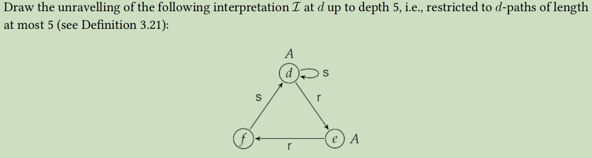
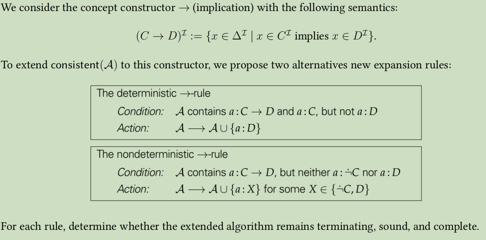

## 1、**Some interesting properties of** $\mathcal{EL}$

#### 

#### (1)satisfiable

We give the Interpretation  $\mathcal{I} = (\Delta^{\mathcal{I}}, \cdot ^{\mathcal{I}})$ :

 $\Delta^{\mathcal{I}} = \{ a \}$ 

$A^{\mathcal{I}} = \{ a \}$ for all concept name $A$

 $r^{\mathcal{I}} = \{ (a, a) \}$ for all role name  $r$

We can prove it by induction on the structure of $\mathcal{EL}$-concept $C$:

- if $C = \top$, then $C^{\mathcal{I}} = \Delta^{\mathcal{I}} = \{ a \}$.
- if $C = A \in \mathbf{C}$, then $C^{\mathcal{I}} = A^{\mathcal{I}} = \{ a \}$ .
- if $C = D \sqcap E$, then $C^{\mathcal{I}} = D^{\mathcal{I}} \cap E^{\mathcal{I}} =  \{ a \}\cap  \{ a \} =  \{ a \}$.
- if $C = \exists r.F$, then $C^{\mathcal{I}} = \{ a \}$ .

So there exists an interpretation $\mathcal{I}$ such that $C^{\mathcal{I}} \neq \empty$.

#### (2)consistent

We continue to use the interpretation $\mathcal{I}$ listed in (1).

Since every $\mathcal{EL}-TBox$ can be transformed into these 4 kinds of normal form:
$$
(sform)  {A} \sqsubseteq {B} \\
(cform)  A_{1} \sqcap A_{2} \sqsubseteq B  \\(rform)  A \sqsubseteq \exists r . B \\(lform)  \exists r . A \sqsubseteq B
$$
From (1) we know that every $\mathcal{EL}-concept$ is satisfiable, then $A,B,A_1,A_2,\exists r.A,\exists r.B$ are all satisfiable according to $\mathcal{I}$

It's obvious that $\mathcal{I}$ fit all 4 normal forms listed above.(We can prove it by induction on the structure)

So there exists an intterpretation $\mathcal{I}$ such that $\mathcal{I} \models \mathcal{T}$.

## 2、Reasoning in $\mathcal{EL}$

#### (1)pre-processing algorithm

to transform into 4 formal forms

**step 1 gives:**（注意运算符优先级）
$$
\text{Bird} &\sqsubseteq& \text{Vertebrate} \sqcap \exists \text{has\_part}.\text{Wing}  \\ \text{Vertebrate} \sqcap \exists \text{has\_part}.\text{Wing} &\sqsubseteq& \text{Bird} \ \\\text{Reptile} &\sqsubseteq& \text{Vertebrate} \sqcap \exists \text{lays}.\text{Egg} \
$$
**step  2 gives**:
$$
Bird  &\sqsubseteq&  Vertebrate\\
Bird  &\sqsubseteq& \exists  has\_part.Wing\\
Vertebrate  \sqcap \exists  has\_part.Wing  &\sqsubseteq&  Bird\\
Reptile  &\sqsubseteq&  Vertebrate \\Reptile  &\sqsubseteq& \exists  lays.Egg
$$
**step 4 gives**：
$$
Bird  &\sqsubseteq&  Vertebrate\\
Bird  &\sqsubseteq& \exists  has\_part.Wing\\
 X &\sqsubseteq& \exists  has\_part.Wing \\
 \exists  has\_part.Wing &\sqsubseteq& X \\
Vertebrate  \sqcap X &\sqsubseteq&  Bird\\
Reptile  &\sqsubseteq&  Vertebrate \\Reptile  &\sqsubseteq& \exists  lays.Egg
$$

#### (2)Deciding intuition algorithm

use 4 rules and 7 axioms above to compute functions **S** and **R**

**Initalisition**:
$$
\begin{aligned} S(\text{Bird}) &= \{ \text{Bird} \} \\ S(\text{Vertebrate}) &= \{ \text{Vertebrate} \} \\ S(\text{Wing}) &= \{ \text{Wing} \} \\ S(X) &= \{ X \} \\\ S(\text{Reptile}) &= \{ \text{Reptile} \} \\ S(\text{Egg}) &= \{ \text{Egg} \} \\ R(\text{has\_part}) &= \empty \\ R(\text{lays}) &= \empty \ \end{aligned}
$$
**rule simpleR**:(axiom 1,6)
$$
\begin{aligned} S(\text{Bird}) &= \{ \text{Bird}, \text{Vertebrate} \}\\ \ S(\text{Reptile}) &= \{ \text{Reptile}, \text{Vertebrate} \} \ \end{aligned}
$$
**rule rightR**:(axiom 2,3,7)
$$
\begin{aligned} R(\text{has\_part}) &= \{ (\text{Bird}, \text{Wing}), (X, \text{Wing}) \} \\ R(\text{lays}) &= \{ (\text{Reptile}, \text{Egg}) \} \ \end{aligned}
$$
**rule leftR**:(axiom 4)(要理解)
$$
S(\text{Bird}) = \{ \text{Bird}, \text{Vertebrate},\text{X} \}
$$
**final result**:
$$
\begin{aligned}S(\text{Bird}) &= \{ \text{Bird}, \text{Vertebrate},\text{X} \}\\ S(\text{Vertebrate}) &= \{ \text{Vertebrate} \} \\ S(\text{Wing}) &= \{ \text{Wing} \} \\ S(X) &= \{ X \} \\
S(\text{Reptile}) &= \{ \text{Reptile}, \text{Vertebrate} \} 
\\ S(\text{Egg}) &= \{ \text{Egg} \} \\  R(\text{has\_part}) &= \{ (\text{Bird}, \text{Wing}), (X, \text{Wing}) \} \\ R(\text{lays}) &= \{ (\text{Reptile}, \text{Egg}) \} \end{aligned}
$$

#### (3)application

$\text{Reptile} \sqsubseteq_{\mathcal{T}'} \text{Vertebrate}$ is T
$\text{Vertebrate} \sqsubseteq_{\mathcal{T}'} \text{Bird}$ is F 

## 3、 **Bisimulation invariance**

#### (1)Extend the notion of bisimulation to ALCN:

Let $\mathcal{I}$ and $\mathcal{J}$ be interpretations. The relation $\rho \subseteq \Delta^{\mathcal{I}} \times \Delta^{\mathcal{J}}$ is a bisimulation between $\mathcal{I}$ and $\mathcal{J}$ if

**(i)** $d \ \rho \ e$ implies
$$
d \in A^{\mathcal{I}} \ if \ and \ only  \ if \ e \in A^{\mathcal{J}}
$$
for all $d \in \Delta^{\mathcal{I}}$, $e \in \Delta^{\mathcal{J}}$, and $A \in \mathbf{C}$.

**(ii)** if $d_1, \cdots, d_{n}$ are all distinct elements of $\Delta^{\mathcal{I}}$ such that $d \ \rho \ e$ and$(d, d_i) \in r^{\mathcal{I}}$ for $1 \le i \le n$ implies the existence of exactly $n$ distinct elements $e_1, \cdots, e_{n}$ of $\Delta^{\mathcal{J}}$ such that
$$
d_i \ \rho \ e_i \, and\ (e, e_i) \in r^{\mathcal{J}} for \  1 \le i \le n
$$
for all $d,d_i \in \Delta^{\mathcal{I}}$, $e,\in \Delta^{\mathcal{J}}$, and $r \in \mathbf{R}$.

**(iii)** if $d_1, \cdots, d_{n}$ are all distinct elements of $\Delta^{\mathcal{I}}$ such that $d \ \rho \ e$ and$(e, e_i) \in r^{\mathcal{J}}$ for $1 \le i \le n$ implies the existence of exactly $n$ distinct elements $d_1, \cdots, d_{n}$ of $\Delta^{\mathcal{I}}$ such that
$$
d_i \ \rho \ e_i \, and\ (d, d_i) \in r^{\mathcal{I}} for \  1 \le i \le n
$$
for all $d_1 \in \Delta^{\mathcal{I}}$, $e,e_i,\in \Delta^{\mathcal{J}}$, and $r \in \mathbf{R}$.

##### Prove

Then we prove that $\mathcal{ALCN}$ is bisimulation invariant for the bisimulation relation on the basis of $\mathcal{ALC}$

For $(\le n R.\top)$,
$$
d \in (\le n R.\top)^{\mathcal{I}}&\Leftrightarrow& \exists\ m(\  m \le n) \ elements\  d_1, \cdots, d_{m} , (d, d_{i}) \in R^{\mathcal{I}} \\
&\Leftrightarrow&  \exists\ m \ elements\  e_1, \cdots, e_{m}, (e, e_{i}) \in R^{\mathcal{J}} 
\\
&\Leftrightarrow& e \in (\le n R.\top)^{\mathcal{J}}
$$

#### (2)ALCQ is more expressive than ALCN

##### prove by definition

$\mathcal{ALCN}$ is unqualified number restriction and does not admit qualifications using an arbitrary concept $\mathcal{C}$

Besides, there is no$(\ge n R.\top)$ in $\mathcal{ALCN}$.

Therefore, $\mathcal{ALCQ}$ is more expressive than $\mathcal{ALCN}$

## 4、Closure under Disjoint Union

##### Extend the notion of disjoint union to individual names:

Their *disjoint union* $\mathcal{J}$ isdefined as follows:

- $\Delta^{\mathcal{J}} = \{ (d,v)| v \in \Omega \text{ and } d \in \Delta^{\mathcal{I}_v} \}$
- $A^{\mathcal{J}} = \{ (d,v)| v \in \Omega \text{ and } d \in A^{\mathcal{I}_v} \}$ for all $A \in \mathbf{C}$
- $r^{\mathcal{J}} = \{ ((d,v), (e,v)) | v \in\Omega \text{ and } (d, e) \in r^{\mathcal{I}_v} \}$ for all $r \in \mathbf{R}$
- $a^{\mathcal{J}} = \{(a^{\mathcal{I}_{v_0}}, v_0)| \forall  a \in  \mathcal{A} \ and \  v_0 \in \Omega\}$

##### Prove:

Then we prove that its disjoint union $\mathcal{J} = \biguplus_{v \in \Omega}\mathcal{I}_v$ is also a model of $\mathcal{K}$.

From `Theorem 3.8` we know that $\mathcal{J}$ is  a model of $\mathcal{T}$. 

Assume that $\mathcal{J}$ is not a model of $\mathcal{K}$ .

Assume that there is assertion $a: C$ in $\mathcal{K}$ and  $(a^{\mathcal{I}{v_0}}, v_0) \not \in C^{\mathcal{J}}$. This implies $a^{\mathcal{I}_{v_0}} \not \in C^{\mathcal{I}_{v_0}}$, which contradicts to the assumption of $\mathcal{I}_{v_0}$ is a model of $\mathcal{K}$.

Assume that there is assertion $(a, b): r$ in  $\mathcal{K}$ and $((a^{\mathcal{I}_{v_0}}, v_0), (b^{\mathcal{I}_{v_0}}, v_0)) \not \in r^{\mathcal{J}}$. This implies $(a^{\mathcal{I}_{v_0}}, b^{\mathcal{I}_{v_0}}) \not \in r^{\mathcal{I}_{v_0}}$, which contradicts to the assumption of $\mathcal{I}_{v_0}$ is a model of $\mathcal{K}$.

## 5、 Closure under Disjoint Union

##### $\Leftarrow:$

If $C \sqsubseteq_{\mathcal{T}} D$, then $C^{\mathcal{I}} \subseteq D^{\mathcal{I}}$ holds for every model $\mathcal{I}$ of $\mathcal{T}$.

Because each model $J$ of $\mathcal{K}$ must be a model of $\mathcal{T}$, so $C^{\mathcal{J}} \subseteq D^{\mathcal{J}}$ holds for every model $\mathcal{J}$ of $\mathcal{K}$. 

So  $C \sqsubseteq_{\mathcal{K}} D$.

$\Rightarrow:$

If $C \sqsubseteq_{\mathcal{K}} D$, then $C^{\mathcal{I}} \subseteq D^{\mathcal{I}}$ holds for every model $\mathcal{I}$ of $\mathcal{K}$. Assumed $C \not \sqsubseteq_{\mathcal{T}} D$.

So there is a model $\mathcal{I}_1$ of $\mathcal{K}$ satisfying $C^{\mathcal{I}_1} \subseteq D^{\mathcal{I}_1}$, another model $\mathcal{I}_{2}$ of $\mathcal{T}$ satisfying $C^{\mathcal{I}_2} \not \subseteq D^{\mathcal{I}_2}$.

Let $\mathcal{J}$ be the disjoint union of $\mathcal{I}_1$ and $\mathcal{I}_2$.

Assumed $C^{\mathcal{J}} \not \subseteq D^{\mathcal{J}}$, then there is an element $(d, v) \in C^{\mathcal{J}}$ but $(d, v) \not \in D^{\mathcal{J}}$. By `Lemma 3.7`, this implies $d \in C^{\mathcal{I}_1}$ but $d \not \in D^{\mathcal{I}_1}$, which contradicts to $C^{\mathcal{I}_1} \subseteq D^{\mathcal{I}_1}$. So $C^{\mathcal{J}} \subseteq D^{\mathcal{J}}$.

 By `Lemma 3.7`, $C^{\mathcal{J}} \subseteq D^{\mathcal{J}}$ implies $ \forall $ element d satisfying $(d, v) \in C^{\mathcal{J}}$ also satisfies $(d, v)  \in D^{\mathcal{J}}$, which implies $ \forall $ element e satisfying $(e, v) \in C^{\mathcal{I}_2}$ also satisfy $(e, v)  \in D^{\mathcal{I}_2}$ And thie contradicts to $C^{\mathcal{I}_2} \not  \subseteq D^{\mathcal{I}_2}$.

So  $C \sqsubseteq_{\mathcal{T}} D$.

## 6、Finite model property

#### (1)True

By the finite model property, there is a finite model $\mathcal{I}$ such that $|C^{\mathcal{I}}| \ge 1$.

Let $\mathcal{I}_m = \biguplus_{v \in { 1, \cdots, m }}\mathcal{I}$ be the disjoint union of  $\mathcal{I}$ itself of m times. So $|C^{I_{m}}| = m|C^{\mathcal{I}}| \ge m$.

So  $\forall m \ge 1$ there is a finite model $\mathcal{I}_{m}$ of $\mathcal{T}$ such that $|C^{\mathcal{I}_m}| \ge m$.

#### (2)False

**Counter example**:

Let  $m = 1$,  $C = \top$, $\mathcal{T} = \{ A \sqsubseteq \exists r.\lnot A, \lnot A \sqsubseteq \exists r.A \}$ 

For any model $\mathcal{I}$ of $\mathcal{T}$, assume that $A^{\mathcal{I}} \neq \empty$ or $(\lnot A)^{\mathcal{I}} \neq \empty$.

- If$A^{\mathcal{I}} = \empty$, then $(\exists r.A)^{\mathcal{I}} = \empty$. From the GCI $\lnot A \sqsubseteq \exists r.A$, we know $(\lnot A)^{\mathcal{I}} \subseteq (\exists r.A)^{\mathcal{I}}$ then $(\lnot A)^{\mathcal{I}} = \empty$, which contradicts to$A^{\mathcal{I}} \neq \empty$ or $(\lnot A)^{\mathcal{I}} \neq \empty$.

- If $(\lnot A)^{\mathcal{I}} = \empty$, then $(\exists r.\lnot A)^{\mathcal{I}} = \empty$. From the GCI $A \sqsubseteq \exists r.\lnot A$, we know $A^{\mathcal{I}} \subseteq (\exists r.\lnot A)^{\mathcal{I}}$ then $A^{\mathcal{I}} = \empty$, which contradicts to $A^{\mathcal{I}} \neq \empty$ or $(\lnot A)^{\mathcal{I}} \neq \empty$.

Then  $|C^{\mathcal{I}}| = |\top^{\mathcal{I}}| = |A^{\mathcal{I}}| + |(\lnot A)^{\mathcal{I}}| \ge 1 + 1 = 2$, which contradicts $|C^{\mathcal{I}}| = m = 1$.

So it doesn't hold if the condition "$|C^{\mathcal{I}_m}| \ge m$" is replaced by "$|C^{\mathcal{I}_m}| = m$".

##  7、 Bisimulation over filtration

##### False

**Counter example**:

Assume that  $S=\{\top, A, \exists r . \top\}$  where $ \mathbf{C}=\{A\}$  and  $\mathbf{R}=\{r\}$ , $\Delta^{\mathcal{I}}=\{d_{1}, d_{2}, d_{1}^{\prime}, d_{2}^{\prime}\}$

Then  $\simeq_{S}$  has 3 equivalence classes: $\left[d_{1}\right]_{S}=\left[d_{2}\right]_{S},\left[d_{1}^{\prime}\right]_{S} $ and  $\left[d_{2}^{\prime}\right]_{S}$ 

We have $ \left(d_{1},\left[d_{1}\right]_{S}\right) \in \rho $, but  $\left[d_{1}\right]_{S} $ has an  r -successor in $ \mathcal{J} $ that does not belong to the extension of  A , whereas $ d_{1} $ does not have such an  r -successor in $  \mathcal{I}$ .

## 8、Bisimulation over ltration

#### (1)

**condition 1** 

$d \thickapprox_{\mathcal{I}} e$ implies $d \in A^{\mathcal{I}}$ if and only if $e \in A^{\mathcal{I}}$

( for all $d \in \Delta^{\mathcal{I}}$, $e \in \Delta^{\mathcal{I}}$, and $A \in \mathbf{C}$)

**condition 2**

$d \thickapprox_{\mathcal{I}} e$ and $(d, d') \in r^{\mathcal{I}}$ implies the existence of $e' \in \Delta^{\mathcal{I}}$ sattisfying $d' \rho \ e'$ and $(e, e') \in r^{\mathcal{I}}$

Then $d' \thickapprox_{\mathcal{I}} e'$ and $(e, e') \in r^{\mathcal{I}}$  because of the definition of $d' \thickapprox_{\mathcal{I}} e'$

(for all $d, d' \in \Delta^{\mathcal{I}}$, $e \in \Delta^{\mathcal{I}}$, and $r \in \mathbf{R}$)

**condition 3** 

similar to condition 2

According to 3 conditions of the definition of BIsimulation,  $\thickapprox_{\mathcal{I}}$ is a bisimulation on $\mathcal{I}$.

#### (2)

**condition 1** 

 $(d, [d]_{\thickapprox_{\mathcal{I}}}) \in \rho$ implies  $d \in A^{\mathcal{I}}$ if and only if $[d]_{\thickapprox_{\mathcal{I}}} \in A^{\mathcal{J}}$

for all $d \in \Delta^{\mathcal{I}}$, $[d]*{\thickapprox*{\mathcal{I}}} \in \Delta^{\mathcal{J}}$, and $A \in \mathbf{C}$.

**$\Rightarrow:$**

If $d \in A^{\mathcal{I}}$, then we have $d \in [d]_{\thickapprox_{\mathcal{I}}}$ and $d _{\thickapprox{\mathcal{I}}} d$  . We can know $[d]_{\thickapprox_{\mathcal{I}}} \in A^{\mathcal{J}}$ by the definition of $A^{\mathcal{J}}$.

**$\Leftarrow:$**

If $[d]_{\thickapprox_{\mathcal{I}}} \in A^{\mathcal{J}}$, then we have $d' \in [d]_{\thickapprox_{\mathcal{I}}}$ and $d' \in A^{\mathcal{I}}$. From $d \in [d]_{\thickapprox{\mathcal{I}}}$ and $d _{\thickapprox\mathcal{I}} d$, we can know that $d _{\thickapprox\mathcal{I} }d'$. However, $d' \in A^{\mathcal{I}}$ if and only if $d \in A^{\mathcal{I}}$.

**condition 2**

$(d, [d]_{\thickapprox_{\mathcal{I}}}) \in \rho$ and $(d, e) \in r^{\mathcal{I}}$ implies there is $d \in [d]_{\thickapprox_{\mathcal{I}}}$, $e \in [e]_{\thickapprox_{\mathcal{I}}}$ with $(d, e) \in r^{\mathcal{I}}$, which implies the existence of $[e]_{\thickapprox_{\mathcal{I}}} \in \Delta^{\mathcal{J}}$ satisfying$(e, [e]_{\thickapprox_{\mathcal{I}}}) \in \rho$ and $([d]_{\thickapprox-{\mathcal{I}}}, [e]_{\thickapprox_{\mathcal{I}}}) \in r^{\mathcal{J}}$

for all $d, e \in \Delta^{\mathcal{I}}$, $[d]_{\thickapprox_{\mathcal{I}}} \in \Delta^{\mathcal{J}}$, and $r \in \mathbf{R}$.

**condition 3** 

similar to condition 2

According to 3 conditions of the definition of BIsimulation, we show that $\rho = { (d, [d]*{\thickapprox*{\mathcal{I}}}) | d \in \Delta^{\mathcal{I}} }$ is a bisimulation between $\mathcal{I}$ and $\mathcal{J}$.

#### (3)

 $\mathcal{I}$ is a model of an $\mathcal{ALC}$-concept $C$ with respect to an $\mathcal{ALC}$-TBox $\mathcal{T}$.

 $C^{\mathcal{I}} \neq \empty$ implies the existence of  $d \in C^{\mathcal{I}}$ and $[d]_{\thickapprox_{\mathcal{I}}} \in C^{\mathcal{J}}$

 Let $D \sqsubseteq E$ be a GCI in $\mathcal{T}$, and $[e]_{\thickapprox_{\mathcal{I}}} \in D^{\mathcal{J}}$.  $e \in D^{\mathcal{I}}$ implies $e \in E^{\mathcal{J}}$ since $\mathcal{I}$ is a model of $\mathcal{T}$ , which implies $[e]_{\thickapprox_{\mathcal{I}}} \in E^{\mathcal{J}}$.

So $\mathcal{J}$ is a model of an $\mathcal{ALC}$-concept $C$ with respect to an $\mathcal{ALC}$-TBox $\mathcal{T}$.

## 9、Unravelling

## 10、Tree model property

**False**

Let $\mathcal{K} = (\mathcal{T}, \mathcal{A}), \mathcal{T} = \empty, \mathcal{A} = \{ a: A, b: B, (a,b): r, (b,a): r \}$.

Then $\forall \mathcal{I}$ of such $\mathcal{K}$, $a^{\mathcal{I}}$ and $b^{\mathcal{I}}$ are two distinct elements satisfying $(a^{\mathcal{I}}, b^{\mathcal{I}}), (b^{\mathcal{I}}, a^{\mathcal{I}}) \in r^{\mathcal{I}}$ . 

So there is a ring "$a \xrightarrow{r} b \xrightarrow{r} a$" for any model $\mathcal{I}$ of such $\mathcal{K}$.

## 11、Tableau

- Initalisition: $\mathcal{A} $ is in NNF, so $\mathcal{A}_0$=$\mathcal{A}$

- An application of $\to_{\exists}$ and $a: \exists s.A$ gives

$$
\mathcal{A}_1 = \mathcal{A}_0 \cup \{ (a,d): s, d: A \}
$$

- An application of $\to_{\forall}$ and $b: \forall r.((\forall s.\lnot A)\sqcup (\exists r.B))$ and $(b,a):r$ gives:

$$
\mathcal{A}_2 = \mathcal{A}_1 \cup \{ a: (\forall s.\lnot A)\sqcup (\exists r.B) \}
$$

-  An application of $\to_{\sqcup}$ and $a: (\forall s.\lnot A)\sqcup (\exists r.B)$ gives:

  - Firstly, we can try
    $$
    \mathcal{A}_3 = \mathcal{A}_2 \cup \{ a: \forall s.\lnot A \}
    $$
    
  - An application of $\to_{\forall}$ and $a: \forall s.\lnot A$  and $(a,c):s,(a,d):s$  gives
  
  $$
  \mathcal{A}_4 = \mathcal{A}_3 \cup \{ c: \lnot A, d: \lnot A \}
  $$
  
  
  
  - We have abtained a clash because $d: A$ and $d: \lnot A$, thus this choice was unsuccessful.
  
  - Secondly, we can try
  
  $$
  \mathcal{A}_3^{*} = \mathcal{A}_2 \cup \{ a: \exists r.B \}
  $$
  
  - An application of $\to_{\exists}$ and $a: \exists r.B$ gives（这里不能新建fresh individual，因为已经有（a，b）：r）
    $$
    \mathcal{A}_4 = \mathcal{A}_3^{*} \cup \{ (a,b):r,b:B\}
    $$
  
- An application of $\to_{\forall}$ and $c: \forall s.(B \sqcap (\forall s.\bot))$ and $(c,b):s$  gives:
  $$
  \mathcal{A}_5 = \mathcal{A}_4 \cup \{ b: B \sqcap (\forall s.\bot) \}
  $$

- An application of $\to_{\sqcap }$ and $b: B \sqcap (\forall s.\bot)$ gives:
  $$
  \mathcal{A}_6 = \mathcal{A}_5 \cup \{ b: B, b: \forall s.\bot \}
  $$

- No rule is applicable to $\mathcal{A}_6$ and it does not contain a clash.

  Thus, $\mathcal{A}$ is consistent.

## 12、Extension of Tableau algorithm

##### Knowledge of implication

$\begin{aligned} (C \to D)^{\mathcal{I}}  = \{ x \in \Delta^{\mathcal{I}} | x \in \Delta^{\mathcal{I}} \setminus C^{\mathcal{I}} \text{ or } x \in D^{\mathcal{I}} \}  = (\lnot C \sqcup D)^{\mathcal{I}} \end{aligned}$

According to NNF, $\lnot (C \to D) \equiv C \sqcap \lnot D$

#### The deterministic -rule: 

##### Terminating: True

Omit the part of original proof and add the new proof for $\to$(`Lemma 4.4`)

- The new rule never remove an assertion and add a new assertion of the form $\\{}$ $\{a:D\}$. And the size of $sub(A)$ is still bounded by the size of *A*
- The new rule does not add new individual name.
- The new rule only add concept assertions of the form $\{a:D\}$. The depth of each tree in the forest-shaped ABox is bounded by  $|\operatorname{sub}(\mathcal{A})|$. 

Along with the original properties on the book, these properties ensure that there is a bound on the size of the ABox that can be constructed via rule applications, and thus a bound on the number of recursive applications of expand.

##### Soundness: False

Conter example:

Let $\mathcal{A} = \{ a: (C \sqcup D) \to E, a: C,a: \lnot E  \}$

Since $a: C \sqcup D \not \in \mathcal{A}$, we cannot use the deterministic $\to$-rule or any other rules.

Then no rules are applicable and no clash in it, so the $\text{consistent}(\mathcal{A})$ will return "consistent". However, if  we replace $(C \sqcup D) \to E$ with $\lnot (C \sqcup D) \sqcup E$ in preprocessing and call the original $\text{consistent}(\mathcal{A})$, clash ${ a: E, a: \lnot E } \subseteq \mathcal{A}'$ will be found.

##### Completeness: True

Omit the part of original proof(`Lemma 4.6`)

- The deterministic $\to$-rule: If $a: C \to D \in \mathcal{A}$ and $a: C \in \mathcal{A}$, then $a^{\mathcal{I}} \in (C \to D)^{\mathcal{I}}$. Thus $a^{\mathcal{I}} \in \Delta^{\mathcal{I}} \setminus C^{\mathcal{I}}$ or $a^{\mathcal{I}} \in D^{\mathcal{I}}$ by the semantics of $\to$, but $a^{\mathcal{I}} \in C^{\mathcal{I}}$, so $a^{\mathcal{I}} \in D^{\mathcal{I}}$. Therefore, $\mathcal{I}$ is still a model of $\mathcal{A} \cup { a: D }$, so $\mathcal{A}$ is still consistent after the rule is applied.

#### The nondeterministic -rule: 

##### Terminating: True

Omit the part of original proof and add the new proof for $\to$(`Lemma 4.4`)

- The new rule never remove an assertion and add a new assertion of the form $\\{}$ $\{a:X\}$. And the size of $sub(A)$ is still bounded by the size of *A*
- The new rule does not add new individual name.
- The new rule only add concept assertions of the form $\{a:X\}$. The depth of each tree in the forest-shaped ABox is bounded by  $|\operatorname{sub}(\mathcal{A})|$. 

Along with the original properties on the book, these properties ensure that there is a bound on the size of the ABox that can be constructed via rule applications, and thus a bound on the number of recursive applications of expand.

##### Soundness: True

Omit the part of original proof(`Lemma 4.5`)

Induction Basis: C is a conceptname: by definition of $\mathcal{I}$, if $a: C \in \mathcal{A}'$, then $a^{\mathcal{I}} \in C^{\mathcal{I}}$ as required.

Induction Steps:

- $C = \lnot D$: since $\mathcal{A}'$ is clash-free, $a: \lnot D \in \mathcal{A}'$ implies that $a: D \in \mathcal{A}'$. Since all concepts in $\mathcal{A}$ are in NNF, D is a concept name. By definition of $\mathcal{I}$, $a^{\mathcal{I}} \not \in D^{\mathcal{I}}$, which implies $a^{\mathcal{I}} \in \Delta^{\mathcal{I}} \setminus D^{\mathcal{I}} = C^{\mathcal{I}}$ as required.
- $C = D \to E$: if $a: D \to E \in \mathcal{A}'$, then completeness of $\mathcal{A}'$ implies that ${ a: E } \subseteq \mathcal{A}'$ or ${ a: \dot{\lnot} D } \subseteq \mathcal{A}'$ (otherwise the nondeterministic $\to$-rule would be applicable). Thus $a^{\mathcal{I}} \in E^{\mathcal{I}}$ or $a^{\mathcal{I}} \in \Delta^{\mathcal{I}} \setminus D^{\mathcal{I}}$ by induction, and hence $a^{\mathcal{I}} \in (\Delta^{\mathcal{I}} \setminus D^{\mathcal{I}}) \cup E^{\mathcal{I}} = (\lnot D \sqcup E)^{\mathcal{I}} = (D \to E)^{\mathcal{I}}$ by the semantics of $\to$.

As a consequence, $\mathcal{I}$ satisfies all concept assertions in $\mathcal{A}'$ and thus in $\mathcal{A}$, and it satisfies all role assertions in $\mathcal{A}'$ and thus in $\mathcal{A}$ by definition. Hence $\mathcal{A}$ has a model and thus is consistent.

##### Completeness: True

Omit the part of original proof(`Lemma 4.6`)

- The nondeterministic $\to$-rule: If $a: C \to D \in \mathcal{A}$, then $a^{\mathcal{I}} \in (C \to D)^{\mathcal{I}}$. Thus $a^{\mathcal{I}} \in \Delta^{\mathcal{I}} \setminus C^{\mathcal{I}}$ or $a^{\mathcal{I}} \in D^{\mathcal{I}}$ by the semantics of $\to$. Therefore, at least one of the ABoxes $\mathcal{A}' \in \exp (\mathcal{A}, \text{nondeterministic } \to \text{-rule}, a: C \to D)$ is consistent. Thus, one of the calls of expand is applied to a consistent ABox.

## 13、Modification of Tableau algorithm

##### Modify

Add a judgement rule of the calsh:

- for role names $r$ and $s$ satisfying  ${ \text{disjoint}(r, s) } \subseteq \mathcal{T}$  , if ${ (a, b): r, (a, b): s } \subseteq \mathcal{A}$ 

Add a new expansion rule:

- $\sqsubseteq$-rule: if $(a, b): r \in \mathcal{A}$, $r \sqsubseteq s \in \mathcal{T}$ and $(a, b): s \not \in \mathcal{A}$, then $\mathcal{A} \xrightarrow{} \mathcal{A} \cup \{ (a, b): s \}$

##### Termination: True

Omit the part of original proof and add the new proof for $\sqsubseteq$

The number of the new role assertions will be no more than the square of the count of individual names , which is well bounded.

##### Soundness: True

Let $\mathcal{A}' =\text{consistent}(\mathcal{A})$. Then $\mathcal{A}'$ must be a clash-free and complete ABox.

- $\mathcal{I}$ satisfies each $\text{disjoint}(r, s) \in \mathcal{T}$:
  - Assume $r^{\mathcal{I}} \cap s^{\mathcal{I}} \neq \empty$, thus there are $a$ and $b$ satisfying $(a, b) \in r^{\mathcal{I}}$ and $(a, b) \in s^{\mathcal{I}}$. So we can know ${ (a, b): r, (a, b): s } \subseteq \mathcal{A}'$, which contradicts $\mathcal{A}'$ is a clash-free ABox.

- $\mathcal{I}$ satisfies each $r \sqsubseteq s \in \mathcal{T}$:
  - Assume there are $a$ and $b$ satisfying $(a, b) \in r^{\mathcal{I}}$ but $(a, b) \in s^{\mathcal{I}}$. Therefore, $(a, b): r \in \mathcal{A}'$ but $(a, b): s \not \in \mathcal{A}'$, which contradicts $\mathcal{A}'$ is a complete ABox.

##### Completeness: True

Omit the part of original proof(`Lemma 4.6`)

- The $\sqsubseteq$-rule: if $(a, b): r \in \mathcal{A}$ and $r \sqsubseteq s \in \mathcal{T}$, then $(a, b) \in r^{\mathcal{I}}$. As $\mathcal{I}$ is a model of $\mathcal{T}$, $r^{\mathcal{I}} \subseteq s^{\mathcal{I}}$, thus $(a, b) \in s^{\mathcal{I}}$. Therefore, $\mathcal{I}$ is still a model of $\mathcal{A} \cup { (a, b): s }$, so $\mathcal{A}$ is still consistent after the rule is applied.