## 1、Termination

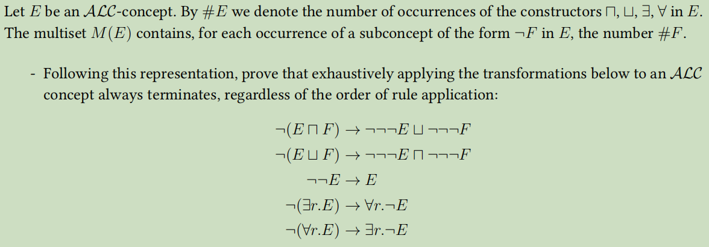

Firstly we can simplify rule 1and rule 2 by combining them to rule 3. Then we get:
$$
\begin{array}{l}
\neg(E \sqcap F) \rightarrow  \neg E \sqcup  \neg F \\
\neg(E \sqcup F) \rightarrow  \neg E \sqcap  \neg F
\end{array}
$$

#### Prove:

##### 1.assumption

Define $sum(E)$ to represent the sum of all elements in $M(E)$.

Define $sum_{neg}(E)$ to represent the total count of constructor $\neg$ in $E$.

##### 2.Analysis

We give the proof by giving the verification that forall $\mathcal{ALC}-concept \ E$ , each application of the 5 rules will strictly reduce $sum(E)$ or $sum_{neg}(E)$. Since the $sum(E)$ and $sum_{neg}(E)$must be a positive number , application of those 5 rules always terminate.

##### 3.induction

Forall occurrence of a subconcept of the form $\neg F$ in $E$, it must be equavalent to one of the left side of those 5 rules. So we can prove this by induction on the structure of $\mathcal{ALC}$-concept $\neg F$:

- ##### rule 1:$\neg(D \sqcap F) \rightarrow  \neg D \sqcup  \neg F $

$$
\#(D \sqcap F)=\#D+1+\#F
$$

​		So $sum(E)$ reduce 1 and  $sum_{neg}(E)$ increase 1 after applying rule 1.

- ##### rule 2:$\neg(D \sqcup F) \rightarrow  \neg D \sqcap  \neg F$

​		This case is analogous to the previous one.

- ##### rule 3:$\neg \neg D \rightarrow D$

​		After applying this rule, the original element $\#(\neg E)$ in $M(E)$ should be deleted. Therefore $sum(E)$ shall reduce $\#E$ and $sum_{neg}(E)$ shall reduce 2.

- ##### rule 4:$\neg(\exists r . D) \rightarrow \forall r . \neg D$

$$
\#(\exists r . D) = 1+\# D
$$

​		So $sum(E)$ reduce 1 and  $sum_{neg}(E)$  remains after applying rule 4.

- ##### rule 5:$\neg(\forall r . E) \rightarrow \exists r . \neg E$

​		This case is analogous to the previous one.

##### 4.Now we prove that the applying times of rule 3 must be finite:

As we can see above, only rule 1 and rule 2 will increase  $sum_{neg}(E)$ .However, the applying times of rule 1 and rule 2 is no more than $\#E$. Since the total increase and original numeric value of $sum_{neg}(E)$ are both finite, then the applying times of rule 3 must be finite.

##### 5.Conlusion:

- $sum(E)$  will strictly reduce after applying  rule 1,2,4,5 and will not increase after applying rule 3.
- $sum(E)$ must be a positive number and therefore **the applying times of rule 1,2,4,5 must be finite**
- **the applying times of rule 3 must be finite**

So it terminates.

## 2、Normal form

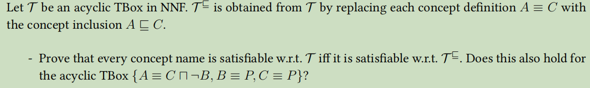

#### (1)proof

##### $\Rightarrow (only\  if):$If concept name $C$ is satisfiable w.r.t. $\mathcal{T}$, then $C$ is satisfiable w.r.t. $\mathcal{T}^{\sqsubseteq}$

We replace $A \equiv C$ with $A \sqsubseteq C$ and $C \sqsubseteq A$ and then get $\mathcal{T}'$. We can know $\mathcal{T}^{\sqsubseteq} \subseteq \mathcal{T}'$, so every model of $\mathcal{T}'$ is also model of $\mathcal{T}^{\sqsubseteq}$.

Thus every model of $\mathcal{T}$ is also model of $\mathcal{T}^{\sqsubseteq}$.

So every concept name that is satisfiable w.r.t. $\mathcal{T}$ is satisfiable w.r.t. $\mathcal{T}^{\sqsubseteq}$.

##### $\Leftarrow(if):$If concept name $C$ is satisfiable w.r.t. $\mathcal{T}^{\sqsubseteq}$, then $C$ is satisfiable w.r.t. $\mathcal{T}$

Since a $\mathcal{T}$ refers to only one $\mathcal{T}^{\sqsubseteq}$ but a $\mathcal{T}^{\sqsubseteq}$ possibly refers to more than one $\mathcal{T}$, we assumed that the  $\mathcal{T}$ occured in this section is obtained from $\mathcal{T}^{\sqsubseteq}$ by replacing **all** $A \sqsubseteq C$ with $A \equiv C$. (Prove this $\mathcal{T}$ so we don't need to prove other $\mathcal{T}$ referred form $\mathcal{T}^{\sqsubseteq}$  )

If concept name $C$ is satisfiable w.r.t. $\mathcal{T}^{\sqsubseteq}$ , then there exists an interpretation $\mathcal{I}$  s.t. $C^{\mathcal{I}}\not = \empty$ w.r.t. $\mathcal{T}^{\sqsubseteq}$.

Constract a new interpretation $\mathcal{J}$ by modifying  $\mathcal{I}$:
$$
Recursively \ modify \ all\ A^{\mathcal{J}^{}},C_1^{\mathcal{J}},C_2^{\mathcal{J}}……,C_n^{\mathcal{J}} \ to\ A^{\mathcal{J}}\cup \ C_1^{\mathcal{I}}\cup \ C_2^{\mathcal{I}}\cup……\cup \ C_n^{\mathcal{I}} \text { if GCI }  A \sqsubseteq C_i \text { in } \mathcal{T} ^\sqsubseteq forall\ 1\le i\le n\\ ,until\ all \ A^{\mathcal{J}^{}} =\ C^{\mathcal{J}} \text { if GCI } A \equiv C \text { in } \mathcal{T}
$$

Then $\mathcal{J}$ is not only a model of $\mathcal{T}^{\sqsubseteq}$, but also a model of $\mathcal{T}^{}$.

So every concept name that is satisfiable w.r.t. $\mathcal{T}^{\sqsubseteq}$ is satisfiable w.r.t. $\mathcal{T}$.

#### (2)No,it doesn't hold if we don't transform  into a simple TBox $\mathcal{T^{'}} $

 $\text {In the acyclic TBox  }\mathcal{T^{}} \{A \equiv C \sqcap \neg B, B \equiv P, C \equiv P\}$:

- defined concept name:$A,B,C$
- primitive concept name:$P$

So $\mathcal{T^{}}$ is not in NNF.  $A^{\mathcal{I}}=\emptyset$ so concept name $\mathcal{A}$ is not satisfiable w.r.t. $\mathcal{T}$.

$\mathcal{T^{\sqsubseteq }}$$\{A \sqsubseteq C \sqcap \neg B, B \sqsubseteq  P, C \sqsubseteq P\}$.

Constract an Interpretation $\mathcal{I}$ as a **counter example:**
$$
\Delta^{\mathcal{I}}=\{a,b\}, A^{\mathcal{I}}=\{a\}, B^{\mathcal{I}}=\{b\}, C^{\mathcal{I}}=\{a\}, P^{\mathcal{I}}=\{a,b\}
$$
So $A^{\mathcal{I}}=\{a\}$ and concept name $\mathcal{A}$ is satisfiable w.r.t. $\mathcal{T}^{\sqsubseteq}$.

This conclusion doesn't hold for the acyclic TBox $\{ A \equiv C \sqcap \lnot B, B \equiv P, C \equiv P \}$.

## 3、$\mathcal{ALC}$-Worlds algorithm

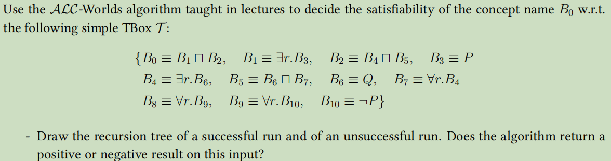

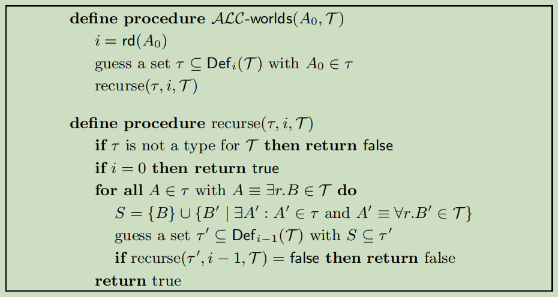

$\operatorname{rd}(B_0) = 2, \operatorname{rd}(B_1) = 1, \operatorname{rd}(B_2) = 2, \operatorname{rd}(B_3) = 0, \operatorname{rd}(B_4) = 1, \operatorname{rd}(B_5) = 2, \operatorname{rd}(B_6) = 0, \operatorname{rd}(B_7) = 2, \operatorname{rd}(B_8) = 2, \operatorname{rd}(B_9) = 1, \operatorname{rd}(B_{10}) = 0$

$Def_2(\mathcal{T})=\{B_0, B_1, B_2,B_3, B_4, B_5, B_6, B_7, B_8, B_9, B_{10}\}$

$Def_1(\mathcal{T})=\{ B_1,B_3, B_4, B_6,  B_9, B_{10}\}$

$Def_0(\mathcal{T})=\{ B_3,  B_6, B_{10}\}$

#### (1)successful run

We guess $\tau = \{ B_0, B_1, B_2,B_3, B_4, B_5, B_6, B_7 \}$ . $\tau$ is a type for $\mathcal{T}$  and then recurse$(\tau, 2, \mathcal{T})$:

- for $B_1 \in \tau$ with $B_1 \equiv \exists r.B_3$ do:

​		$S = { B_3 } \cup { B_4 } = \{ B_3, B_4 \}$

​		We guess $\tau' = \{B_3, B_4, B_6 \}$ . $\tau'$ is a type for $\mathcal{T}$  and then recurse$(\tau', 1, \mathcal{T})$:

​			for $B_4 \in \tau'$ with $B_4 \equiv \exists r.B_6$ do:

​				$S = \{ B_6 \} $

​				We guess $\tau'' = \{B_6 \}$ and then recurse$(\tau', 0, \mathcal{T})$ . 

​					i=0 so return `true`

- for $B_4 \in \tau$ with $B_4 \equiv \exists r.B_6$ do:

​			$S = \{ B_6 \} $

​			We guess $\tau''' = \{B_6 \}$ and then recurse$(\tau', 1, \mathcal{T})$ . 

​				Return `true`

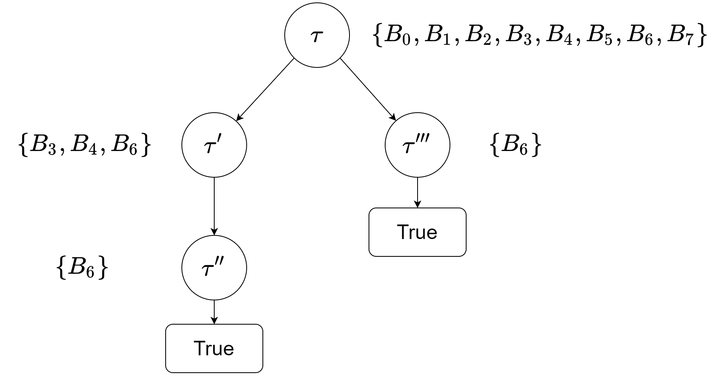

#### **(2) Unsuccessful run**

We guess $\tau = \{ B_0,B_3,  B_{10} \}$  and then recurse$(\tau, 2, \mathcal{T})$:

$\tau$ is not a type for $\mathcal{T}$ because $B_3 \in \tau, B_{10} \in \tau$ but $B_3 \equiv P$ and $B_{10} \equiv \lnot P$

Return` false`

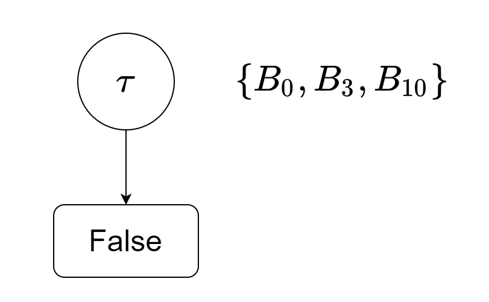

#### **(3) result**:Positive

Reason：$\exists$ successful run

## 4、$\mathcal{ALC}$-Elim algorithm

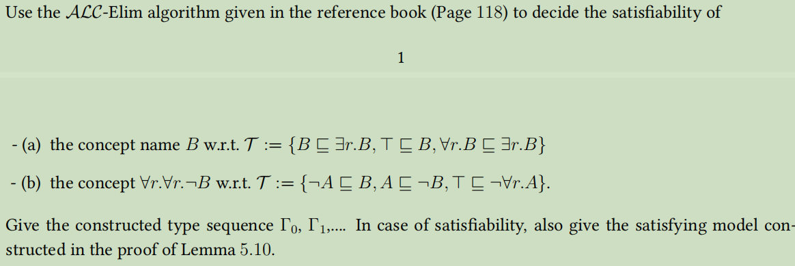

#### Lemma：

$sub(A⊓B⊓C)=\{A⊓B⊓C\}\cup sub(B⊓C)\cup sub(A)\cup sub(B)\cup sub(C)$

​								or $\{A⊓B⊓C\}\cup sub(A⊓B)\cup sub(A)\cup sub(B)\cup sub(C)$

#### **(a)**

$C_{\mathcal{T}}$ $= \{(¬B⊔∃r.B)⊓B⊓(∃r.¬B⊔∃r.B)\}$

$\operatorname{sub}(\mathcal{T})=\{B,\neg B,∃r.¬B, ∃r.B,(¬B⊔∃r.B), (∃r.¬B⊔∃r.B),(¬B⊔∃r.B)⊓B,(¬B⊔∃r.B)⊓B⊓(∃r.¬B⊔∃r.B)\}$

$\Gamma_0 = [\ \ \{B, ∃r.B,(¬B⊔∃r.B), (∃r.¬B⊔∃r.B),(¬B⊔∃r.B)⊓B,(¬B⊔∃r.B)⊓B⊓(∃r.¬B⊔∃r.B),∃r.¬B\} $

$\ \ \ \  \ \  \ \  \ \ \ , \{B, ∃r.B,(¬B⊔∃r.B), (∃r.¬B⊔∃r.B),(¬B⊔∃r.B)⊓B,(¬B⊔∃r.B)⊓B⊓(∃r.¬B⊔∃r.B)\}\ \ ]$

$\Gamma_1=[\ \ \{B, ∃r.B,(¬B⊔∃r.B), (∃r.¬B⊔∃r.B),(¬B⊔∃r.B)⊓B,(¬B⊔∃r.B)⊓B⊓(∃r.¬B⊔∃r.B)\}\ \ ]$

$\Gamma_2=[\ \ \{B, ∃r.B,(¬B⊔∃r.B), (∃r.¬B⊔∃r.B),(¬B⊔∃r.B)⊓B,(¬B⊔∃r.B)⊓B⊓(∃r.¬B⊔∃r.B)\}\ \ ]=\Gamma_1$ 

$\tau=\ \ \ \ \ \{B, ∃r.B,(¬B⊔∃r.B), (∃r.¬B⊔∃r.B),(¬B⊔∃r.B)⊓B,(¬B⊔∃r.B)⊓B⊓(∃r.¬B⊔∃r.B)\}$ 

So $B$ is satisfiable.

- Satisfying model:

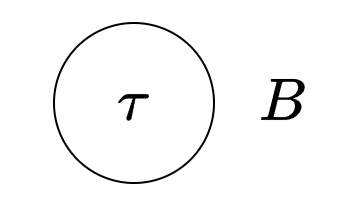

#### **(b)**

$∀r.∀r.¬B$ is equal to $C \sqsubseteq ∀r.∀r.¬B$

$C_{\mathcal{T}} = \{(¬C⊔∀r.∀r.¬B)⊓(A⊔B)⊓(¬A⊔¬B)⊓(∃r.¬A)\}$
$$
\operatorname{sub}(\mathcal{T})=
&\{①:&A,\neg A,B,\neg B,C,\neg C,∀r.¬B, ∀r.∀r.¬B
\\&,②:& (¬C⊔∀r.∀r.¬B),(¬A⊔¬B), ∃r.¬A, (A⊔B)
\\&,③:& (¬C⊔∀r.∀r.¬B)⊓(A⊔B)
\\&,④:&(¬C⊔∀r.∀r.¬B)⊓(A⊔B)⊓(¬A⊔¬B)
\\&,⑤:&(¬C⊔∀r.∀r.¬B)⊓(A⊔B)⊓(¬A⊔¬B)⊓(∃r.¬A) &\}
$$
We simplify the answers by using ②,③,④,⑤ to represent a certain line above

There are 16 different types in $\Gamma_0$:
$$
\Gamma_0= [
&\{&A,\neg B,∀r.∀r.¬B,②,③,④,⑤\}
\\&,\{&A,\neg B,∀r.∀r.¬B,C,②,③,④,⑤\}
\\&,\{&A,\neg B,∀r.∀r.¬B,\neg C,②,③,④,⑤\}
\\&,\{&A,\neg B,\neg C,②,③,④,⑤\}
\\&,\{&A,\neg B,∀r.∀r.¬B,∀r.¬B,②,③,④,⑤\}
\\&,\{&A,\neg B,∀r.∀r.¬B,C,∀r.¬B,②,③,④,⑤\}
\\&,\{&A,\neg B,∀r.∀r.¬B,\neg C,∀r.¬B,②,③,④,⑤\}
\\&,\{&A,\neg B,\neg C,∀r.¬B,②,③,④,⑤\}
\\&,\{&B,\neg A,∀r.∀r.¬B,②,③,④,⑤\}
\\&,\{&B,\neg A,∀r.∀r.¬B,C,②,③,④,⑤\}
\\&,\{&B,\neg A,∀r.∀r.¬B,\neg C,②,③,④,⑤\}
\\&,\{&B,\neg A,\neg C,②,③,④,⑤\}
\\&,\{&B,\neg A,∀r.∀r.¬B,∀r.¬B,②,③,④,⑤\}
\\&,\{&B,\neg A,∀r.∀r.¬B,C,∀r.¬B,②,③,④,⑤\}
\\&,\{&B,\neg A,∀r.∀r.¬B,\neg C,∀r.¬B,②,③,④,⑤\}
\\&,\{&B,\neg A,\neg C,∀r.¬B,②,③,④,⑤\}\ \ ]
$$

$S_1=\{\neg A,\neg B\}$ and $S_2=\{\neg A,\neg B,∀r.¬B\}$ are no subset of any type in $\Gamma_0$

So there are 8 different types in $\Gamma_1$:
$$
\Gamma_1= [
&\{&A,\neg B,∀r.∀r.¬B,②,③,④,⑤\}
\\&,\{&A,\neg B,∀r.∀r.¬B,C,②,③,④,⑤\}
\\&,\{&A,\neg B,∀r.∀r.¬B,\neg C,②,③,④,⑤\}
\\&,\{&A,\neg B,\neg C,②,③,④,⑤\}
\\&,\{&B,\neg A,∀r.∀r.¬B,②,③,④,⑤\}
\\&,\{&B,\neg A,∀r.∀r.¬B,C,②,③,④,⑤\}
\\&,\{&B,\neg A,∀r.∀r.¬B,\neg C,②,③,④,⑤\}
\\&,\{&B,\neg A,\neg C,②,③,④,⑤\}
\ \ ]
$$
$S_3=\{\neg A,∀r.¬B\}$ are no subset of any type in $\Gamma_1$

So there are 2 different types in $\Gamma_2$:
$$
\Gamma_2= [
&\{&A,\neg B,\neg C,②,③,④,⑤\}

\\&,\{&B,\neg A,\neg C,②,③,④,⑤\}
\ \ ]
$$

$$
\Gamma_3= [
&\{&A,\neg B,\neg C,②,③,④,⑤\}

\\&,\{&B,\neg A,\neg C,②,③,④,⑤\}
\ \ ]=\Gamma_2
$$

But there is no $\tau \in \Gamma_3$ that $C \in \tau$.

So $C$ i.e. $∀r.∀r.¬B$ is unsatisfiable. There is no satisfying model.

## 5、 Finite Boolean games

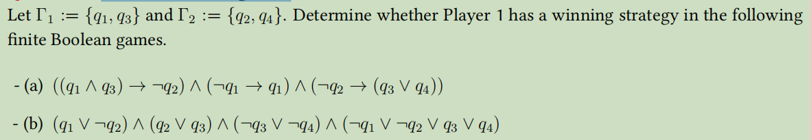

#### (a)

First we give the truth table:

| $q_1$ | $q_2$ | $q_3$ | $q_4$ | $((q_1 ∧ q_3) → ¬q_2) ∧ (¬q_1 → q_1) ∧ (¬q_2 → (q_3 ∨ q_4))$ |
| ----- | ----- | ----- | ----- | ------------------------------------------------------------ |
| 0     | 0     | 0     | 0     | 0                                                            |
| 0     | 0     | 0     | 1     | 0                                                            |
| 0     | 0     | 1     | 0     | 0                                                            |
| 0     | 0     | 1     | 1     | 0                                                            |
| 0     | 1     | 0     | 0     | 0                                                            |
| 0     | 1     | 0     | 1     | 0                                                            |
| 0     | 1     | 1     | 0     | 0                                                            |
| 0     | 1     | 1     | 1     | 0                                                            |
| 1     | 0     | 0     | 0     | 0                                                            |
| 1     | 0     | 0     | 1     | 1                                                            |
| 1     | 0     | 1     | 0     | 1                                                            |
| 1     | 0     | 1     | 1     | 1                                                            |
| 1     | 1     | 0     | 0     | 1                                                            |
| 1     | 1     | 0     | 1     | 1                                                            |
| 1     | 1     | 1     | 0     | 0                                                            |
| 1     | 1     | 1     | 1     | 0                                                            |

It's obvious that Player 1 has to make $q_1=1$ if he wishes to win.

So the winning strategy:

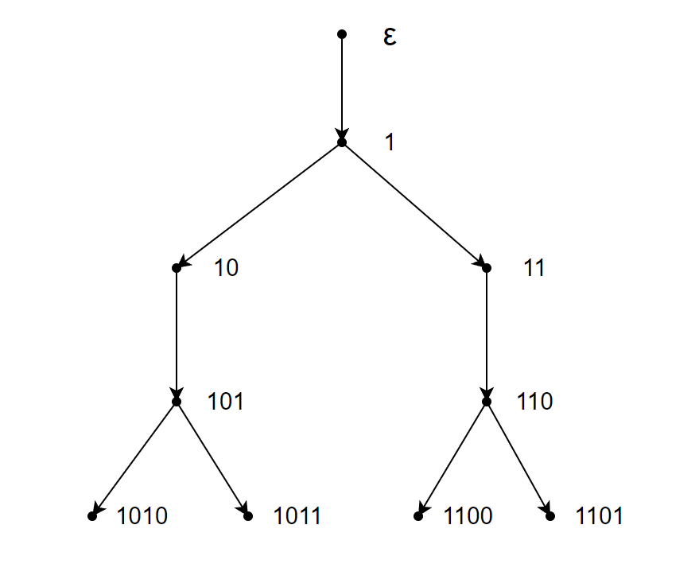

#### (b)

First we give the truth table:

| $q_1$ | $q_2$ | $q_3$ | $q_4$ | $(q_1 ∨ ¬q_2) ∧ (q_2 ∨ q_3) ∧ (¬q_3 ∨ ¬q_4) ∧ (¬q_1 ∨ ¬q_2 ∨ q_3 ∨ q_4)$ |
| ----- | ----- | ----- | ----- | ------------------------------------------------------------ |
| 0     | 0     | 0     | 0     | 0                                                            |
| 0     | 0     | 0     | 1     | 0                                                            |
| 0     | 0     | 1     | 0     | 1                                                            |
| 0     | 0     | 1     | 1     | 0                                                            |
| 0     | 1     | 0     | 0     | 0                                                            |
| 0     | 1     | 0     | 1     | 0                                                            |
| 0     | 1     | 1     | 0     | 0                                                            |
| 0     | 1     | 1     | 1     | 0                                                            |
| 1     | 0     | 0     | 0     | 0                                                            |
| 1     | 0     | 0     | 1     | 0                                                            |
| 1     | 0     | 1     | 0     | 1                                                            |
| 1     | 0     | 1     | 1     | 0                                                            |
| 1     | 1     | 0     | 0     | 0                                                            |
| 1     | 1     | 0     | 1     | 1                                                            |
| 1     | 1     | 1     | 0     | 1                                                            |
| 1     | 1     | 1     | 1     | 0                                                            |

If Player 2 assign $q_2 = 0\ and\ q_4=1$, then no matter what Player 1 do, Player 1 must lose.

So Player 1 doesn't have a winning strategy.

## 6、Infite Boolean games

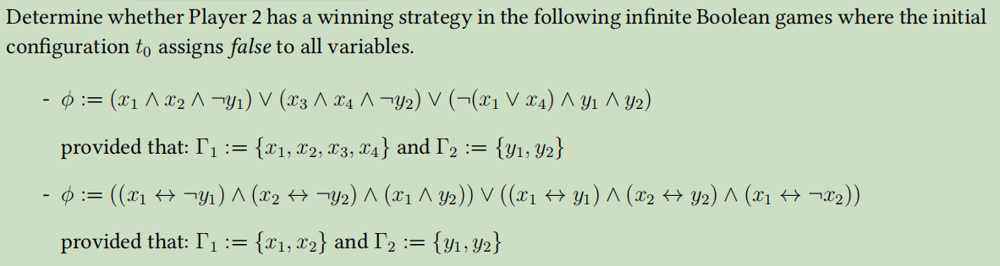

#### **(a)**

There is a winning strategy for Player 1:

- Player 1 assigns $x_2 = \text{True}$ and $x_3 = \text{True}$ in move 1 and move 3 , no matter what Player 2 will do in move 2.
- now discuss the situation of $y_1\ and \ y_2$ after Player 2 assign his move 4.
  - if $y_1 = \text{True}\ and \ y_2 = \text{True}$, then $(\lnot (x_1 \lor x_4) \land y_1 \land y_2) = \text{True}$ and Player 1 wins
  - If $y_1 = \text{False}$, Player 1 assigns $x_1 = \text{True}$ in move 5 and  then $(x_1 \land x_2 \land \lnot y_1) = \text{True}$, so Player 1 wins.
  - If $y_2 = \text{False}$, Player 1 assigns $x_4 = \text{True}$ in move 5 and then $(x_3 \land x_4 \land \lnot y_2) = \text{True}$, so Player 1 wins.

So Player 2 doesn't have a winning strategy.

**(b)**

First we give the truth table:

| $x_1$ | $x_2$ | $y_1$ | $y_2$ | $\left(\left(x_{1} \leftrightarrow \neg y_{1}\right) \wedge\left(x_{2} \leftrightarrow \neg y_{2}\right) \wedge\left(x_{1} \wedge y_{2}\right)\right) \vee\left(\left(x_{1} \leftrightarrow y_{1}\right) \wedge\left(x_{2} \leftrightarrow y_{2}\right) \wedge\left(x_{1} \leftrightarrow \neg x_{2}\right)\right)$ |
| ----- | :---: | ----- | ----- | :----------------------------------------------------------- |
| 0     |   0   | 0     | 0     | 0                                                            |
| 0     |   0   | 0     | 1     | 0                                                            |
| 0     |   0   | 1     | 0     | 0                                                            |
| 0     |   0   | 1     | 1     | 0                                                            |
| 0     |   1   | 0     | 0     | 0                                                            |
| 0     |   1   | 0     | 1     | 1                                                            |
| 0     |   1   | 1     | 0     | 0                                                            |
| 0     |   1   | 1     | 1     | 0                                                            |
| 1     |   0   | 0     | 0     | 0                                                            |
| 1     |   0   | 0     | 1     | 1                                                            |
| 1     |   0   | 1     | 0     | 1                                                            |
| 1     |   0   | 1     | 1     | 0                                                            |
| 1     |   1   | 0     | 0     | 0                                                            |
| 1     |   1   | 0     | 1     | 0                                                            |
| 1     |   1   | 1     | 0     | 0                                                            |
| 1     |   1   | 1     | 1     | 0                                                            |

We find that  $\phi$ must be `False` when $y_1 = 0$ and $y_2 = 0$

As we can see in the tree, Player 2 only need to do nothing(left unchanged) to make sure $y_1 = 0$ and $y_2 = 0$ . No matter what Player 1 do,  $\phi$ will always be `False`

So Player 2 has a winning strategy.

## 7、Variations of IBG

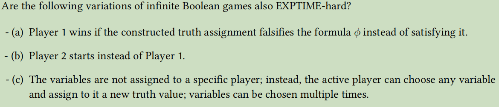

#### **(a)**Yes

This modified $IBG$ is equivalent to the original $IBG$ because we can swap all the `True` and `False` so they can be transformed into each other in polynomial time.

#### **(b)**Yes

Define $m$ to represent the count of different possibilities of Player 2 in his first move. Then $m$ must be a finite number.

##### Algorithm:

Consider the initial $t$ to be the root of tree and all these $m$ possibilities to be $m$ branches. In each branch:

- After Player 2's first move(one of the $m$ possibilities), the configuration $(2,t)$ becomes the configuration $(1,t')$.

- We can know from the original $IBG$ that no matter what initial $t$ is , as soon as Player 1 takes the first move, we can always know whether Player 2 has a winning strategy in EXPTIME-hard.

- Now we assume that the $t'$ to be the initial $t$ and the configuration $(1,t')$ to be initial state, which is saying that we omit the first move of Player 2. Now everything in this branch is equivalent to the original $IBG$ , so it can be solved and return yes or no in EXPTIME-hard.

If all branches return no, then Player 2 doesn't have a winning strategy.

If there is one branch return yes, then Player 2 must have a winning strategy.

##### Time cost

In each branch we need to solve a original $IBG$ which is EXPTIME-hard. There are $m$ branches in total. However, $m$ is a finite number so the total time cost is still EXPTIME-hard.

#### **(c)**No

This problem can be solved in PTIME.

Assume that the initial configuration is $(1,t)$ 

- If the initial $t$ or one of its  $\Gamma_1$-variation satisfies $\phi$, then Player 1 wins.
- If the initial $t$ and all of its  $\Gamma_1$-variation doesn't satisfy $\phi$, then Player 2 can assign the variable exactly what Player 1 assigned to make sure that the current truth assignment $t''$  is exactly the same with the initial $t$. (Specially, if Player 1 do nothing in his first move, then Player 2 only need to do nothing as well.)

In this strategy, we only need to verify all truth values of the initial $t$ and its $\Gamma_1$-variation, which can be solved in PTIME.

## 8、 Complexity of concept satisability in $\mathcal{ALC}$ **extensions**

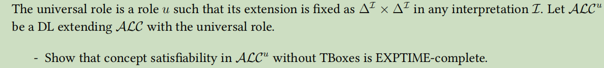

We only need to prove that the satisfifiability in $\mathcal{ALC}^{u}$ without TBoxes has the same complexity as in $\mathcal{ALC}^{}$ , namely ExpTime-complete.

##### (i)First we prove that concept satisfiability in $\mathcal{ALC}^{u}$ without TBoxes is EXPTIME-hard.

We reduce satisfiability of $\mathcal{ALC}$ concepts with respect to general TBoxes. Let $C$ be an $\mathcal{ALC}$ concept and $\mathcal{T}$ a general $\mathcal{ALC}$ TBox.

Construct an $\mathcal{ALC}^{u}$ concept
$$
D_0 = C_0 \sqcap \forall u.(\underset{C \sqsubseteq D \in \mathcal{T}}{\Large \sqcap} \lnot C \sqcup D)
$$
where $u$ is a fresh role name.Then $C_0$ is satisfiable with respect to $\mathcal{T}$ **iff** $D_0$ is satisfiable.

$\Rightarrow (only\  if):$

Let $\mathcal{I}$ be a model of $C_0$ and $\mathcal{T}$, and let $d_0 \in C_0^{\mathcal{I}}$. Modify $\mathcal{I}$ by setting $u^{\mathcal{I}}=\Delta^{\mathcal{I}} \times \Delta^{\mathcal{I}}$ . 

Since $C^{\mathcal{I}} \subseteq D^{\mathcal{I}}$ for all $C \sqsubseteq D \in \mathcal{T}$, we have $\Delta^{\mathcal{I}} \subseteq (\lnot C \sqcup D)^{\mathcal{I}}$ and therefore  $d_0 \in (\forall u.(\underset{C \sqsubseteq D \in \mathcal{T}}{\Large \sqcap} \lnot C \sqcup D))^{\mathcal{I}} = (\forall u.\top)^{\mathcal{I}} = \Delta^{\mathcal{I}}$.

So $\mathcal{I}$ is also a model of $D_0$ .

**$\Leftarrow(if):$**

Let $\mathcal{I}$ be a model of $D_0$, and let $d_0 \in D_0^{\mathcal{I}}$.

Due to the universal rule, forall $d \in D_0^{\mathcal{I}}$ we have $(d_0, d) \in u^{\mathcal{I}}$and therefore $d \in (\underset{C \sqsubseteq D \in \mathcal{T}}{\Large \sqcap} \lnot C \sqcup D)^{\mathcal{I}}$ ,which means forall $d \in C^{\mathcal{I}}$ and $C \sqsubseteq D \in \mathcal{T}$, we have $d \in D^{\mathcal{I}}$ because $d \in (\lnot C \sqcup D)^{\mathcal{I}}$.

So $\mathcal{I}$ is also a model of $C_0$ .

Because satisfiability of $\mathcal{ALC}$ concepts with respect to general TBoxes is EXPTIME-complete, so concept satisfiability in $\mathcal{ALC}^{u}$ without TBoxes is EXPTIME-hard.

##### (ii)Modify the $ALC$-Elim algorithm to $ALC^{u}$-Elim algorithm by only modifying the definition of "bad" of a type:

Let $\Gamma$ be a set of types and $\tau \in \Gamma$. Then $\tau$ is bad in $\Gamma$ if any of these 3 statements is true:(add 1 new rule)

-  $\exists r.C \in \tau$  such that the set $S = \{C\} \cup \{ D| \forall r.D \in \tau \}$ is no subset of any type in $\Gamma$

-  $\exists u.C \in \tau$ such that the set $S' = \{C\} \cup \{ D| \forall u.D \in \tau \}$ is no subset of any type in $\Gamma$;

##### (iii)Then we prove that concept satisfiability in $\mathcal{ALC}^{u}$ without TBoxes has a EXPTIME upper bound.

To analyse the time cost, we only need to prove that $\mathcal{ALC}^{u}-Elim(A_0, T )$= `true` **iff** $A_0$ is satisfifiable with respect to $T$

$\Rightarrow (only\  if):$

Constract a model $\mathcal{I}$ to make the algorithm returns `true`:
$$
\begin{aligned}\Delta^{\mathcal{I}} &= \Gamma_i\\
A^{\mathcal{I}} &= \{{ \tau \in \Gamma_i | A \in \tau \}}\\
r^{\mathcal{I}} &= \{{ (\tau, \tau') \in \Gamma_i \times \Gamma_i | \forall r.C \in \tau \text{ implies } C \in \tau' }\}\end{aligned}
$$
By induction on the structure of  $C$ , we can prove, for all  $C \in \operatorname{sub}(\mathcal{T})$  and all $ \tau \in \Gamma_{i}$ , that $ C \in \tau $ implies $ \tau \in C^{\mathcal{I}}$ . Most cases are straightforward, using the definition of  $\mathcal{I}$  and the induction hypothesis. We only do the case  $C=\exists r . D \ and\ $  $C = \exists u.D$  explicitly:

- Let  $\exists r . C \in \tau$ . Since  $\tau$  has not been eliminated from  $\Gamma_{i}$ , it is not bad. 

  Thus, there is a  $\tau^{\prime} \in \Gamma_{i}$  such that
  $$
  \{C\} \cup\{D \mid \forall r . D \in \tau\} \subseteq \tau^{\prime} .
  $$
  By definition of $ \mathcal{I}$ , we have $ \left(\tau, \tau^{\prime}\right) \in r^{\mathcal{I}}$ . Since $ \tau^{\prime} \in C^{\mathcal{I}}$  by induction hypothesis, we obtain $ \tau \in(\exists r . C)^{\mathcal{I}} $ by the semantics.

- Let  $\exists u . C \in \tau$ . Since  $\tau$  has not been eliminated from  $\Gamma_{i}$ , it is not bad. 

  Thus, there is a  $\tau^{\prime} \in \Gamma_{i}$  such that
  $$
  \{C\} \cup\{D \mid \forall u . D \in \tau\} \subseteq \tau^{\prime} .
  $$
  By definition of $ \mathcal{I}$ , we have $ \left(\tau, \tau^{\prime}\right) \in u^{\mathcal{I}}$ . Since $ \tau^{\prime} \in C^{\mathcal{I}}$  by induction hypothesis, we obtain $ \tau \in(\exists u . C)^{\mathcal{I}} $ by the semantics.

  

  

$\Leftarrow(if):$

If  $A_{0} $ is satisfiable with respect to  $\mathcal{T}$ , then there is a model $ \mathcal{I}$  of $ A_{0}$  and  $\mathcal{T}$ . Let $ d_{0} \in A_{0}^{\mathcal{I}} $. For all $d \in \Delta^{\mathcal{I}}$, set
$$
\operatorname{tp}(d) = \{ C \in \operatorname{sub}(\mathcal{T}) | d \in C^{\mathcal{I}} \}
$$
Define $\Psi = \{ \operatorname{tp}(d) | d \in \Delta^{\mathcal{I}} \}$ and let  $\Gamma_0, \Gamma_1, \cdots, \Gamma_{k}$ be the sequence of type sets computed by $\mathcal{ALC}^{u}-Elim(A_0, T )$. It is possible to prove by induction on $i$ that no type from $\Psi$ is ever eliminated from any set $\Gamma_i$, for $i \le k$. So the algorithm return `true`.

This finishes the proof of the upper bound.

From **(i), (ii), (iii)** , we know that the concept satisfiability in $\mathcal{ALC}^{u}$ without TBoxes is EXPTIME-complete.

## 9、**Tree model property in** *$\mathcal{ALC}$* extensions

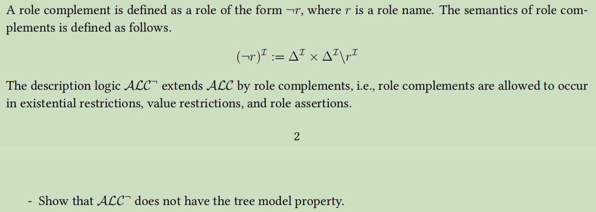

##### Counter example:

Let $ALC^{\lnot}$ concept $C \ w.r.t.\ \mathcal{T}  :=  \{ \exists \neg r . C \sqsubseteq \perp, \exists r . \neg C \sqsubseteq \perp, C \sqsubseteq \exists \neg r . \neg C\}$

- First inclusion implies all elements should have relation r with all elements in  $C$ .

- Second inclusion implies no element has relation r with the element in  $\neg C$ .
- Third inclusion implies $ \neg C$  should not be interpretated as empty, otherwise $C \sqsubseteq\empty$

So all model $I$ of $C\ w.r.t.\ \mathcal{T}$ should be look like this:

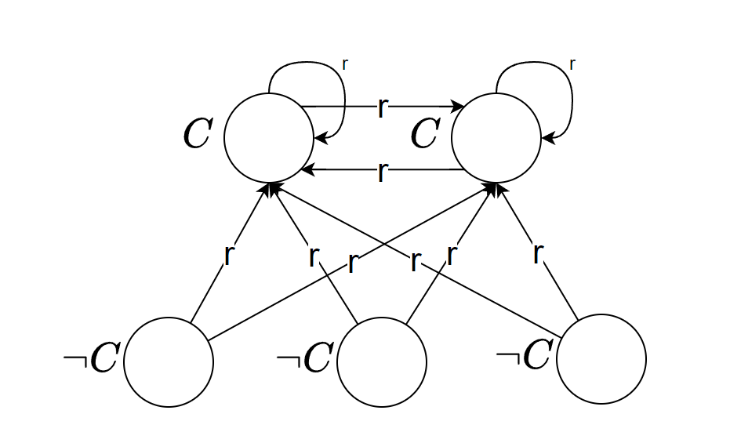

A tree model of $C$ should contain all elements and a unique root node of $C$, but we can not find a proper root node of $C$ in this counter example.

So even though  $C$ is satisfiable w.r.t. $\mathcal{T}$,  $C$ doesn't have a tree model.

So $ALC^{\lnot}$ does not have the tree model property.

## 11、Pushdown automata

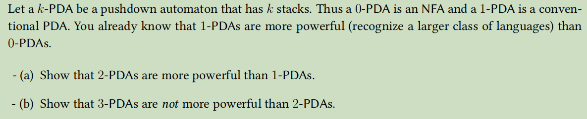

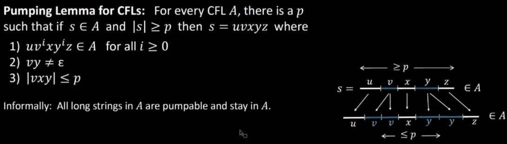

#### (a)

$1-PDAs$ is equivalent in power to context-free grammars.

We only need to prove that there exists a non-context-free languages which can be recognized by $2-PDAs$ 

##### example:

$\text { Let } D=\left\{0^{k} 1^{k}2^{k} \mid k \geq 0\right\}$

##### (i)use `Pumping Lemma for CFLs` to prove D is non-context-free by contradiction

Asumme that D is context-free. Let $s=0^i1^i2^i\in D\ ,\ 2i\le p\ ,\ 3i\ge p$

Pumping lemma says that can divide $𝑠 = uv𝑥𝑦𝑧$ satisfying the 3 conditions.(Shown in the graph)

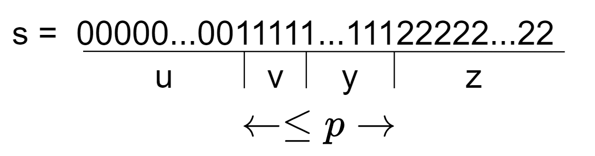

But $uvvyz$ has excess 1s and thus $uvvyz ∉ 𝐷$ contradicting the pumping lemma.

Therefore our assumption is false. We conclude that 𝐷 is non-context-free.

##### (ii)$D$ can be recognized by $2-PDAs$ 

1. Read 0s from input, push onto stack1 until read 1.
2. Read 1s from input, push onto stack2 until read 2.
3. Read 2s from input, while poping 0s from stack1 and poping 1s from stack2.
4. Enter accept state if stack is empty. (note: acceptance only at end of input)

So there exists non-context-free languages can be recognized by $2-PDAs$ which means $2-PDAs$ is more powerful than $1-PDAs$

#### (b)

##### (i)Simulate tape of TM using 2 stacks. 

Top of first stack is the position of head of TM. 

Simulate $\delta(q, \alpha)=(r, \beta, R) $  as follows:

- Pop the symbol $ \alpha$ in state $q$ from the top of $1^{st}$ stack and push the symbol  $\beta$  in its place.
- Move symbol from top of $2^{nd}$ stack to the top of $1^{st}$ (by first popping from $2^{nd}$ stack, remembering the symbol in state, and pushing it back to $1^{st}$ stack; if $2^{nd}$ stack is empty, we push blank symbol $ \sqcup$  to $1^{st}$ stack)and go to state  $r$ . 
- Move to left side means popping $ \alpha$  from $1^{st}$ stack and pushing  $\beta$  to $2^{nd}$ stack. (If $1^{st}$ stack would become empty, then pushing is done to $1^{st}$ stack.)

This proves that $ 2-PDA$ is at least as powerful as $TM$. 

##### (ii)Prove that $2-PDA$ is not more powerful than $TM$

Turing machine can easily simulate  $k -PDAs, \forall  k \geq 1$ , by using  k -tapes.  $i ^{th}$ tape is then a copy of string on $i ^{th}$ stack, and head is always looking at the top of stack. Since multitape $TM's$ are equivalent to ordinary ones, we conclude that Turing machine is at least as powerful as  $k -PDA$. So $\forall   k \geq 2,k -PDAs$  are equivalent in power of $TM's$.

So we prove that  $\forall   k \geq 2,k -PDAs$  are not more powerful than $2-PDA$

## 12、Turing machine

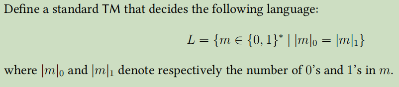

$M_1$ = On input string $m$:

1. Scan the input from left to right to determine whether it is a member of $\{0,1\}^*$ and ` reject` if it isn’t.
2. Return the head to the left-hand end of the tape. If the tape contains nothing, `accept`. Otherwise, scan to the right until a $0$ occurs and cross it off.  But if no $0$ can be found, `reject`.
3. Return the head to the left-hand end of the tape. Scan to the right until a $1$ occurs and cross it off. But if no $1$ can be found, `reject`.
4. Repeat stage 2 and stage 3 until `accept` or `reject`.

## 13、Decidability

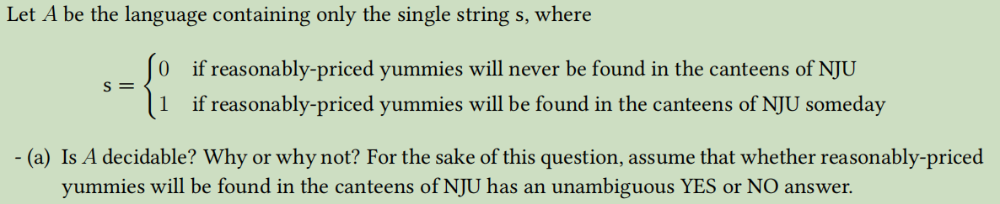

There are only 2 possibilities for set  A  : either  \{0\}  or  \{1\} , which are both finite sets and hence decidable.

Its decider should be: 

- Match the input string with the only string  $s$ in language
- Accept iff they match, and reject otherwise

Therefore, even though I unfortunately don't know whether there will be reasonably-priced yummies in the canteens of NJU someday, the language  A  is decidable.