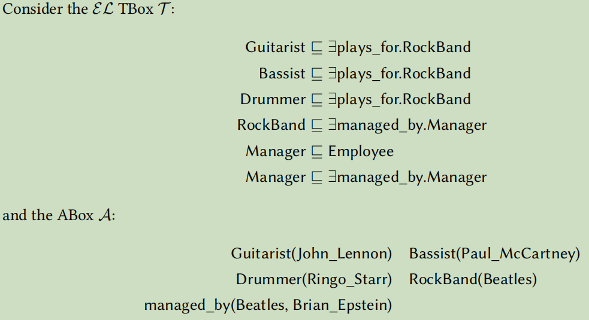

## 一、OWA & CWA


#### (1)DL to FOL

(a)$Album(Fantasy)$
$$
Album(Fantasy)
$$
(f)$\neg \text { StudioAlbum } \sqcup \neg \text { LiveAlbum(2004\_Incomparable\_Concert) }$
$$
\neg \text { StudioAlbum(2004\_Incomparable\_Concert) } \vee \neg \text { LiveAlbum(2004\_Incomparable\_Concert) })
$$
(h)$\exists \text { hasFriend. T(Jay\_Chou) }$
$$
\exists y. hasFriend(Jay\_Chou,y)
$$
(i)$\exists \text { hasFriend. } \exists \text { dancesWith.Song(Jay\_Chou) }$
$$
\exists y\exists z. (hasFriend(Jay\_Chou,y)\wedge dancesWith(y,z)\wedge Song(z))
$$
(k)$\exists \text { hasFriend.\{Jay\_Chou }\} \text { (Vincent\_Fang) }$<font color='blue'>多个取值怎么表示？</font>
$$
hasFriend(Vincent\_Fang,Jay\_Chou)
$$


#### (2)Boolean-CWA

(a)NO	 $Album(Fantasy)$
(b)Yes	$StudioAlbum(The\_Eight\_Dimensions)$
(c)No	$LiveAlbum(Common\_Jasmin\_Orange)$
(d)Yes	$ \neg  LiveAlbum(Common\_Jasmin\_Orange)$
(e)Yes	$\neg \mathrm{EP}  (secret)$
(f)Yes	$ \neg  StudioAlbum  \sqcup \neg  LiveAlbum(2004\_Incomparable\_Concert)$

(g)Yes	$ \neg  StudioAlbum  \sqcup \neg  LiveAlbum(Eason\_Chan)$

(h)Yes	$\exists \text { hasFriend. T(Jay\_Chou) }$

(i)Yes	$ \exists  hasFriend.  \exists  dancesWith.Song(Jay\_Chou)$
(j)No	$\exists  hasFriend.Composer(Jay\_Chou)$
(k)No	$ \exists hasFriend.\{Jay\_Chou  \}  (Vincent\_Fang)$
(l)No	$ DebutAlbum(2004\_Incomparable\_Concert)$
(m)No	 $Song(Rewind)$
(n)Yes	$ Singer(Jay\_Chou)$
(o)No	 $Singer(Jolin\_Tsai)$
(p)No	$ Lyricist(Jay\_Chou)$
(q)Yes	 $Composer(Jay\_Chou)$
(r)No	 $Composer(Ta-yu\_Lo)$
(s)No	 $Police(Jay\_Chou)$
(t)No	 $Police(Jolin\_Tsai)$
(u)Yes	 $ \neg  Singer-SongWriter  \sqcup \neg  Police(Vincent\_Fang)$
(v)Yes	  $\neg  Singer-SongWriter  \sqcup \neg  Police(Ta-yu\_Lo)$
(w)No	 $Singer-SongWriter(Jay\_Chou)$
(x)No	$ Singer-SongWriter(Jolin\_Tsai)$
(y)Yes<font color='red'>no</font>	  $\neg  SongWriter(Vincent\_Fang)$
(z)Yes<font color='red'>no</font>	 $\neg  Dancer(Will\_Liu)$


#### (3)Boolean-OWA

(a)Don't know	 $Album(Fantasy)$
(b)Yes					$StudioAlbum(The\_Eight\_Dimensions)$
(c)Don't know	$LiveAlbum(Common\_Jasmin\_Orange)$
(d)Don't know	$ \neg  LiveAlbum(Common\_Jasmin\_Orange)$
(e)Don't know	$\neg \mathrm{EP}  (secret)$
(f)Don't know	$ \neg  StudioAlbum  \sqcup \neg  LiveAlbum(2004\_Incomparable\_Concert)$

(g)Don't know	$ \neg  StudioAlbum  \sqcup \neg  LiveAlbum(Eason\_Chan)$

(h)Yes				$\exists \text { hasFriend. T(Jay\_Chou) }$

(i)Yes				$ \exists  hasFriend.  \exists  dancesWith.Song(Jay\_Chou)$
(j)Don't know	$\exists  hasFriend.Composer(Jay\_Chou)$
(k)Don't know	$ \exists hasFriend.\{Jay\_Chou  \}  (Vincent\_Fang)$
(l)Don't know	$ DebutAlbum(2004\_Incomparable\_Concert)$
(m)Don't know	 $Song(Rewind)$
(n)Yes					$ Singer(Jay\_Chou)$
(o<font color='red'>)Don't know</font>	 $Singer(Jolin\_Tsai)$
(p)Don't know	$ Lyricist(Jay\_Chou)$
(q)Yes					 $Composer(Jay\_Chou)$
(r)Don't know	 $Composer(Ta-yu\_Lo)$
(s)Don't know	 $Police(Jay\_Chou)$
(t)<font color='red'>Don't know</font>	 $Police(Jolin\_Tsai)$
(u)Don't know	 $ \neg  Singer-SongWriter  \sqcup \neg  Police(Vincent\_Fang)$
(v)Don't know	  $\neg  Singer-SongWriter  \sqcup \neg  Police(Ta-yu\_Lo)$
(w)Don't know	 $Singer-SongWriter(Jay\_Chou)$
(x)Don't know	$ Singer-SongWriter(Jolin\_Tsai)$
(y)Don't know	  $\neg  SongWriter(Vincent\_Fang)$
(z)Don't know	 $\neg  Dancer(Will\_Liu)$


#### (4)non-Boolean-CWA

$answer(F_1,D_{music})=\{Jay\_Chou,Eason\_Chan\}$

$answer(F_2,D_{music})=Ind(D_{music})/\{Jay\_Chou,Eason\_Chan\}$

$answer(F_3,D_{music})=\{(Jay\_Chou, Vincent\_Fang),(Jay\_Chou, Will\_Liu)\}$

$answer(F_4,D_{music})=\{Vincent\_Fang\}$

#### (5)non-Boolean-OWA

$certanswer(F_1,D_{music})=\{Jay\_Chou,Eason\_Chan\}$

$certanswer(F_2,D_{music})=\empty$

$certanswer(F_3,D_{music})=\{(Jay\_Chou, Vincent\_Fang),(Jay\_Chou, Will\_Liu)\}$

$certanswer(F_4,D_{music})=\empty$<font color='red'>，错，和CWA一样？</font>


## 二、**Querying with TBox**


#### (1)

<font color='red'>注意陷阱</font>

(a)Yes	 $Album(Fantasy)$
(b)Yes	$StudioAlbum(The\_Eight\_Dimensions)$
(c)No	$LiveAlbum(Common\_Jasmin\_Orange)$
(d)Yes	$ \neg  LiveAlbum(Common\_Jasmin\_Orange)$
(e)<font color='red'>Don't know</font>	$\neg \mathrm{EP}  (secret)$
(f)Yes	$ \neg  StudioAlbum  \sqcup \neg  LiveAlbum(2004\_Incomparable\_Concert)$

(g)<font color='red'>Yes</font>	$ \neg  StudioAlbum  \sqcup \neg  LiveAlbum(Eason\_Chan)$

(h)Yes	$\exists \text { hasFriend. T(Jay\_Chou) }$

(i)Yes	$ \exists  hasFriend.  \exists  dancesWith.Song(Jay\_Chou)$
(j)Don't know	$\exists  hasFriend.Composer(Jay\_Chou)$
(k)Don't know	$ \exists hasFriend.\{Jay\_Chou  \}  (Vincent\_Fang)$
(l)No	$ DebutAlbum(2004\_Incomparable\_Concert)$
(m)Yes	 $Song(Rewind)$
(n)Yes	$ Singer(Jay\_Chou)$
(o)Don't know	 $Singer(Jolin\_Tsai)$
(p)Yes	$ Lyricist(Jay\_Chou)$
(q)Yes	 $Composer(Jay\_Chou)$
(r)Don't know	 $Composer(Ta-yu\_Lo)$
(s)No<font color='red'>Don't know</font>	 $Police(Jay\_Chou)$
(t)Don't know	 $Police(Jolin\_Tsai)$
(u)Don't know<font color='red'>Yes</font>	 $ \neg  Singer-SongWriter  \sqcup \neg  Police(Vincent\_Fang)$
(v)Don't know<font color='red'>Yes</font>	  $\neg  Singer-SongWriter  \sqcup \neg  Police(Ta-yu\_Lo)$
(w)Don't know<font color='red'>Yes</font>	 $Singer-SongWriter(Jay\_Chou)$
(x)Don't know	$ Singer-SongWriter(Jolin\_Tsai)$
(y)Don't know	  $\neg  SongWriter(Vincent\_Fang)$
(z)Don't know	 $\neg  Dancer(Will\_Liu)$


#### (2)

Find all assertions that after rendering them and they can still be reasoned by remaining assertions:

$Singer(Jay\_Chou)$

$ Lyricist(Vincent\_Fang)$

$Song(Herbalist\_Manual) $

$Song(Elimination)$


## 三、$\text { Computing } \mathcal{I}_{\mathcal{T}, \mathcal{A}} \text { in } \mathcal{E} \mathcal{L}$



#### (1)Compute $\mathcal{I}_{\mathcal{T},\mathcal{A}}$

**initial assignment:**<font color='red'>初始为空的r关系也要给个初始化空集</font>
$$
\begin{aligned}
S(d_{Guitarist})&=\{Guitarist\}\\
S(d_{Bassist})&=\{Bassist\}\\
S(d_{Drummer})&=\{Drummer\}\\
S(d_{RockBand})&=\{RockBand\}\\
S(d_{Manager})&=\{Manager\}\\
S(d_{Employee})&=\{Employee\}\\
R(managed\_by)&=\{(Beatles,Brain\_Epstein)\}\\
S(John\_Lennon)&=\{Guitarist\}\\
S(Paul\_McCartney)&=\{Bassist\}\\
S(Ringo\_starr)&=\{Drummer\}\\
S(Beatles)&=\{RockBand\}\\
S(Brain\_Epstein)&=\empty\\
R(plays\_for)&=\empty
\end{aligned}
$$
**applications of (simpleR),(rightR):**

- Update $S$ using (simpleR):
  $$
  S(d_{Manager})=\{Manager,Employee\}
  $$

- Update $R$ using (rightR):
  $$
  R(plays\_for)=\{(d_{Guitarist},d_{RockBand}),(d_{Bassist},d_{RockBand}),(d_{Drummer},d_{RockBand})\}
  $$

- Update $R$ using (rightR):
  $$
  R(managed\_by)=\{(Beatles,Brain\_Epstein),(d_{RockBand},d_{Manager}),(d_{Manager},d_{Manager})\}
  $$
  
- Update $R$ using (rightR):
  $$
  R(plays\_for)=\{(d_{Guitarist},d_{RockBand}),(d_{Bassist},d_{RockBand}),(d_{Drummer},d_{RockBand})\\,(John\_Lennon,d_{RockBand}),(Paul\_McCartney,d_{RockBand}),(Ringo\_starr,d_{RockBand})\}
  $$

- Update $R$ using (rightR):

$$
R(managed\_by)=\{(Beatles,Brain\_Epstein),(d_{RockBand},d_{Manager}),(d_{Manager},d_{Manager}),(Beatles,d_{Manager})\}
$$

**So final assignment:**
$$
\begin{aligned}
S(d_{Guitarist})&=\{Guitarist\}\\
S(d_{Bassist})&=\{Bassist\}\\
S(d_{Drummer})&=\{Drummer\}\\
S(d_{RockBand})&=\{RockBand\}\\
S(d_{Manager})&=\{Manager,Employee\}\\
S(d_{Employee})&=\{Employee\}\\
R(managed\_by)&=\{(Beatles,Brain\_Epstein),(d_{RockBand},d_{Manager}),(d_{Manager},d_{Manager}),(Beatles,d_{Manager})\}\\
R(plays\_for)&=\{(d_{Guitarist},d_{RockBand}),(d_{Bassist},d_{RockBand}),(d_{Drummer},d_{RockBand})\\&,(John\_Lennon,d_{RockBand}),(Paul\_McCartney,d_{RockBand}),(Ringo\_starr,d_{RockBand})\}\\
S(John\_Lennon)&=\{Guitarist\}\\
S(Paul\_McCartney)&=\{Bassist\}\\
S(Ringo\_starr)&=\{Drummer\}\\
S(Beatles)&=\{RockBand\}\\
S(Brain\_Epstein)&=\empty\\
\end{aligned}
$$
 $\mathcal{I}_{\mathcal{T},\mathcal{A}}$：

- $\Delta_{\mathcal{T},\mathcal{A}}^\mathcal{I}=\{d_{Guitarist},d_{Bassist},d_{Drummer},d_{RockBand},d_{Manager},d_{Employee}$

  ​				$,John\_Lennon,Paul\_McCartney,Ringo\_starr,Beatles,Brain\_Epstein\}$

- $Guitarist^{\mathcal{I}_{\mathcal{T},\mathcal{A}}}=\{d_{Guitarist},John\_Lennon\}$

- $Bassist^{\mathcal{I}_{\mathcal{T},\mathcal{A}}}=\{d_{Bassist},Paul\_McCartney\}$

- $Drummer^{\mathcal{I}_{\mathcal{T},\mathcal{A}}}=\{d_{Drummer},Ringo\_starr\}$

- $RockBand^{\mathcal{I}_{\mathcal{T},\mathcal{A}}}=\{d_{RockBand},Beatles\}$

- $Manager^{\mathcal{I}_{\mathcal{T},\mathcal{A}}}=\{d_{Manager}\}$

- $Employee^{\mathcal{I}_{\mathcal{T},\mathcal{A}}}=\{d_{Employee},d_{Manager}\}$

- $plays\_for^{\mathcal{I}_{\mathcal{T},\mathcal{A}}}=\{(d_{Guitarist},d_{RockBand}),(d_{Bassist},d_{RockBand}),(d_{Drummer},d_{RockBand})$

  ​									$,(John\_Lennon,d_{RockBand}),(Paul\_McCartney,d_{RockBand}),(Ringo\_starr,d_{RockBand})\}$

- $managed\_by^{\mathcal{I}_{\mathcal{T},\mathcal{A}}}=\{(Beatles,Brain\_Epstein),(d_{RockBand},d_{Manager}),(d_{Manager},d_{Manager}),(Beatles,d_{Manager})\}$


#### (2)

- Yes

- Don't know（$(\mathcal{T}, \mathcal{A}) \text { doesn't give the certain answer "Yes" }$）

  <font color='red'>answer:</font>$(\mathcal{T}, \mathcal{A})  Don't\  know,\ {\mathcal{I}_{\mathcal{T},\mathcal{A}}}\ No$

- Yes


#### (3)

<font color='red'>answer</font>


$-\ \ F(x, y)=\exists z \cdot(\text { plays\_for }(x, z) \wedge \text { plays\_for }(y, z))$

​	Both $\mathcal{I}_{\mathcal{T},\mathcal{A}}$ and $({\mathcal{T},\mathcal{A}})$ give the certain answer:

$certanswer(F(x,y),\mathcal{I}_{\mathcal{T},\mathcal{A}})=\{(John\_Lennon,Paul\_McCartney),(John\_Lennon,Ringo\_starr),(Paul\_McCartney,Ringo\_starr)$

​						$,(Paul\_McCartney,John\_Lennon),(Ringo\_starr,John\_Lennon),(Ringo\_starr,Paul\_McCartney)$

​						$,(John\_Lennon,John\_Lennon),(Paul\_McCartney,Paul\_McCartney),(Ringo\_starr,Ringo\_starr)\}$

$certanswer(F(x,y),({\mathcal{T},\mathcal{A}}))=\{(John\_Lennon,John\_Lennon),(Paul\_McCartney,Paul\_McCartney),(Ringo\_starr,Ringo\_starr)\}$


$-\ \ F=\exists x . \text { managed\_by }(x, x)$

​	The certain answer to **F** in $(\mathcal{T},\mathcal{A})$ is `Don't know`

​	But if we modify the $\mathcal{I}_{\mathcal{T},\mathcal{A}}$ computed in **(1)** by adding:
$$
Manager^{\mathcal{I}_{\mathcal{T},\mathcal{A}}}=\{d_{Manager},some\_manageer\}
$$
​	Then $\mathcal{I}_{\mathcal{T},\mathcal{A}}$ can give the answer "Yes" enen if $({\mathcal{T},\mathcal{A}})$ does not give the certain answer "Yes"

## 四、Conjunctive queries


#### (1)Interpretation

- $\Delta^{\mathcal{I}_\mathcal{D}}=\{2001,2002,2003,2004,30000160,30000170,30000180,2020,2021$

  ​				$,Jay\_Chou,Jolin\_Tsai,Stefanie\_Sun,Ta-yu\_Lo,KR\&P,PR\&CV,NLP\}$

- $Person\_ID^{\mathcal{I}_\mathcal{D}}=\{2001,2002,2003,2004\}$

- $Enrollment\_StedentID^{\mathcal{I}_\mathcal{D}}=\{2002,2003,2004\}$

- $Attendance\_StedentID^{\mathcal{I}_\mathcal{D}}=\{2001,2002,2003\}$

- $Course\_ID^{\mathcal{I}_\mathcal{D}}=\{30000160,30000170,30000180\}$

- $Name^{\mathcal{I}_\mathcal{D}}=\{Jay\_Chou,Jolin\_Tsai,Stefanie\_Sun,Ta-yu\_Lo\}$

- $Since^{\mathcal{I}_\mathcal{D}}=\{2020,2021\}$

- $Title^{\mathcal{I}_\mathcal{D}}=\{KR\&P,PR\&CV,NLP\}$

- $Person\_{Nmae}^{\mathcal{I}_\mathcal{D}}=\{(2001,Jay\_Chou),(2002,Jolin\_Tsai),(2003,Stefanie\_Sun),(2004,Ta-yu\_Lo)\}$

- $Enrollment\_Since^{\mathcal{I}_\mathcal{D}}=\{(2002,2020),(2003,2021),(2004,2020)\}$

- $Attendence\_Course^{\mathcal{I}_\mathcal{D}}=\{(2001,30000160),(2002,30000160),(2002,30000170),(2003,30000180)\}$

- $Course\_Title^{\mathcal{I}_\mathcal{D}}=\{(30000160,KR\&P),(30000180,PR\&CV),(30000170,NLP)\}$


#### (2)Reformulate SQL queries into first-order queries

##### 	(a)yes

$$
f_Q((x,y))=Person\_Name(x,y)
$$


##### 	(b)yes

$$
f_Q(x)=\exists y\exists z.(Person\_Name(y,x)\wedge Attendence\_Course(y,z)\wedge Course\_Title(z,KR\&P))
$$


##### 	(c)no

$$
f_Q(x)=\exists y\exists z.(Person\_Name(y,x)\wedge Enrollment\_Since(y,z))\wedge \forall w\neg Attendence\_Course(y,w))
$$


#### (3)Answer

$\text { Answer } Q \text { in the context of } \mathcal{D} \text { and  answer } f_{Q} \text { in the context of } I_{\mathcal{D}} are always the same $

##### 	(a)

$$
f_Q((x,y))=\{(2001,Jay\_Chou),(2002,Jolin\_Tsai),(2003,Stefanie\_Sun),(2004,Ta-yu\_Lo)\}
$$

##### 	(b)

$$
f_Q(x)=\{Jay\_Chou,Jolin\_Tsai\}
$$

##### 	(c)

$$
f_Q(x)=\{Ta-yu\_Lo\}
$$


## 五、Conjunctive queries in different contexts


#### (1)ABox only

##### 	(a)$\emptyset$

##### 	(b)$\emptyset$

##### 	(c)Yes 

##### 	(d)$\emptyset$


#### (2)ABox + TBox(Rewriting)

First we append the $ABox$ by reasoning $\{X \sqsubseteq Y, Y \sqsubseteq \exists r . X, X \sqsubseteq \forall r . Y, \forall r . X \sqsubseteq Y, W \equiv \neg V, \exists r . Y \sqsubseteq \neg V\}$:

- From $X \sqsubseteq Y$ we know:	$\{Stefanie\_Sun:Y\}$

- From $X \sqsubseteq \forall r . Y$ we know:	$\{Jay\_Chou:Y\}$

- From $Y \sqsubseteq \exists r . X$ we know:	$\{(Jay\_Chou,d_X):r\}$<font color='cornflowerblue'>这里用dx比较好</font>

- From $ W \equiv \neg Vand\  \exists r . Y \sqsubseteq \neg V$ we know:	$\{Stefanie\_Sun,Jolin\_Tsai\}:W$

  

##### 	(a)$\{(Stefanie\_Sun,Stefanie\_Sun),(Jolin\_Tsai,Stefanie\_Sun),(Stefanie\_Sun,Jay\_Chou)\}$


##### 	(b)$\{Stefanie\_Sun,Jolin\_Tsai\}$


##### 	(c)Yes


##### 	(d)

$$
\{(Jay\_Chou, Jolin\_Tsai) , (Jolin\_Tsai, Stefanie\_Sun) , (Stefanie\_Sun, Jay\_Chou),\\
(Jolin\_Tsai,Jolin\_Tsai),(Stefanie,Stefanie)\}
$$


## 六、Simpleness of ABox


No, this doesn't affect the data complexity results.

The data complexity of OMQA query entailment may vary considerably in these 3 possibilities:

##### (i)Prove ontology-mediated querying in DL-Lite is always in $AC^0$ in data complexity:

Because the inputs are identical and the “yes”-inputs also coincide, we can neglect representational differences between an $ABox \mathcal{A}$ and the corresponding interpretationl $\mathcal{I}_\mathcal{A}$ .

We can reduce it to entailment of their FO-rewriting  $q_\mathcal{T}$.

DL-Lite are FO-reducible and FO-reducibility implies a data complexity in $AC^0$ for query answering, and thus in particular tractability w.rt. data complexity

Therefore ontology-mediated querying in DL-Lite is always in complexity class $AC^0$ (below LogSpace and PTime) in data complexity.

##### (ii)Prove ontology-mediated querying in $\mathcal{EL}$ remains in data complexity: 

Note that the exponential size of $q_\mathcal{T}$ is irrelevant since $q_\mathcal{T}$ is fixed and not an input. By utilising the PTime data complexity of Datalog query entailment,  we can derive from the rewritings that conjunctive queries entailment in  $\mathcal{EL}$  is in PTime-complete regarding data complexity. 

Arbitrary ABox will not change the complexity in LogSpace-reduction of path system accessibility, which suggests that ontology-mediated querying in $\mathcal{EL}$ remains P-complete.

##### (iii)Prove ontology-mediated querying in $\mathcal{ALC}$ remains in data complexity: 

The data complexity result remains coNP-complete in $\mathcal{ALC}$  because we can still use tableau algorithm to solve the problem. 

Questions like non-3-colorability can be reduced into $\mathcal{ALC}$ by the same way with simple ABoxes.


## 七、k-colorability


#### No, but it's possible when k is fixed

**proof:**

- If k is not fixed, the answer is not possible. This is because we have to assume that TBox and the query are constant.

- If k is fixed. Then whether it's possible or not depends on the value of k:


##### (i)$k=1$:no

The graph is totally disconnected that every single vertice is isolated. So it can be identified in PTime.

So it's not possible.


##### (ii)$k=2$:no

All vertices are divided into 2 different subset and any 2 of them have relatiion $E$ iff they are in different subset.

Therefore solving this CQ-entailment is equvalent to deciding whether graph $G=(\boldsymbol{W}, \boldsymbol{E})$ is a bipartite graph.

So we gives the deciding algorithm for bipartite graph:

```c
is_bipartite(G):
for (each u in W)//..............................................O(|W|)
  u.color = WHITE, u.d = INF//Record the parity of 'u.d' to decide which subset u belongs to 
for (each u in W)//..............................................O(|W|)
  if (u.color== WHITE)//WHITE vertice has not been used
    u.color = GRAY, u.d = 0
    Q.enque(u)//Q is a stack
    while (!Q.empty())
       v = Q.dequeue()
       v.color = BLACK
       for (each edge (v,w) in E)//.........................O（|E|）in all circulation in total
        	if((w.d+v.d)%2==0)
            	return false
        	else if (w.color == WHITE)
          		w.color = GRAY
          		w.d = v.d+1
          		Q.enque(w)
return true      
```

This algorithm ends in $O(|W|+|E|)$, which is PTime.

So it's not possible.


##### (iii)$k\ge3$:yes

Assume  $G=(\boldsymbol{W}, \boldsymbol{E})$  is given and k is fixed, construction as follows:

Construct the ABox  $\mathcal{A}_{G} $ by taking a role name  $r$  and setting:

-  $r(a, b) \in \mathcal{A}$  for all$  a, b \in W$  with$  (a, b) \in E $

Construct the  $\mathcal{A L C}$  TBox  $\mathcal{T}_{C}$  by taking concept names $Color_1,Color_2 \cdots,Color_k$ and $Clash$ taking the inclusions:

-  $\top \sqsubseteq   {\bigsqcup}_{i=1}^k Color_i  $

-  $Color_i \sqcap \exists r .Color_i \sqsubseteq Clash, \text { for all } i $

Let  $F=\exists x  Clash  (x)$. Then $ \left(\mathcal{T}_{C}, \mathcal{A}_{G}\right) \models F $  iff,  $G$  is not k -colorable.

Because 3-colorability is NP-complete, thus k-colorability is also NP-complete. 

So we can know that the problem of CQ-entailment is coNP-hard w.r.t data complexity in $\mathcal{ALC}$
