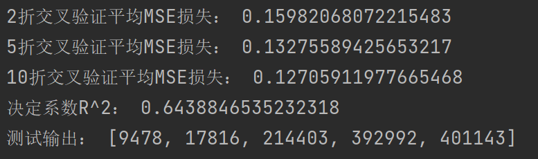
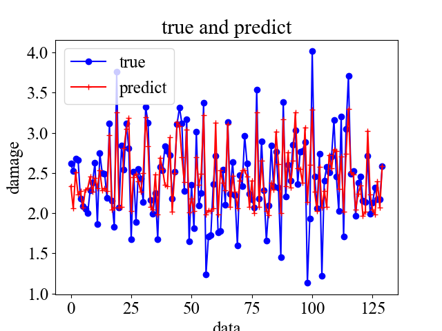
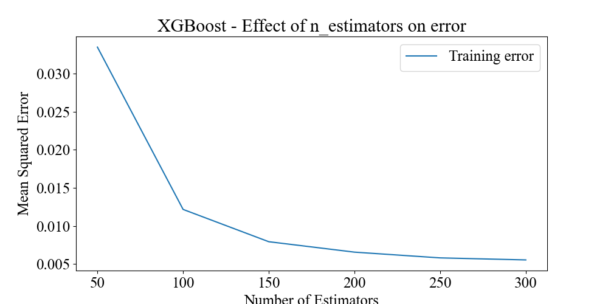
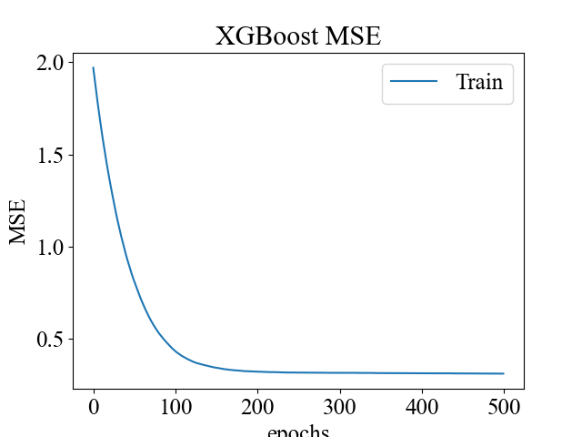
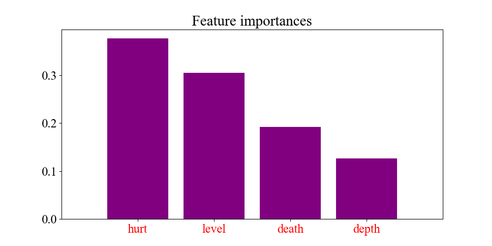

## 使用XGBoost建立地震损失回归模型

#### 一、任务描述

使用地震的level,death,hurt,depth四个属性，对damage进行回归


#### 二、最优模型

```python
# 使用xgboost方法进行回归任务
xgb = XGBRegressor(random_state=42, n_jobs=-1, learning_rate=0.02, n_estimators=500, max_depth=4,min_child_weight= 9, subsample=0.6,colsample_bytree=1,gamma=0.5,reg_alpha=0.2,reg_lambda=0.4)

#训练使用早停机制
clf.fit(train_features, train_labels, eval_metric="rmse", eval_set=eval_set, early_stopping_rounds=20)
```

模型效果：

> 折数越大，MSE越小



{:height="50%" width="10%"}

#### 三、结果分析

- XGBoost相比GDBT多了预剪枝和后剪枝，而且可以在特征级别上并行
- XGBoost在训练时就可以使用交叉验证进行早停，Adaboost不行


- 基学习器数量对MSE的影响：



- 训练轮数对MSE影响



- 变量重要性分析：


