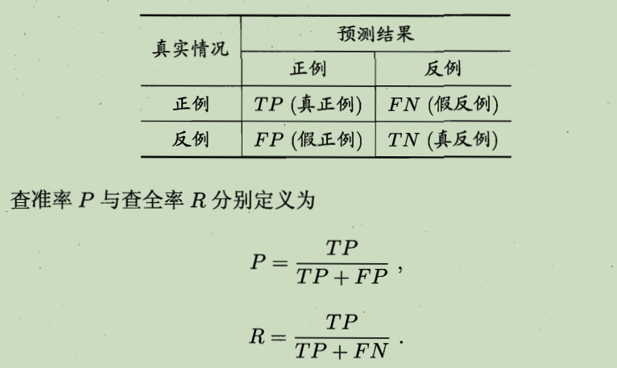
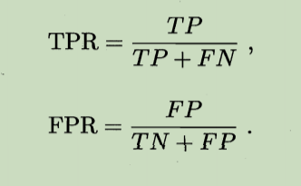
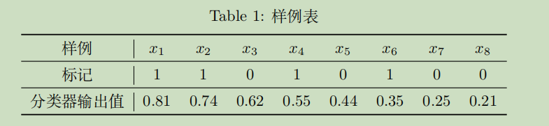
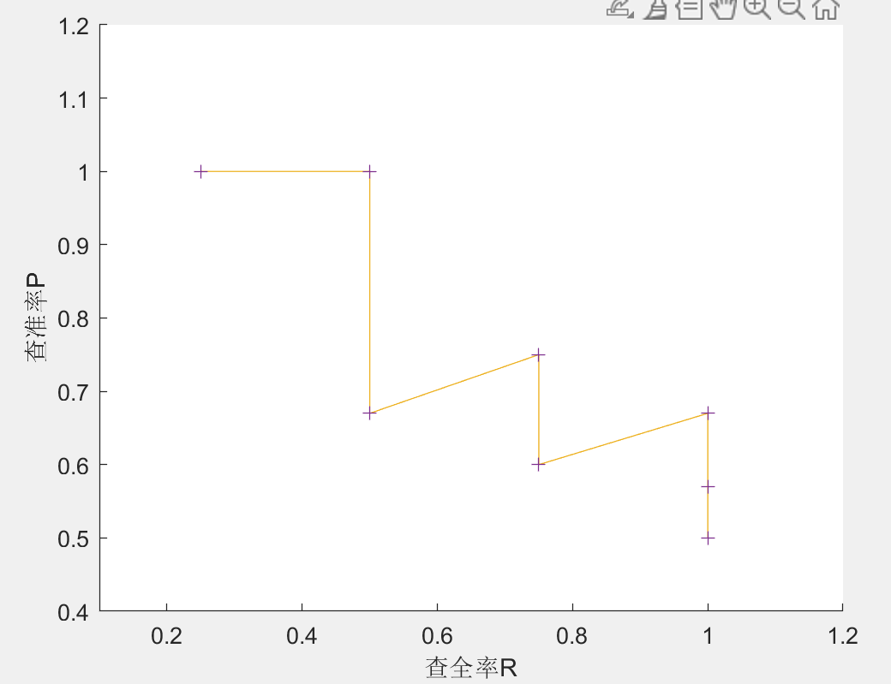
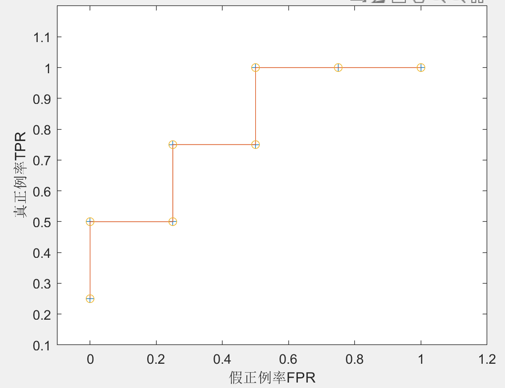

# ML-01

### 一、概率论

#### (1)

$$
F_X(x)=\begin{cases}
		0&,&x\le0\\
		\frac{x}{4}&,&0<x<1\\
		\frac{1}{4}&,&1\le x\le 3\\
		\frac{3x-7}{8}&,&3<x<5\\
		1&,&x\ge5
		\end{cases}
$$

#### (2)

由于$Y=g(X)=1/X$单调可导，可利用概率密度公式

其中$h(X)=g^{-1}(X)=1/X$

求得$f_Y(y)=\frac{f_X(1/y)}{y^2}$，再带入$f_X(x)$
$$
f_Y(y)=\begin{cases}
		0&,&0<y< 1/5\\
		\frac{3}{8y^2}&,&1/5< y< 1/3\\
		0&,&1/3\le y< 1\\
		\frac{1}{4y}&,&y\ge 1
		\end{cases}
$$

#### (3)

##### 证明：

$$
\Leftrightarrow& \int_{z=0}^{\infty}zf(z)dz\ &-&\ \int_{z=0}^{\infty}P[Z\ge z]dz\ =\ 0\\
\Leftrightarrow &\int_{z=0}^{\infty}\int_{t=0}^{z}f(z)dtdz\ &-&\ \int_{z=0}^{\infty}\int_{t=z}^{\infty}f(t)dtdz\ =\ 0\\
\Leftrightarrow &\int_{z=0}^{\infty}\int_{t=0}^{z}f(z)dtdz\ &-&\int_{t=0}^{\infty}\ \int_{z=0}^{t}f(t)dzdt\ =\ 0\ \\
\text{z,t对称，显然成立}
$$

##### 验证：

1. $$
   E[X]&=&\int_{x=0}^{\infty}xf(x)dx\\&=&\int_{x=0}^{1}x/4\ dx+\int_{x=3}^{5}3x/8\ dx=\frac{25}{8}
   $$

   

2. 

$$
E[X]&=&\int_{x=0}^{\infty}P[X\ge x]dx\\&=&\int_{x=0}^{\infty}[1-F(x)]dx\\&=&\int_{x=0}^{1}\frac{4-x}{4}dx+\int_{x=1}^{3}\frac{3}{4}dx+\int_{x=3}^{5}\frac{15-3x}{8}d\\&=&\frac{7}{8}+\frac{3}{2}+\frac{15}{4}-3=\frac{25}{8}
$$

​	3.
$$
E[Y]&=&\int_{y=0}^{\infty}yf(y)dy\\&=&\int_{\frac{1}{5}}^{\frac{1}{3}}\frac{3y}{8y^2}dy+\int_{1}^{\infty}\frac{1}{4y}dy\\&=&\infty
$$
​	4.
$$
E[Y]&=&\int_{y=0}^{\infty}P[Y\ge y]dy\\&=&\int_{y=0}^{\infty}[1-F(y)]dy\\&=&\infty
$$

### 二、自助法评估

#### (1)&(2)

$$
\begin{aligned}
1.E[\bar{x}_m]&=\frac{1}{m}E[\sum_{i=1}^{m}x_i]=\frac{1}{m}mμ=μ\\
由方差定义E[x_i^2]&=σ^2+μ^2\\
2.E[\bar{x}_m^2]&=\frac{1}{m^2}E[(\sum_{i=1}^{m}x_i)^2] \\
&=\frac{1}{m^2}E[\sum_{i=1}^{m}x_i^2]+\frac{1}{m^2}E[\sum_{i\not=j}x_ix_j]\\
&=\frac{mσ^2+mμ^2+m(m-1)μ^2}{m^2}\\
&=\frac{σ^2}{m}+μ^2\\
3.E[\bar{σ}_m^2] &=\frac{1}{m-1}E[\sum_{i=1}^{m}(x_i-\bar{x}_m)^2]\\
&=\frac{m}{m-1}E[x_i^2]-\frac{m}{m-1}E[\bar{x}_m^2]\\
&=\frac{mσ^2+mμ^2-σ^2-mμ^2}{m-1}\\
&=σ^2\\
4.Var(\bar{x}_m)&=E[\bar{x}_m^2]-E^2[\bar{x}_m]=\frac{σ^2}{m}\\
\end{aligned}
$$

#### (3)

$$
\begin{aligned}
{E}[x_i^* | x_1, \cdots, x_{m}]&=\frac{1}{m} \sum_{i=1}^{m} x_{i}=\bar{x}_{m}\\
Var\left[x_{i}^{*} \mid x_{1}, \cdots, x_{m}\right] 
&={E}\left[\left(x_{i}-\bar{x}_{m}\right)^{2} \mid x_{1}, \cdots, x_{m}\right] \\
&=\frac{1}{m} \sum_{i=1}^{m}\left(x_{i}-\bar{x}_{m}\right)^{2} \\
&=\frac{m-1}{m} \bar{\sigma}_{m}^{2}\\
{Var}\left[\bar{x}_{m}^{*} \mid x_{1}, \cdots, x_{m}\right]&=\frac{1}{m^{2}} \cdot \sum_{i=1}^{m} {Var}\left[x_{i}^{*} \mid x_{1}, \cdots, x_{m}\right]=\frac{m-1}{m^{2}} \bar{\sigma}_{m}^{2}
\end{aligned}
$$

#### (4)

$$
\begin{aligned}
{E}\left[x_{i}^{*}\right]&=\sum_{i=1}^{m} \frac{1}{m} {E}\left[x_{i}\right]=\mu\\
{Var}\left[x_{i}^{*}\right] &={E}\left[x_{i}^{* 2}\right]-{E}\left[x_{i}^{*}\right]^{2} \\
&=\sum_{i=1}^{m} \frac{1}{m}{E}\left[x_{i}^{2}\right]-\mu^{2} \\
&=\frac{1}{m} \sum_{i=1}^{m}\left({E}\left[x_{i}^{2}\right]-{E}\left[x_{i}\right]^{2}\right) \\
&=\frac{1}{m} \sum_{i=1}^{m} {Var}\left[x_{i}\right] \\
&=\sigma^{2}\\
{Var}\left[\bar{x}_{m}^{*}\right]&=\frac{1}{m^{2}} \cdot \sum_{i=1}^{m} {Var}\left[x_{i}^{*}\right]=\frac{1}{m} \sigma^{2}
\end{aligned}
$$

#### (5)

##### 自助法

可以维持期望方差和原数据集相同，但会改变初始数据集的分布，不可避免重复抽取，会引入估计偏差。在数据集较小、难以有效划分训练测试集时很有用

##### 交叉验证法

同一个样例不会被多次抽取，在大数据集上相对准确，但计算开销大

### 三、性能度量

以每个分类器输出值为阈值，判定正例和负例，得出每一个点对应的P-R值

$$
\begin{array}{c|c}
\hline \text { 点 } & 1 & 2 & 3 & 4 & 5 & 6 & 7 & 8 \\
\hline TP  & 1 & 2 & 2 & 3 & 3 & 4 & 4 & 4 \\
\hline FP  & 0 & 0 & 1 & 1 & 2 & 2 & 3 & 4 \\
\hline FN  & 3 & 2 & 2 & 1 & 1 & 0 & 0 & 0 \\
\hline TN  & 4 & 4 & 3 & 3 & 2 & 2 & 1 & 0 \\
\hline
\end{array}
$$

$$
\begin{array}{c|c}
\hline \text { 点 } & 1 & 2 & 3 & 4 & 5 & 6 & 7 & 8 \\
\hline P  & 1.0 & 1.0 & 0.67 & 0.75 & 0.6 & 0.67 & 0.57 & 0.5 \\
\hline R  & 0.25 & 0.5 & 0.5 & 0.75 & 0.75 & 1.0 & 1.0 & 1.0 \\
\hline TPR  & 0.25 & 0.5 & 0.5 & 0.75 & 0.75 & 1.0 & 1.0 & 1.0 \\
\hline FPR  & 0 & 0 & 0.25 & 0.25 & 0.5 &0.5 & 0.75 & 1.0 \\
\hline
\end{array}
$$

$\text { AUC 面积为 } S=\frac{1}{2} \sum_{i=1}^{m-1}\left(x_{i+1}-x_{i}\right) \cdot\left(y_{i}+y_{i+1}\right)=0.8125$