# ML-02

201300086

## 一、NFL

#### 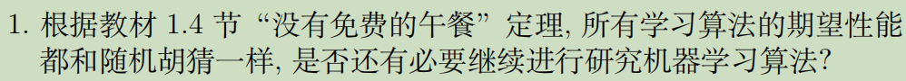

##### 有必要：

- NFL定理有一个重要前提：所有"问题"出现的机会相同、或所有问题同等重要。但实际情形并不是这样。很多时候，我们只关注自己正在试图解决的问题（例如某个具体应用任务），希望为它找到一个解决方案，至于这个解决方案在别的问题、甚至在相似的问题上是否为好方案，我们并不关心。
- 脱离具体问题，空泛地谈论"什么学习算法更好"毫无意义，因为若考虑所有潜在的问题，则所有学习算法都一样好。要谈论算法的相对优劣，必须要针对具体的学习问题。

#### 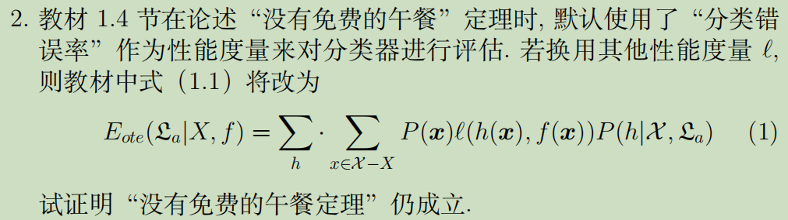

对于任意的k分类问题和任意性能度量，假设f均匀分布，满足（注意到与学习算法无关）：
$$
\sum_{f} \ell(h(\boldsymbol{x}), f(\boldsymbol{x}))=ck^{|\mathcal{X}|}\\
c:预测结果的期望\\
特别地，当k=2时，\sum_{f} \ell(h(\boldsymbol{x}), f(\boldsymbol{x}))=\frac{1}{2}2^{|\mathcal{X}|}
$$
$$
\begin{aligned}
\sum_{f} E_{\text {ote }}\left(\mathfrak{L}_{a} \mid X, f\right) &=\sum_{f} \sum_{h} \sum_{\boldsymbol{x} \in \mathcal{X}-X} P(\boldsymbol{x}) \ell(h(\boldsymbol{x}), f(\boldsymbol{x})) P\left(h \mid X, \mathfrak{L}_{a}\right) \\
&=\sum_{\boldsymbol{x} \in \mathcal{X}-X} P(\boldsymbol{x}) \sum_{h} P\left(h \mid X, \mathfrak{L}_{a}\right)\sum_{f} \ell(h(\boldsymbol{x}), f(\boldsymbol{x})) \\
&=\sum_{\boldsymbol{x} \in \mathcal{X}-X} P(\boldsymbol{x}) \sum_{h} P\left(h \mid X, \mathfrak{L}_{a}\right)ck^{|\mathcal{X}|} \\
&=\sum_{\boldsymbol{x} \in \mathcal{X}-X} P(\boldsymbol{x}) \cdot 1 \cdot ck^{|\mathcal{X}|}
\end{aligned}
$$

我们发现总误差与学习算法无关，NFL仍成立

## 二、线性回归

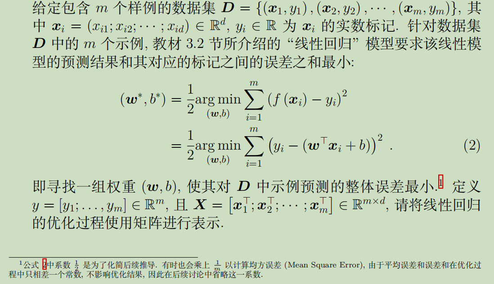
$$
令E_{{\boldsymbol{w}}}=(\boldsymbol{y}-\boldsymbol{X} \boldsymbol{w}-\mathbf{1} b)^{\top}(\boldsymbol{y}-\boldsymbol{X} \boldsymbol{w}-\mathbf{1} b)\\
\frac{\partial E_\boldsymbol{w}}{\partial {\boldsymbol{w}}}=2 \mathbf{X}^{\mathrm{T}}(\mathbf{X} {\boldsymbol{w}}-\boldsymbol{y}+\mathbf{1}b) \\
\frac{\partial E_\boldsymbol{w}}{\partial {b}}=2 \mathbf{1}^{\mathrm{T}}(\mathbf{X} {\boldsymbol{w}}-\boldsymbol{y}+\mathbf{1}b) \\
当\mathbf{X}^\mathrm{T}\mathbf{X}满秩时，令\boldsymbol{T}=(\mathbf{X}^\mathrm{T}\mathbf{X})^{-1}，偏导为0:\\
\begin{cases}
\mathbf{1}^\top\mathbf{1}b^*=b^*=\mathbf{1}^{\top} \boldsymbol{y}-\mathbf{1}^{\top} \boldsymbol{X}\boldsymbol{w^*}
\\\boldsymbol{w^*}=\boldsymbol{T}\boldsymbol{X}^{\top}(\boldsymbol{y}-\mathbf{1} b^*)
\end{cases}\\
最后解出\boldsymbol{w}^{*}=\boldsymbol{T} \boldsymbol{X}^{\top}\left(\boldsymbol{y}-\mathbf{1} \frac{\mathbf{1}^{\top} \boldsymbol{X} \boldsymbol{T} \boldsymbol{X}^{\top} \boldsymbol{y}-\mathbf{1}^{\top} \boldsymbol{y}}{\mathbf{1}^{\top} \boldsymbol{X} \boldsymbol{T} \boldsymbol{X}^{\top} \mathbf{1}-1}\right)
$$

## 三、正则化

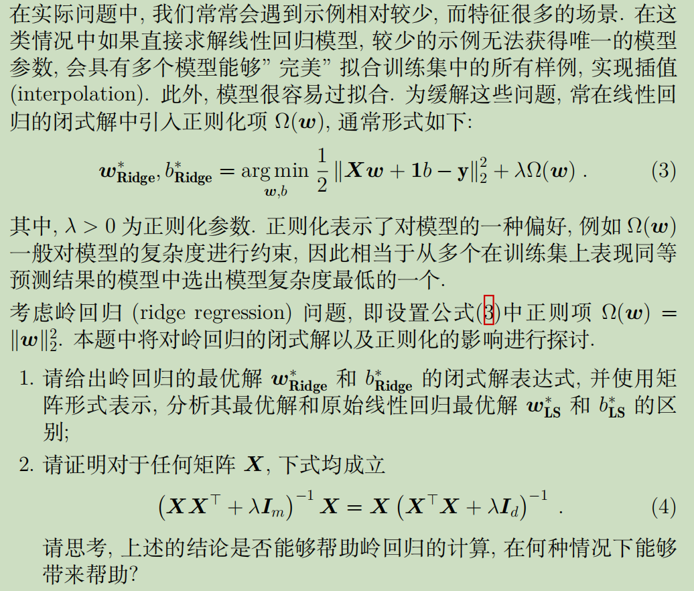

#### (1)

$$
令E_{{\boldsymbol{w}}}=\frac{1}{2}(\boldsymbol{y}-\boldsymbol{X} \boldsymbol{w}-\mathbf{1} b)^{\top}(\boldsymbol{y}-\boldsymbol{X} \boldsymbol{w}-\mathbf{1} b)+λ||\boldsymbol{w}||_2^2\\
\frac{\partial E_\boldsymbol{w}}{\partial {\boldsymbol{w}}}= \mathbf{X}^{\mathrm{T}}(\mathbf{X} {\boldsymbol{w}}-\boldsymbol{y}+\mathbf{1}b)+2λ\boldsymbol{w} \\
\frac{\partial E_\boldsymbol{w}}{\partial {b}}=\mathbf{1}^{\mathrm{T}}(\mathbf{X} {\boldsymbol{w}}-\boldsymbol{y}+\mathbf{1}b) \\
当\mathbf{X}^\mathrm{T}\mathbf{X}+2λ\boldsymbol{I_d}满秩时，令\boldsymbol{T}=(\mathbf{X}^\mathrm{T}\mathbf{X}+2λ\boldsymbol{I_d})^{-1}，令偏导为0:\\
\begin{cases}
b_{\mathbf{Ridge}}^*=\mathbf{1}^{\top} \boldsymbol{y}-\mathbf{1}^{\top} \boldsymbol{X}\boldsymbol{w_{\mathbf{Ridge}}^*}
\\\boldsymbol{w_{\mathbf{Ridge}}^*}=\boldsymbol{T}\boldsymbol{X}^{\top}(\boldsymbol{y}-\mathbf{1} b_{\mathbf{Ridge}}^*)
\end{cases}\\
最后解出\boldsymbol{w}_{\mathbf{Ridge}}^{*}=\boldsymbol{T} \boldsymbol{X}^{\top}\left(\boldsymbol{y}-\mathbf{1} \frac{\mathbf{1}^{\top} \boldsymbol{X} \boldsymbol{T} \boldsymbol{X}^{\top} \boldsymbol{y}-\mathbf{1}^{\top} \boldsymbol{y}}{\mathbf{1}^{\top} \boldsymbol{X} \boldsymbol{T} \boldsymbol{X}^{\top} \mathbf{1}-1}\right)
$$

##### 分析：

- 我们发现最优解和原始最优解形式相同，只有矩阵$\boldsymbol{T}$不同

- 特别的，当λ=0时，我们可以认为二者完全相同

#### (2)

$$
&(\boldsymbol{X} \boldsymbol{X}^{\top}+\lambda I_{m})^{-1} \boldsymbol{X}=\boldsymbol{X}(\boldsymbol{X}^{\top} \boldsymbol{X}+\lambda I_{d})^{-1}\\
&\Leftrightarrow \boldsymbol{X}=(\boldsymbol{X} \boldsymbol{X}^{\top}+\lambda I_{m})\boldsymbol{X}(\boldsymbol{X}^{\top} \boldsymbol{X}+\lambda I_{d})^{-1}\\
&\Leftrightarrow \boldsymbol{X}=(\boldsymbol{X} \boldsymbol{X}^{\top}\boldsymbol{X}+\lambda \boldsymbol{X})(\boldsymbol{X}^{\top} \boldsymbol{X}+\lambda I_{d})^{-1}\\
&\Leftrightarrow \boldsymbol{X}=\boldsymbol{X}( \boldsymbol{X}^{\top}\boldsymbol{X}+\lambda I_{d})(\boldsymbol{X}^{\top} \boldsymbol{X}+\lambda I_{d})^{-1}\\
&\Leftrightarrow \boldsymbol{X}=\boldsymbol{X}
$$

等价条件显然，证毕

##### 可能有帮助：

两式等价，但矩阵求逆计算开销不同。

当m和d大小有差别时，实际应用中可以选取m和d中较小的对应的求逆进行实际计算，加快计算速度

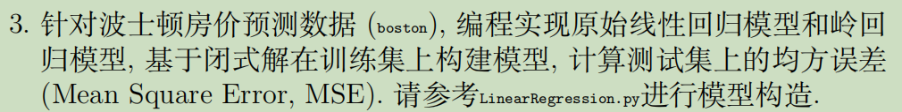

#### (3)

==（附代码LinearRegression.py）==

##### （i）

线性回归模型在测试集上的MSE：20.724023437340996

##### （ii）

λ取值：`lmbds = np.arange(0, 3.1, 0.25)`

得到可视化MSE与λ关系图如下

##### 分析：

- MSE随λ增大而增大，增速逐渐放缓

- 较小的λ对MSE的影响更小，λ大时放大了偏好对MSE的影响

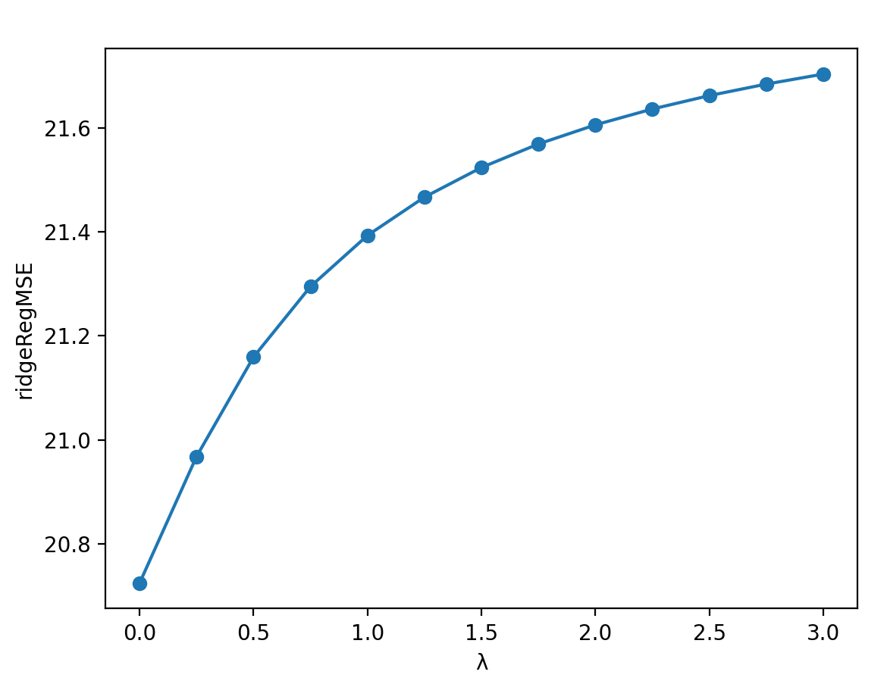

## 四、LDA

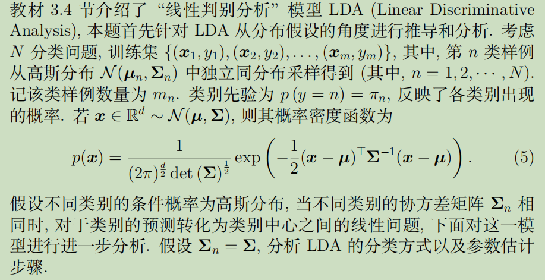

#### (1)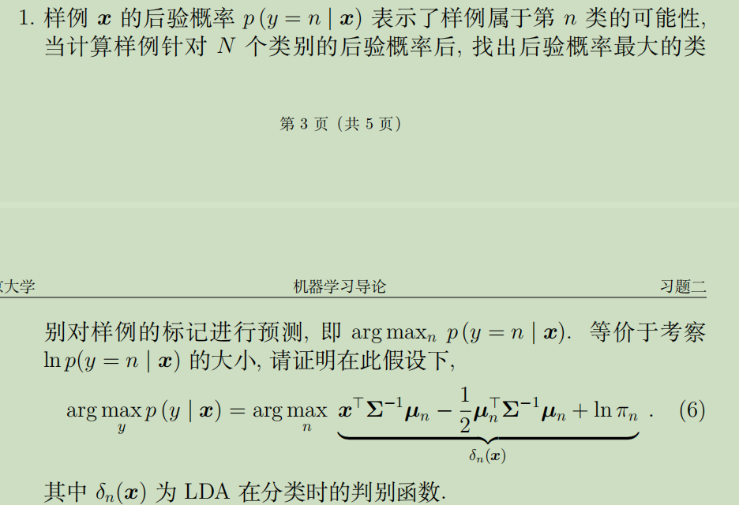

由贝叶斯公式，并除去与n无关项
$$
\arg \max _{y} p(y \mid \boldsymbol{x})=\arg \max _{n}\frac{p(y=n)p(\boldsymbol{x}\mid y=n)}{p(\boldsymbol{x})}\\
=\arg \max _{n}\frac{\pi_{n}\left((2 \pi)^{\frac{d}{2}} \operatorname{det}(\boldsymbol{\Sigma})^{\frac{1}{2}}\right)^{-1} \exp \left(\boldsymbol{x}^{\top} \boldsymbol{\Sigma}^{-1} \boldsymbol{\mu}_{n}-\frac{1}{2} \boldsymbol{\mu}_{n}^{\top} \boldsymbol{\Sigma}^{-1} \boldsymbol{\mu}_{n}-\frac{1}{2} \boldsymbol{x}^{\top} \boldsymbol{\Sigma}^{-1} \boldsymbol{x}\right)}{p(\boldsymbol{x})}\\
=\arg \max _{n}\frac{\pi_{n} \exp \left(\boldsymbol{x}^{\top} \boldsymbol{\Sigma}^{-1} \boldsymbol{\mu}_{n}-\frac{1}{2} \boldsymbol{\mu}_{n}^{\top} \boldsymbol{\Sigma}^{-1} \boldsymbol{\mu}_{n}\right)}{p(\boldsymbol{x})}\\
=\arg \max _{n}{\pi_{n} \exp \left(\boldsymbol{x}^{\top} \boldsymbol{\Sigma}^{-1} \boldsymbol{\mu}_{n}-\frac{1}{2} \boldsymbol{\mu}_{n}^{\top} \boldsymbol{\Sigma}^{-1} \boldsymbol{\mu}_{n}\right)}\\
=\arg \max _{n} \boldsymbol{x}^{\top} \boldsymbol{\Sigma}^{-1} \boldsymbol{\mu}_{n}-\frac{1}{2} \boldsymbol{\mu}_{n}^{\top} \boldsymbol{\Sigma}^{-1} \boldsymbol{\mu}_{n}+\ln \pi_{n}
$$

#### (2)

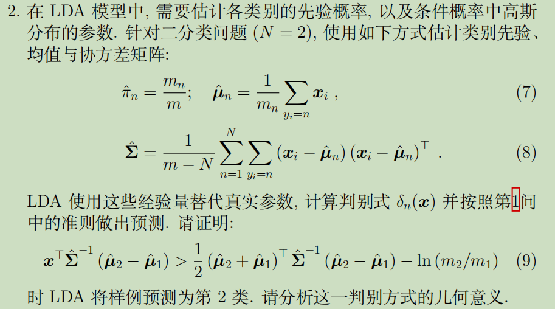

##### 证明：

$$
预测为第二类说明：p(y=2 \mid \boldsymbol{x})>p(y=1 \mid \boldsymbol{x})
\\带入第一问的结论:\\\Leftrightarrow
\boldsymbol{x}^{\top} \boldsymbol{\Sigma}^{-1} \hat{\boldsymbol{\mu}}_{2}-\frac{1}{2} \hat{\boldsymbol{\mu}}_{2}^{\top} \boldsymbol{\Sigma}^{-1} \hat{\boldsymbol{\mu}}_{2}+\ln \pi_{2}>
\boldsymbol{x}^{\top} \boldsymbol{\Sigma}^{-1} \hat{\boldsymbol{\mu}}_{1}-\frac{1}{2} \hat{\boldsymbol{\mu}}_{1}^{\top} \boldsymbol{\Sigma}^{-1} \hat{\boldsymbol{\mu}}_{1}+\ln \pi_{1}\\\Leftrightarrow
\boldsymbol{x}^{\top} \hat{\boldsymbol{\Sigma}}^{-1}\left(\hat{\boldsymbol{\mu}}_{2}-\hat{\boldsymbol{\mu}}_{1}\right)>\frac{1}{2}(\hat{\boldsymbol{\mu}}_{2}^{\top} \boldsymbol{\Sigma}^{-1} \hat{\boldsymbol{\mu}}_{2}-\hat{\boldsymbol{\mu}}_{1}^{\top} \boldsymbol{\Sigma}^{-1} \hat{\boldsymbol{\mu}}_{1})-\ln \left(\pi_{2} / \pi_{1}\right)
\\(由于\hat{\boldsymbol{\Sigma}}^{-1}是对称矩阵，所以\hat{\boldsymbol{\mu}}_{1}^{\top} \hat{\boldsymbol{\Sigma}}^{-1} \hat{\boldsymbol{\mu}}_{2}=\hat{\boldsymbol{\mu}}_{2}^{\top} \hat{\boldsymbol{\Sigma}}^{-1} \hat{\boldsymbol{\mu}}_{1})\\
\Leftrightarrow
\boldsymbol{x}^{\top} \hat{\boldsymbol{\Sigma}}^{-1}\left(\hat{\boldsymbol{\mu}}_{2}-\hat{\boldsymbol{\mu}}_{1}\right)>\frac{1}{2}\left(\hat{\boldsymbol{\mu}}_{2}+\hat{\boldsymbol{\mu}}_{1}\right)^{\top} \hat{\boldsymbol{\Sigma}}^{-1}\left(\hat{\boldsymbol{\mu}}_{2}-\hat{\boldsymbol{\mu}}_{1}\right)-\ln \left(m_{2} / m_{1}\right)
$$

即等价为了原不等式

##### 几何意义：

- $\frac{1}{2}\left(\hat{\boldsymbol{\mu}}_{2}+\hat{\boldsymbol{\mu}}_{1}\right) \text { 是 } \hat{\boldsymbol{\mu}}_{1} \text { 和 } \hat{\boldsymbol{\mu}}_{2} \text { 这两个类别中心的中点 }$

- 上述不等式成立说明了在引入对数几率$ln(m_2/m_1)$时，$\boldsymbol{x}$和中点$\frac{1}{2}(\hat{\boldsymbol{\mu}}_{2}+\hat{\boldsymbol{\mu}}_{1})$相比，$\boldsymbol{x}$离$\hat{\boldsymbol{\mu}}_{2}$更近

#### (3)

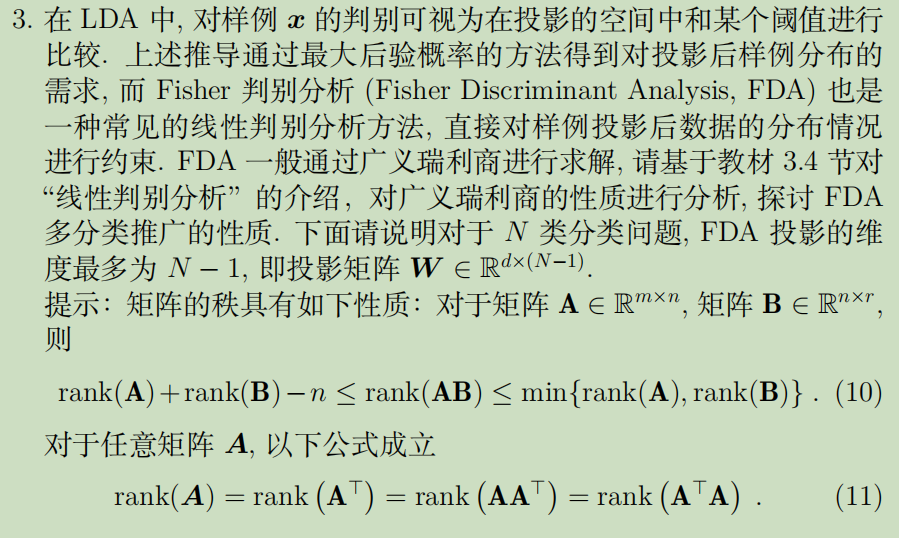
$$
原优化目标：
\max _{\mathbf{W}} \frac{\operatorname{tr}\left(\mathbf{W}^{\mathrm{T}} \mathbf{S}_{b} \mathbf{W}\right)}{\operatorname{tr}\left(\mathbf{W}^{\mathrm{T}} \mathbf{S}_{w} \mathbf{W}\right)}\\
转化为广义特征值问题：\mathbf{S}_{b} \mathbf{W}=\lambda \mathbf{S}_{w} \mathbf{W}\\闭式解\mathbf{W}=\mathbf{S}_{w} ^{-1}\mathbf{S}_{b}\\
由于

\sum_{i=1}^{N} m_{i}\left(\boldsymbol{\mu}_{i}-\boldsymbol{\mu}\right)=\sum_{i=1}^{N} m_{i} \boldsymbol{\mu}_{i}- \sum_{i=1}^{N} m_{i}\boldsymbol{\mu}=0\\
说明\boldsymbol{\mu}_{1}-\boldsymbol{\mu}，\boldsymbol{\mu}_{2}-\boldsymbol{\mu}，......，\boldsymbol{\mu}_{N}-\boldsymbol{\mu}线性相关，任一项可由其他线性表示\\
$$

$$
即rank(\boldsymbol{S}_{b})&=&rank(\sum_{i=1}^{N} m_{i}\left(\boldsymbol{\mu}_{i}-\boldsymbol{\mu}\right)\left(\boldsymbol{\mu}_{i}-\boldsymbol{\mu}\right)^{\top})\\&=&rank(\sum_{i=1}^{N-1} m_{i}\left(\boldsymbol{\mu}_{i}-\boldsymbol{\mu}\right)\left(\boldsymbol{\mu}_{i}-\boldsymbol{\mu}\right)^{\top})\\
&\le& N-1\\
rank(\mathbf{S}_{w} ^{-1}\mathbf{S}_{b})&\le&\min \left\{\operatorname{rank}\left(\boldsymbol{S}_{w}^{-1}\right), \operatorname{rank}\left(\boldsymbol{S}_{b}\right)\right\}\\
&\le&rank(\boldsymbol{S}_{b})\\&\le& N-1
$$

因此 $ \boldsymbol{S}_{w}^{-1} \boldsymbol{S}_{b}$  最多只能对应 ` N-1 ` 个特征向量，而 $ \boldsymbol{W}  $的每个列向量都线性无关，所以 FDA 投影的维度最多为  `N-1 `

## 五、多分类学习

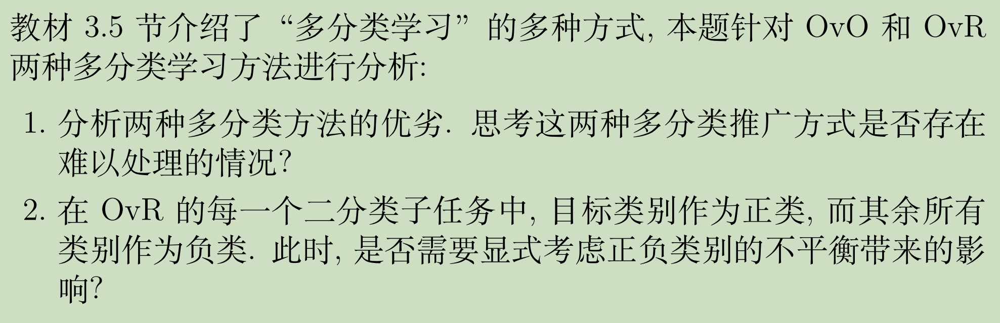

#### (1)

##### 1、存储开销和测试时间开销：

OvR只需训练N个分类器，而 OvO需训练N（N-1）/2个分类器，因此OvO通常比 OvR 更大

##### 2、训练时间开销：

训练时OvR每个分类器均使用全部训练样例，而 OvO 每个分类器仅用到两个类的样例，因此类别很多时，OvO通常比OvR 更小

##### 3、预测性能：

取决于具体的数据分布，多数情形下两者差不多

##### 4、难以处理的情况：

OvR ：如果类别特别多，则每次训练都要使用全部数据，时间开销$O(n^2)$，难以处理

OvO ：如果样例非常不平均，如第一个类别占了一半的样例，而 OvO需训练N（N-1）/2个分类器，存储和测试时间开销难以处理

#### (2)

不需要，因为OvR遍历所有类进行相似处理，其过程的对称性可以消除正负类别不平衡所带来的影响
