# 
ML-03决策树

201300086

（附DecisionTree.py，可处理信息增益、基尼指数、缺失值，输入数据集直接输出决策树）

## 一、信息熵

#### (1)

##### 一定存在，反证法如下：

在默认属性与原训练集一样多时（有限个属性），当训练集可以包含无穷多个样本时，假设不存在与训练集一致的决策树：

那么训练集训练出的决策树上至少有一个节点满足这个结点存在无法划分的多个数据，这是因为如果节点上没有冲突数据，那么总是能够将数据分开。这与训练集不含冲突数据矛盾。

#### (2)

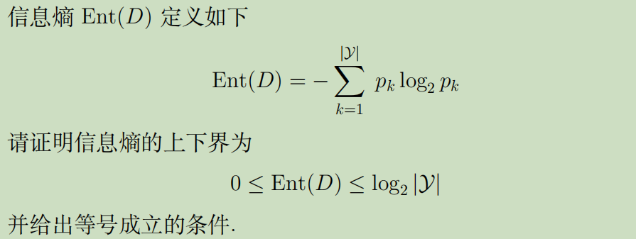

##### LHS:

$$
首先一定有：\begin{cases}
\sum_{k=1}^{|\mathcal{Y}|} p_{k}=1\\
|\mathcal{Y}|\ge1\\
0\le p_k<1
\end{cases}
因此\forall k满足\begin{cases}log_2p_k\le0\\-p_klog_2p_k\ge0\end{cases}\\所以Ent(D)\ge0,
取等条件|\mathcal{Y}|=1
$$

##### RHS:

$$
令f(x)=xlog_2x,则f^{'}(x)=log_2x+ln2,f^{''}(x)=\frac{ln2}{x}>0恒成立\\
因此f(x)是下凸函数，由琴声不等式，对于\sum_{k=1}^{|\mathcal{Y}|} p_{k}=1，一定有\\
\frac{\sum_{k=1}^{|\mathcal{Y}|}f(p_k)}{|\mathcal{Y}|}\ge f(\frac{\sum_{k=1}^{|\mathcal{Y}|} p_{k}}{|\mathcal{Y}|})\\
即\sum_{k=1}^{|\mathcal{Y}|} p_{k}log_2p_k\ge{|\mathcal{Y}|} f(\frac{1}{|\mathcal{Y}|})=-log_2|\mathcal{Y}|\\
所以 Ent(D)\le log_2|\mathcal{Y}|,
取等条件\forall k满足p_k=\frac{1}{|\mathcal{Y}|}
$$

#### (3)

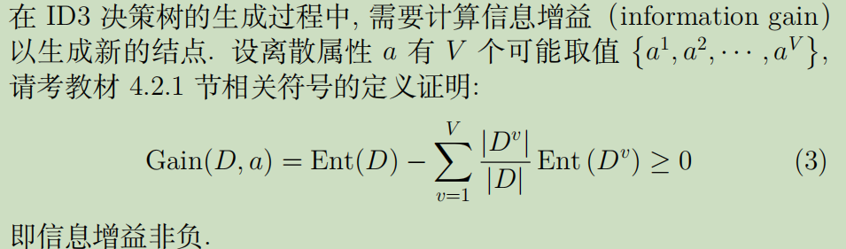
$$
记p_{kv}:取值为a^{v}的结点中第k类样本在D^v中所占比例\\
显然有\begin{cases}\sum_{k=1}^{|\mathcal{Y}|} p_{kv}=1\\\sum_{v=1}^{V} \frac{|D^{v}|}{|D|}p_{kv}=p_k\end{cases}\\
由于\forall k,v满足1\ge p_{kv}\ge p_k,log_2p_{kv}\ge log_2p_k,放缩如下
$$

$$
-\sum_{v=1}^{V} \frac{|D^{v}|}{|D|} Ent(D^{v})
&=&\sum_{v=1}^{V}\frac{|D^{v}|}{|D|} \sum_{k=1}^{|\mathcal{Y}|}p_{kv}log_2p_{kv}\\
&=&\sum_{k=1}^{|\mathcal{Y}|} \sum_{v=1}^{V}\frac{|D^{v}|}{|D|}p_{kv}log_2p_{kv} \\
&\ge&\sum_{k=1}^{|\mathcal{Y}|} \sum_{v=1}^{V}\frac{|D^{v}|}{|D|}p_{kv}log_2p_{k}\\
&=&\sum_{k=1}^{|\mathcal{Y}|}log_2p_{k} \sum_{v=1}^{V}\frac{|D^{v}|}{|D|}p_{kv}\\
&=&\sum_{k=1}^{|\mathcal{Y}|} p_{k}log_2p_k=-Ent(D)
$$

$$
所以Gain(D,a)=\operatorname{Ent}(D)-\sum_{v=1}^{V} \frac{\left|D^{v}\right|}{|D|} \operatorname{Ent}\left(D^{v}\right) \geq 0
$$

## 二、划分

#### (1)信息增益

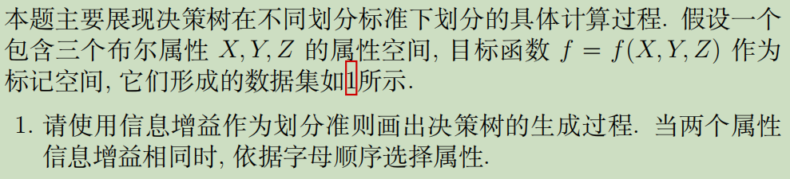

通过python计算出每个结点信息增益如下：（用字典树的形式暂存决策树并输出）

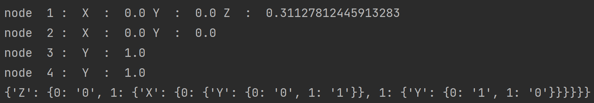

再利用matlab将上述字典树可视化：

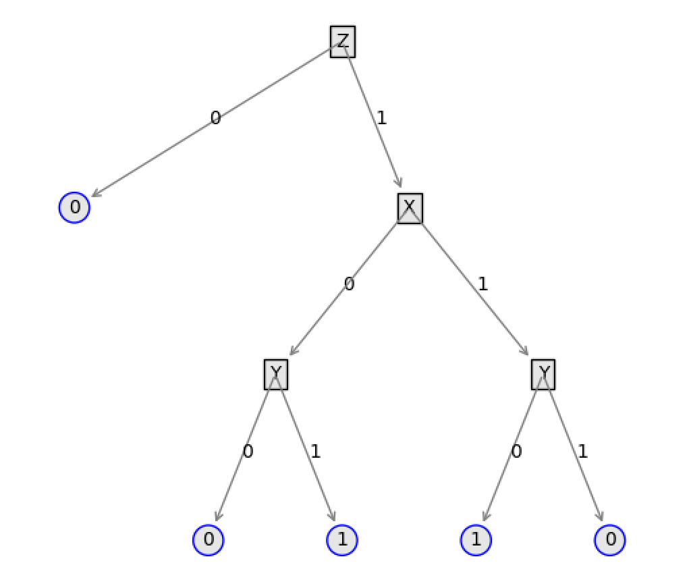

#### (2)基尼指数

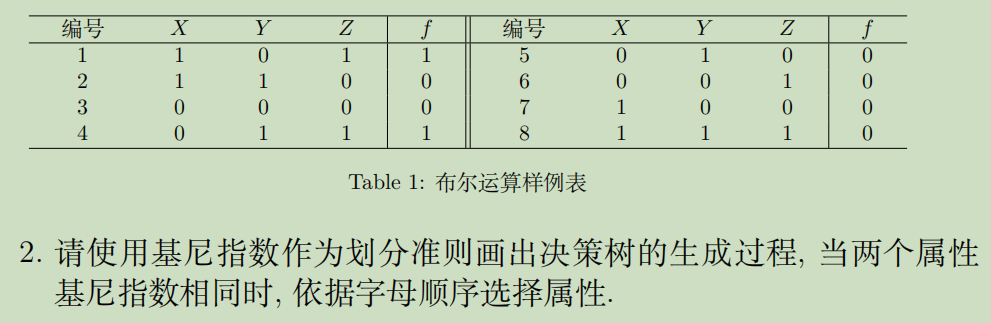

通过python计算出每个结点基尼指数如下：（用字典树的形式暂存决策树并输出）

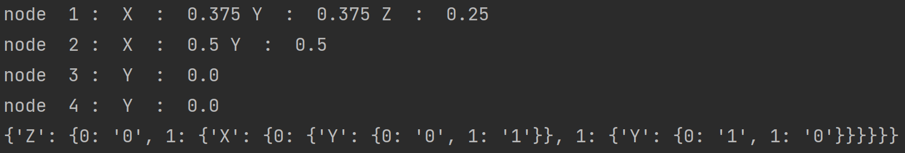

再利用matlab将上述字典树可视化：

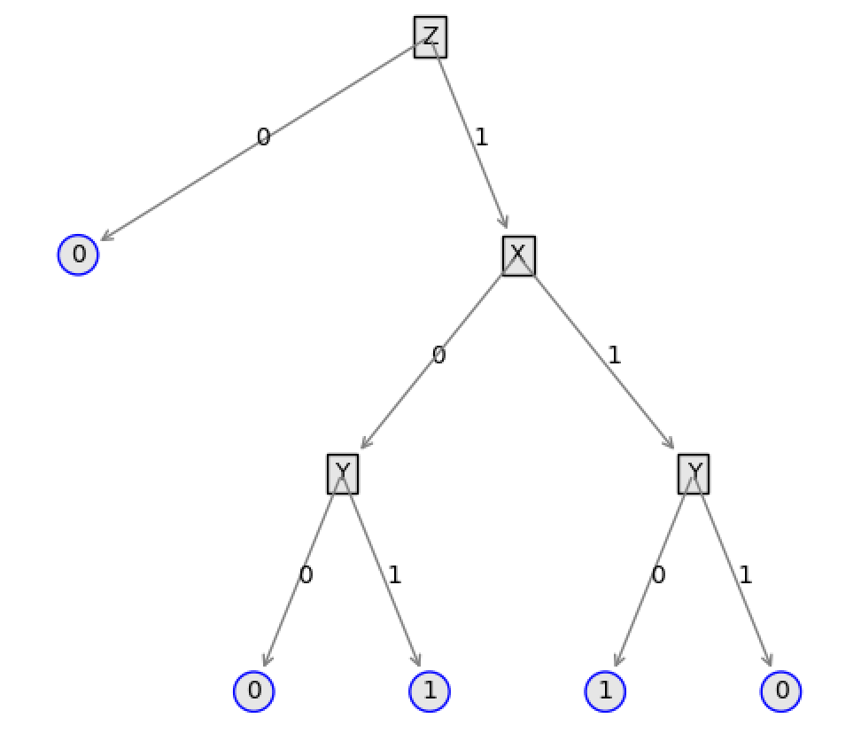

## 三、剪枝

#### (1)验证

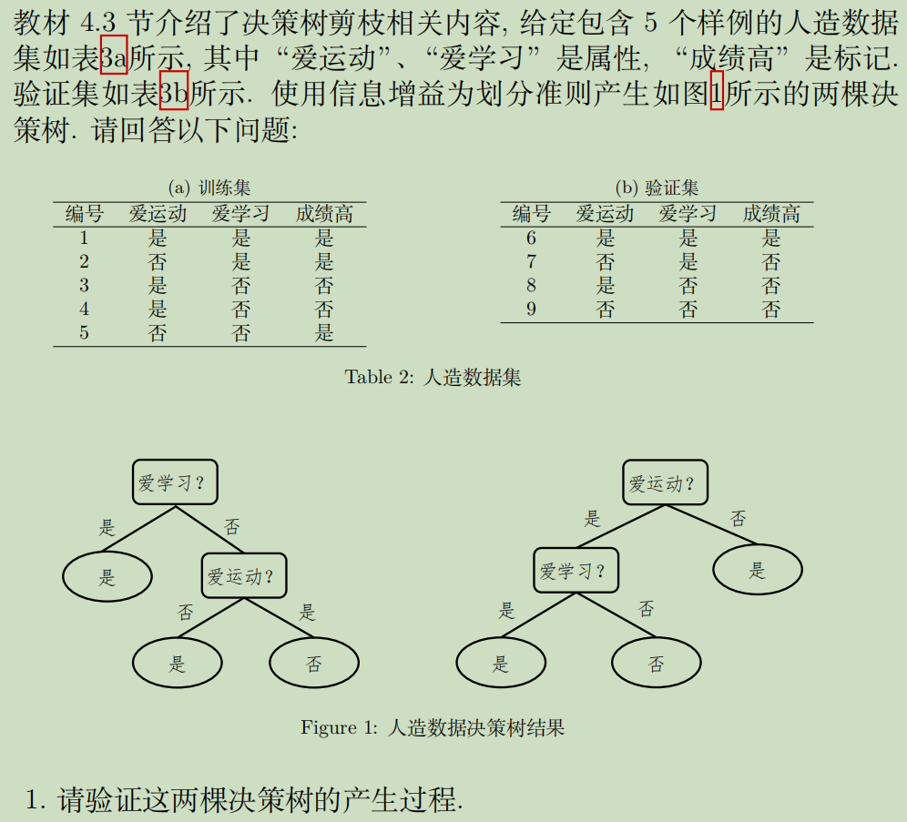

由于第一个结点”爱学习“和”爱运动“的信息增益都是0.41997，所以会产生两个决策树分别以这两个属性进行第一次划分

左侧决策树第二层的”爱运动“和右侧决策树第二层的”爱学习“信息增益都是0.918

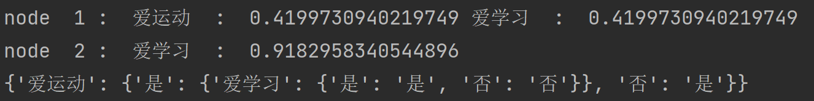

#### (2)剪枝

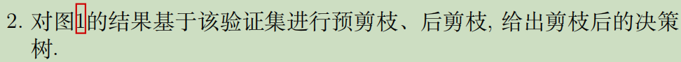

##### 1.左树预剪枝

- node 1”爱学习“：划分
  - 若不剪枝每个样本都被标记为是，只有样例6正确，准确率25%
  - 若剪枝，只有样例7错误，准确率75%

- node 2”爱运动“：禁止划分

  - 若不剪枝即保留现状，准确率75%

  - 若剪枝，样例9错误，准确率下降到50%

    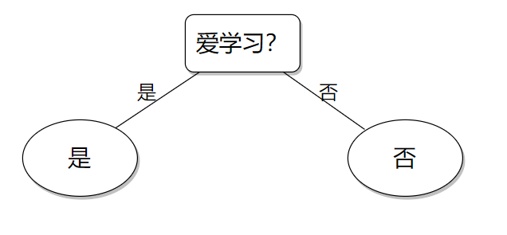

##### 2.右树预剪枝

- node 1”爱运动“：禁止划分

  - 若不剪枝每个样本都被标记为是，只有样例6正确，准确率25%

  - 若剪枝，只有样例8正确，准确率不变，还是25%

    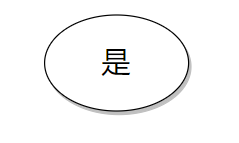

##### 3.左树后剪枝

- node 1”爱运动“：剪枝

  - 若不剪枝，样例9错误，准确率50%
  - 若剪枝，只有样例7错误，准确率75%

- node 2”爱学习“：禁止剪枝

  - 若不剪枝，只有样例7错误，准确率75%

  - 若剪枝，只有样例6正确，准确率25%

    

##### 4.右树后剪枝

都要剪，不能只剪一个

- node 1”爱学习“：禁止剪枝
  - 若不剪枝，准确率50%
  - 若剪枝，无树，准确率25%
- node 2”爱运动“：禁止剪枝
  - 若不剪枝，准确率50%
  - 若剪枝，准确率25%

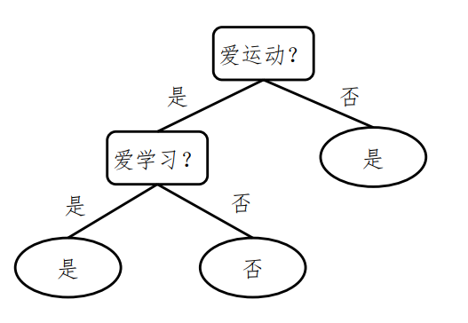

#### (3)分析

##### 左树：

- 预剪枝和后剪枝的决策树相同，没有任何差别
- 训练集80%，验证集75%

##### 右树：

- 预剪枝训练集60%，测试集25%
- 后剪枝训练集100%，测试集50%

##### 综上所述，后剪枝的拟合能力更强

## 四、连续&缺失

#### (1)连续

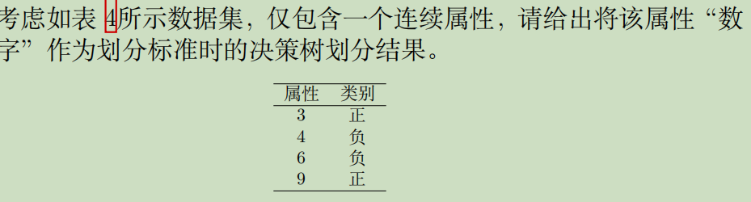

$$
该属性候选划分点集合T=\{3.5,5,7.5\}\\
Ent(D)=-2*\frac{1}{2}log_2\frac{1}{2}=1\\
$$

##### 第一层

$$
\begin{cases}
Gain(D,a,3.5)=1-\frac{3}{4}(-\frac{2}{3}log_2\frac{2}{3}-\frac{1}{3}log_2\frac{1}{3})=0.3112781244591328\\
Gain(D,a,5)=0\\
Gain(D,a,7.5)=1-\frac{3}{4}(-\frac{2}{3}log_2\frac{2}{3}-\frac{1}{3}log_2\frac{1}{3})=0.3112781244591328\\
\end{cases}
$$

因此第一层选择3.5作为划分

##### 第二层

$$
Ent(D')=-\frac{1}{3}log_2\frac{1}{3}-\frac{2}{3}log_2\frac{2}{3}=0.9182958340544897\\
\begin{cases}
Gain(D',a,5)=Ent(D')-\frac{2}{3}(-\frac{1}{2}log_2\frac{1}{2}-\frac{1}{2}log_2\frac{1}{2})=0.25162916738782304\\
Gain(D',a,7.5)=Ent(D')-\frac{3}{4}(-\frac{2}{3}log_2\frac{2}{3}-\frac{1}{3}log_2\frac{1}{3})=0.9182958340544897\\
\end{cases}
$$

因此第二层选择7.5作为划分

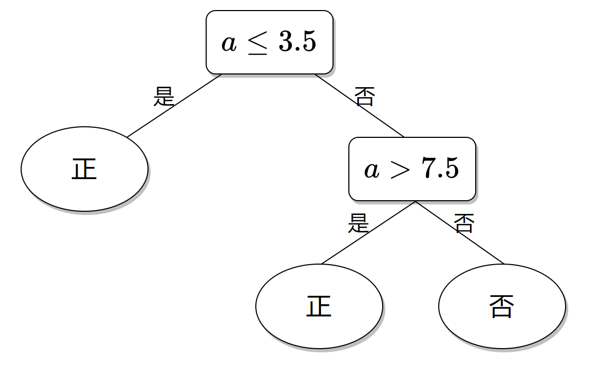

#### (2)缺失

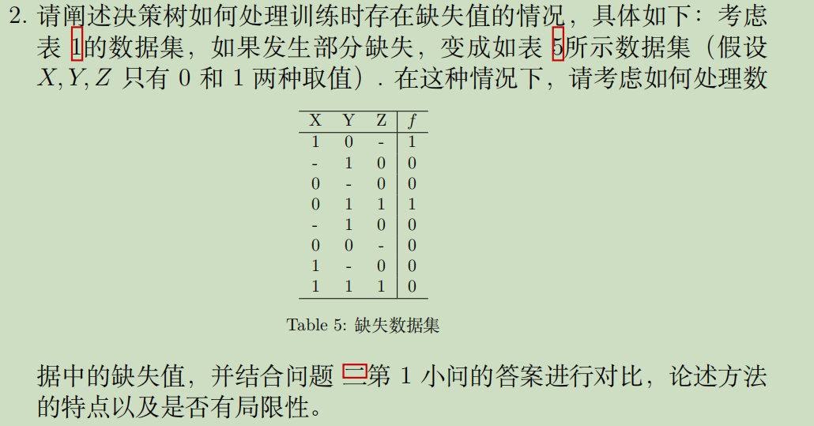

- ##### 使用python计算划分属性选择

$$
\begin{aligned}
\operatorname{Gain}(D, a) &=\rho \times \operatorname{Gain}(\tilde{D}, a) \\
&=\rho \times\left(\operatorname{Ent}(\tilde{D})-\sum_{v=1}^{V} \tilde{r}_{v} \operatorname{Ent}\left(\tilde{D}^{v}\right)\right)
\end{aligned}
$$

- ##### 更改样本比例的计算方式，从个数比改为权重`w`比，得到第一层信息增益如下：

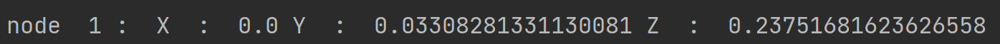

- ##### 所以将Z作为第一个划分属性，后续结点同理，具体信息增益如下：(结点按递归顺序排列)

- ##### 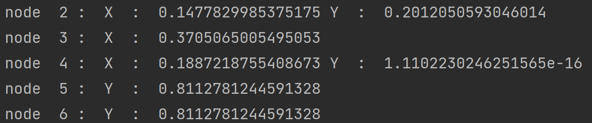

- ##### 因此字典决策树为：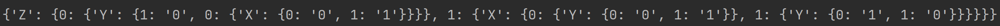

- ##### 向python输入数据集，输出可视化决策树如下：（未添加结点带权预测功能）

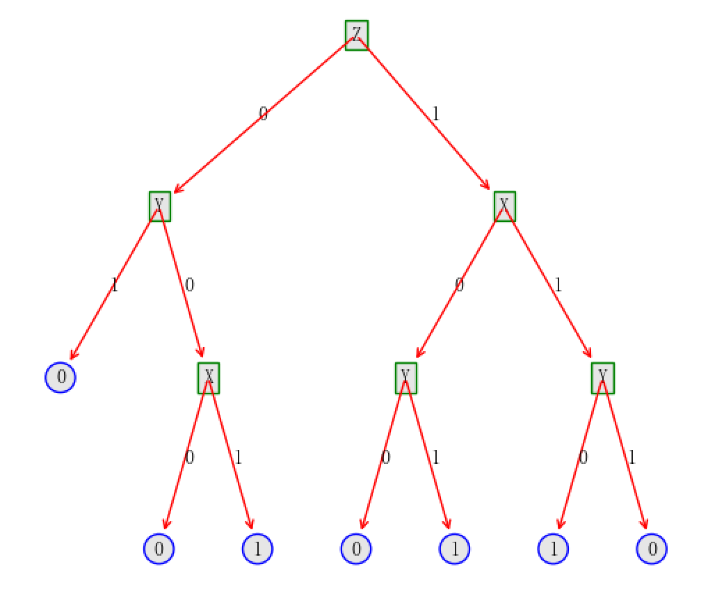

##### 对比分析：

- 与无缺失值的方法相比，划分属性时首先需要排除含缺失值的样本，而后缺失值样本需要按权重分到不同分支中，计算量和复杂程度略有增加
- 这个决策树比原来的更为复杂，Z=0时仍然向下展开分支

##### 局限性：

- 由于对缺失值的处理只能是按权重分摊，但这不符合事实，导致了一些分支出现了不该有的结点，导致了决策树更加复杂，过拟合风险增大

#### (3)输出标签

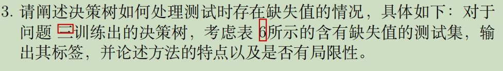

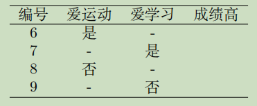

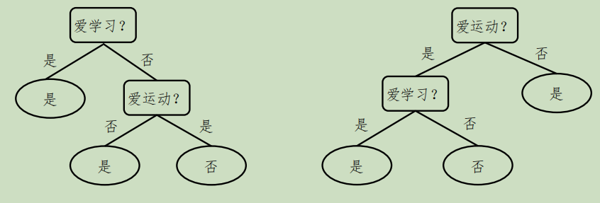

###### （使用问题三左边的决策树作为本题计算依据）

##### 方法：

对于缺失值，按权重分摊到各分支，得到概率

##### 权重从问题三训练集获得：

第二层结点中“是”40%，“爱运动？”60%

第三层结点中“是”33%，“否”67%

##### 输出标签：

编号6：是：$40\%+60\%\times0=40\%$，否：$60\%$，所以否

编号7：是

编号8：是：$40\%+60\%\times1=100\%$，所以是

编号9：是：$33\%$，否：$67\%$，所以否

##### 方法特点：

即使有缺失值也能预测标签，但只有概率，准确率较低

##### 局限性：

只有概率准确率低，且如果各分支概率接近，出错概率极大上升

## 五、多变量决策树

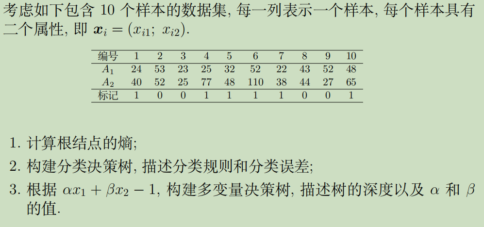

#### (1)根节点熵

$$
{Ent}(D)=-\left(0.4 \log _{2} 0.4+0.6 \log _{2} 0.6\right)=0.97
$$

#### (2)连续值

$$
属性A_1候选划分点集合T=\{22.5,23.5,24.5,28.5,37.5,45.5,50,52,52.5\}\\
属性A_1最优化划分值52，信息增益0.14\\
属性A_2候选划分点集合T=\{26,32.5,39,42,46,50,58.5,71,93.5\}\\
属性A_2最优化划分值32.5，信息增益0.32\\
$$

$所以选择A_2的32.5作为第一层划分，后续同理$

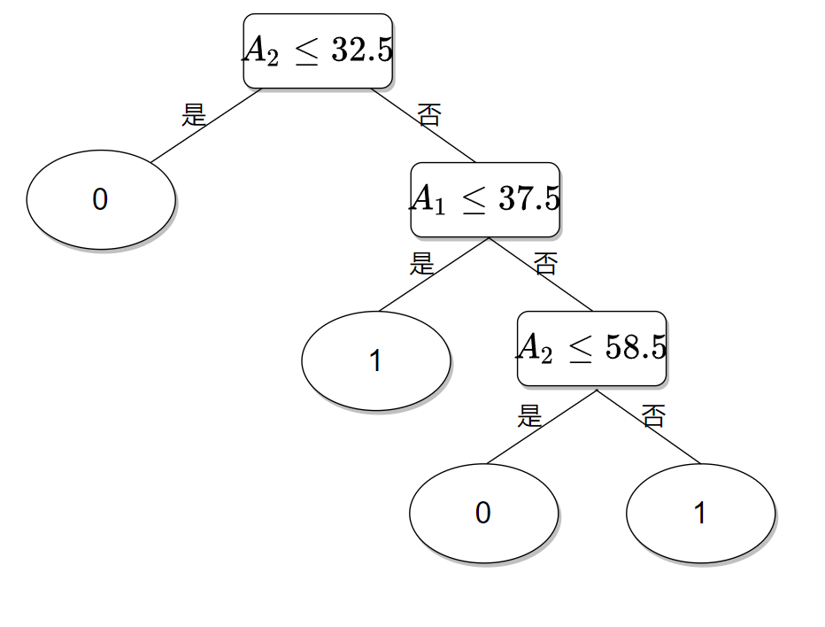

分类误差为0，因为没有冲突样本

#### (3)多变量决策树

##### 分析：

不妨假设两层的决策树可以满足要求，先看看能否实现

令$f(d)=αx_1+βx_2-1$，则对于标记不同的两个样本$d_1,d_2$，一定有$f(d_1)\times f(d_2)\le0$

##### 几何意义：

把`(α,β)`看作是直角坐标系中的一个点，把10个样本对应的函数$f(d_i)$当作是对点`(α,β)`的线性规划，本题的目的就是要找到`(α,β)`的位置满足所有样本的限制。如图：

其中标记为1的样本对应红线

其中标记为0的样本对应蓝线

直观上讲，所有满足条件的`(α,β)`（即能经过一次划分就区分出两种标记）一定满足所有红线都在点的一侧，所有蓝线都在另一侧

阴影区域即为所有`(α,β)`的解

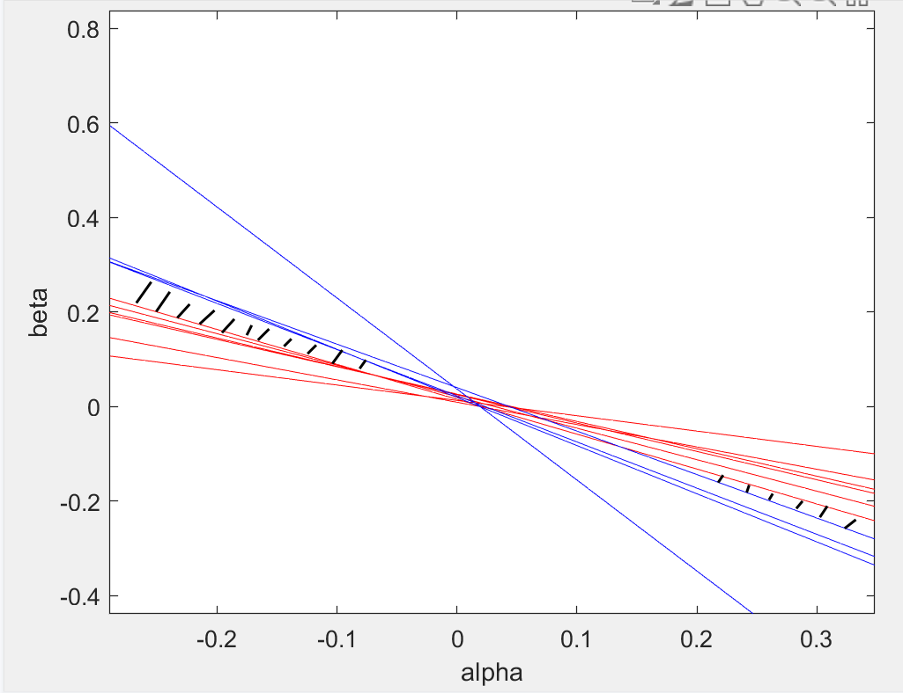

在阴影区域任取一个点`(0.3,-0.21)`作为`(α,β)`的解，得到多变量决策树：

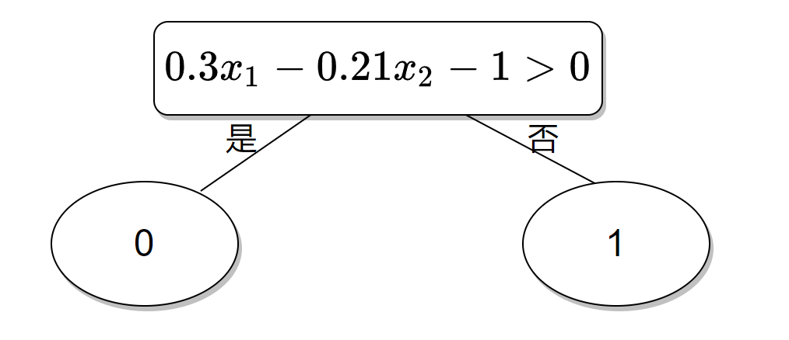
