# 
ML-04

201300086史浩男

第二题附代码Vectorization.py

## 一、神经网络基础

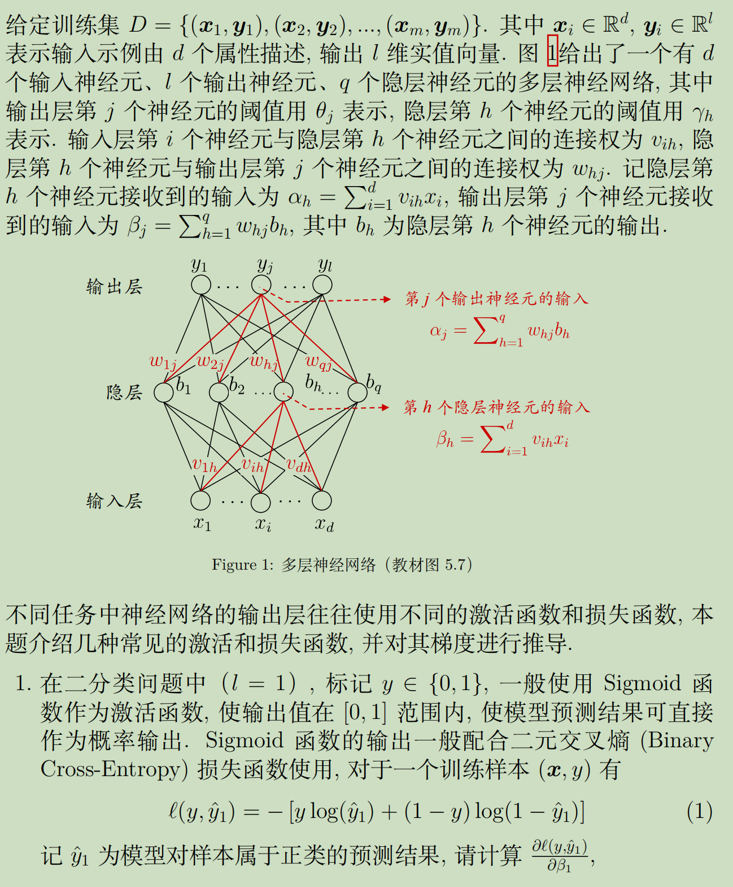

#### (1)Sigmoid

已知 $\hat{y}_{j}=f\left(\beta_{j}-\theta_{j}\right)$，且 $f^{\prime}(x)=f(x)(1-f(x))$，所以
$$
\begin{aligned}
\frac{\partial \ell(y, \hat{y}_{1})}{\partial \beta_{1}}
=&\frac{\partial \ell(y, \hat{y}_{1})\partial\hat{y}_{1}}{\partial\hat{y}_{1}\partial \beta_{1}}\\
=&\left(\frac{1-y}{1-\hat{y}_{1}}-\frac{y}{\hat{y}_{1}}\right)f^{\prime}\left(\beta_{1}-\theta_{1}\right) \\
=&\left(\frac{1-y}{1-\hat{y}_{1}}-\frac{y}{\hat{y}_{1}}\right)\hat{y}_{1}\left(1-\hat{y}_{1}\right)\\
=&\ \hat{y}_{1}-y_1
\end{aligned}
$$
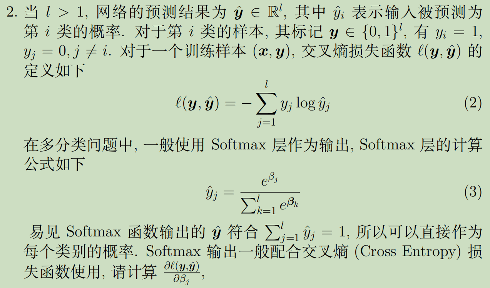

#### (2)Softmax多分类

不能只对维度j求偏导，因为每个$\hat{y}_{k}$中都有$\beta_{j}$

对于$\forall k\not =j$：
$$
\begin{aligned}
\frac{\partial \hat{y}_{k}}{\partial \beta_{j}}
&=\frac{\partial(\frac{e^{\beta_{k}}}{\sum_{i=1}^{l} e^{\boldsymbol{\beta}_{i}}})}{\partial \beta_{j}}\\
&=-\hat{y}_{k}\frac{e^{\boldsymbol{\beta}_{j}}}{\sum_{i=1}^{l} e^{\boldsymbol{\beta}_{i}}}\\
&=-\hat{y}_{k}e^{\boldsymbol{\beta}_{j}}\frac{\hat{y}_{j}}{e^{\boldsymbol{\beta}_{j}}}\\
&=-\hat{y}_{k}\hat{y}_{j}
\end{aligned}
$$
因此求偏导：
$$
\begin{aligned}
\frac{\partial \ell(\boldsymbol{y}, \boldsymbol{\hat{y}})}{\partial \beta_{j}}
=&\frac{\partial \ell(\boldsymbol{y}, \boldsymbol{\hat{y}})\partial\hat{y}_{j}}{\partial\hat{y}_{j}\partial \beta_{j}}+\sum_{k \neq j} \frac{\partial \ell(\boldsymbol{y}, \hat{\boldsymbol{y}})}{\partial \hat{y}_{k}} \frac{\partial \hat{y}_{k}}{\partial \beta_{j}}\\
=&-\frac{y_j}{\hat{y}_{j}} \times\hat{y}_{j}(1-\hat{y}_{j})+\sum_{k \neq j}\frac{y_k}{\hat{y}_{k}} \times\hat{y}_{k}\hat{y}_{j}\\
=&-y_j+y_j\hat{y}_{j}+\sum_{k \neq j}y_k\hat{y}_{j}\\
=&\sum_{k=1}^{l} y_k\hat{y}_{j}-y_j\\
=&  \ \hat{y}_{j}-y_j
\end{aligned}
$$

#### (3)二分类中使用`Softmax`和`Sigmoid`的联系与区别

##### 联系

把$j=1$带入第二问的结果中，可以发现`Softmax`和`Sigmoid`的求偏导结果相同

因此二者用于二分类问题时的结果是大致相同的，并且两个类别概率的和为 1

##### 区别

`Softmax`计算的是一个比重，是一个针对输出结果归一化的过程，对两个类别均输出对应的概率。

`Sigmoid` 只是对每一个输出值进行非线性化，只是一个非线性激活过程，只输出一个类别的概率, 另一个类别使用 1 减去前一类别的概率取得。

所以`softmax`一般用于多分类的结果，大多数用于网络的最后一层。而`sigmoid`是原本一种隐层之间的激活函数，效果比其他激活函数差，一般只会出现在二分类的输出层中，与0 1真实标签配合使用。

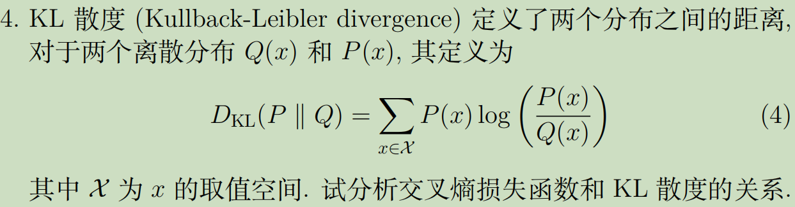

#### (4)KL散度与交叉熵损失

交叉熵损失函数：
$$
\ell(P, Q)=-\sum_{x \in \mathcal{X}} P\left(x\right) \log \left(Q\left(x\right)\right)
$$
信息熵函数：
$$
Ent(P)=\sum_{x \in \mathcal{X}} P\left(x\right) \log \left(P\left(x\right)\right)
$$
所以KL散度可以表示为
$$
D_{\mathrm{KL}}(P \| Q)&=&\sum_{x \in \mathcal{X}} P(x) \log \left(\frac{P(x)}{Q(x)}\right)\\
&=&\sum_{x \in \mathcal{X}} P\left(x\right) \log \left(P\left(x\right)\right)-\sum_{x \in \mathcal{X}} P\left(x\right) \log \left(Q\left(x\right)\right)\\
&=&Ent(P)+\ell(P, Q)
$$

##### 分析

如果$P(x)$代表了输入样本中的$\boldsymbol{y}$，则样本输入不变时，$P(x)与Ent(P)$不变，都可以视作常数

因此 $D_{\mathrm{KL}}(P \| Q) $ 与  $\ell(\boldsymbol{y}, \hat{\boldsymbol{y}}) $ 只是在常数上有区别，最小化  $D_{\mathrm{KL}}(P \| Q) $ 等价于最小化 $ \ell(\boldsymbol{y}, \hat{\boldsymbol{y}}) .$

## 二、运算向量化

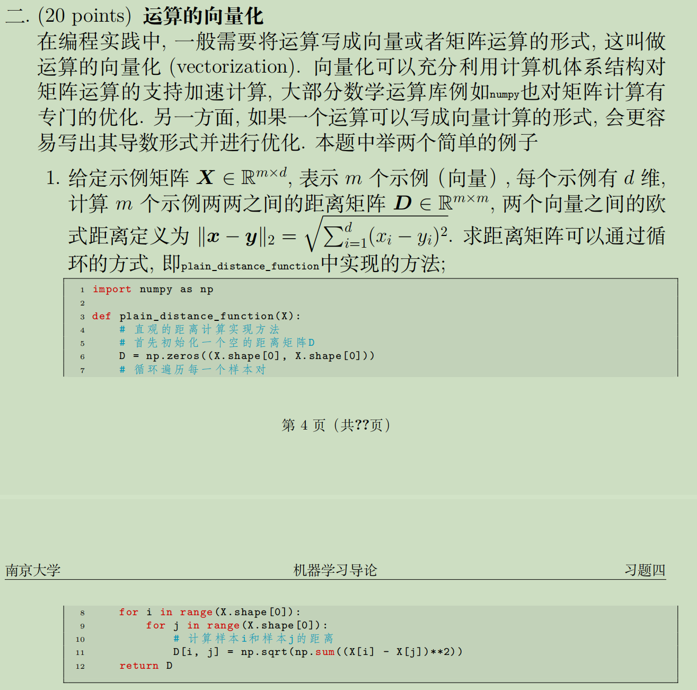

#### (1)

$\text { 将 } \sum_{i=1}^{d}\left(x_{i}-y_{i}\right)^{2} \text { 拆分成 } \sum_{i=1}^{d} x_{i}^{2}+\sum_{i=1}^{d} y_{i}^{2}-2 \sum_{i=1}^{d} x_{i} y_{i} \text { }$，然后分别计算三个矩阵，再相加。

X是随机$m*d$维矩阵，m和d指定

**代码如下：**

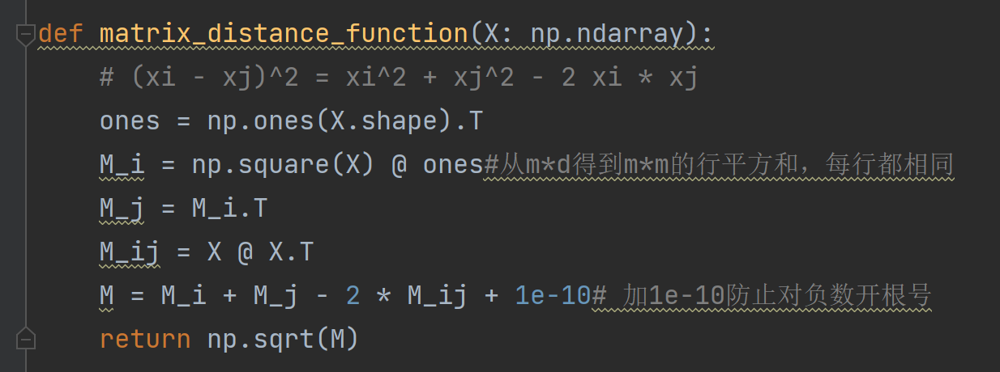

**结果与分析：**

- 分别针对（10，10）和（1000，1000）的矩阵规模尝试`plain`方法和`matrix`方法，

- 其中小规模矩阵计算的是运行100次总时间
- 具体时间计算时没有计算生成随机矩阵$X$所需时间

程序运行时间如下

- 小规模矩阵（10，10）时，`matrix`方法所需时间大概是`plain`的$\frac{1}{10}$
- 大规模矩阵（1000，1000）时，`matrix`方法所需时间大概是`plain`的$\frac{1}{150}$

我们发现`matrix`方法对于`plain`在不同规模下都有绝对优势。

这是因为`matrix`方法中分离了$x和y$内部的平方计算，计算出每个示例内部的平方和后复制了$d$次，减少了大量重复计算，因此我们有理由相信任意矩阵规模`matrix`方法都会有性能的提升

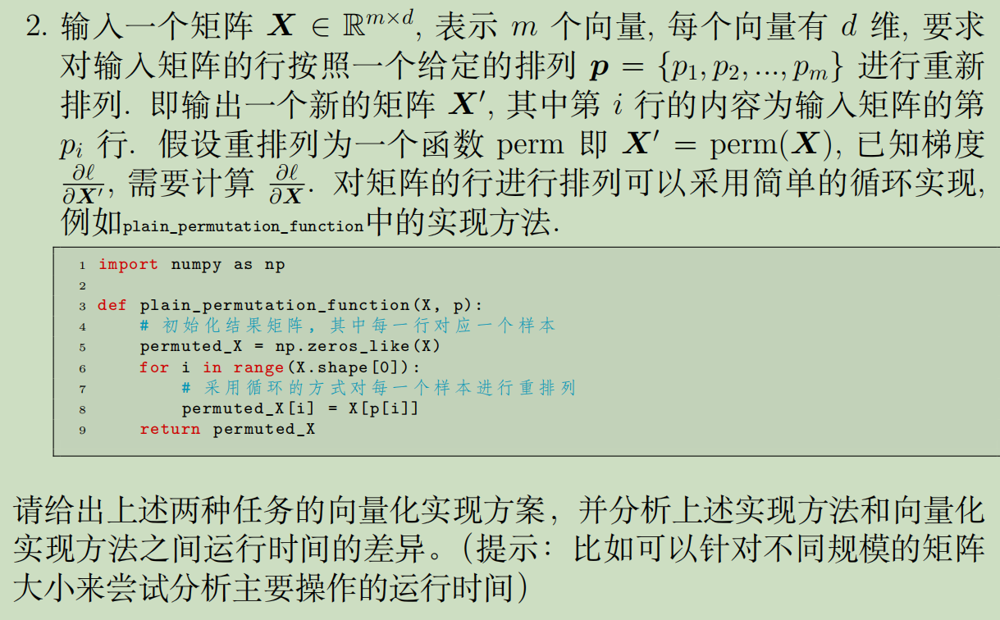

#### (2)

根据任意排列$p$生成变换矩阵$P$的方法：

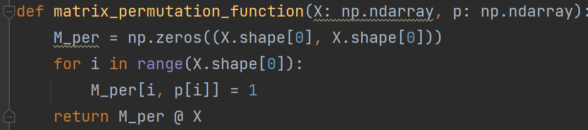

函数返回的$PX$即为我们需要的结果

**结果与分析：**

- 分别针对（10，10）和（2000，2000）的矩阵规模尝试`plain`方法和`matrix`方法，

- 其中小规模矩阵计算的是运行100次总时间，大规模矩阵计算的是运行10次总时间
- 具体时间计算时没有计算生成随机矩阵$X$和随机序列$p$所需时间

程序运行时间如下

- 小规模矩阵（10，10）时，`matrix`方法所需时间大概是`plain`的$\frac{1}{7}$
- 大规模矩阵（1000，1000）时，`matrix`方法所需时间大概是`plain`的$30$倍

我们发现`matrix`方法对于`plain`在小规模下有一些优势，但在输入规模增加后开始显露出越来越大的劣势

这是因为相比于`plain`方法的朴素直接计算，`matrix`方法需要先生成$m\times m$的巨大变换矩阵$P$，然后再将两个巨大的矩阵相乘来得到结果，使得计算开销随着矩阵规模的扩大越发不可控

## 三、支持向量机

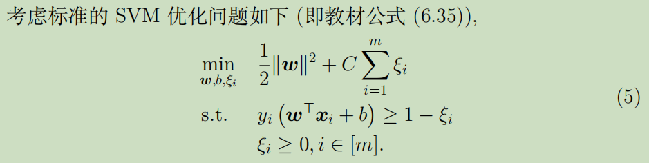

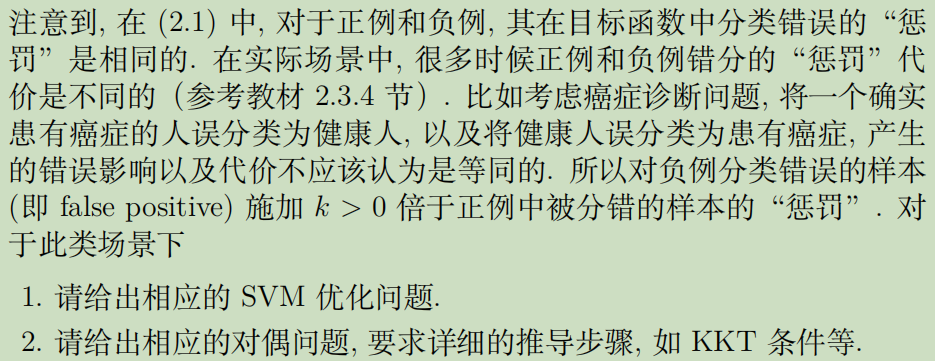

负例分类错误：$y_i=-1,\ w^Tx+b>1$

正例分类错误：$y_i=1,\ w^Tx+b<-1$

0/1损失函数：
$$
\ell_{0 / 1}(y,z)=\left\{\begin{array}{ll}
k, & \text { if } z<0 ,y=-1\\
1, & \text { if } z<0 ,y=1\\
0, & \text { otherwise }
\end{array}\right.
$$

$$
简化后：\ell_{0 / 1}(y,z)=\left\{\begin{array}{ll}
\frac{k+1-y(k-1)}{2}, & \text { if } z<0\\
0, & \text { otherwise }
\end{array}\right.
$$

#### (1)SVM优化问题

$$
\begin{array}{ll}
\min _{\boldsymbol{w}, b, \xi_{i}} & \frac{1}{2}\|\boldsymbol{w}\|^{2}+C \sum_{i=1}^{m}\frac{k+1-y_i(k-1)}{2} \xi_{i} \\
\text { s.t. } & y_{i}\left(\boldsymbol{w}^{\top} \boldsymbol{x}_{i}+b\right) \geq 1-\xi_{i} \\
& \xi_{i} \geq 0, i \in[m] 
\end{array}
$$

#### (2)对偶问题

$$
\begin{aligned}
L(\boldsymbol{w}, b, \boldsymbol{\alpha}, \boldsymbol{\xi}, \boldsymbol{\mu})=& \frac{1}{2}\|\boldsymbol{w}\|_{2}^{2}+C \sum_{i=1}^{m} \frac{k+1-y_i(k-1)}{2} \xi_{i} 
+\sum_{i=1}^{m} \alpha_{i}\left(1-\xi_{i}-y_{i}\left(\boldsymbol{w}^{\mathrm{T}} \boldsymbol{x}_{i}+b\right)\right)-\sum_{i=1}^{m} \mu_{i} \xi_{i}
\end{aligned}
$$

 对$  \boldsymbol{w}, b, \xi_{i}$  求偏导等于零可得

$$
\begin{array}
\boldsymbol{w} =\sum_{i=1}^{m} \alpha_{i} y_{i} \boldsymbol{x}_{i} \\
\sum_{i=1}^{m} \alpha_{i} y_{i} =0 \\
\frac{k+1-y_i(k-1)}{2} C =\alpha_{i}+\mu_{i}
\end{array}
$$
代入化简
$$
\begin{aligned}
L(\boldsymbol{w}, b, \boldsymbol{\alpha}, \boldsymbol{\xi}, \boldsymbol{\mu})
=& \frac{1}{2}\|\boldsymbol{w}\|_{2}^{2}+C \sum_{i=1}^{m} \frac{k+1-y_i(k-1)}{2} \xi_{i} 
+\sum_{i=1}^{m} \alpha_{i}\left(1-\xi_{i}-y_{i}\left(\boldsymbol{w}^{\mathrm{T}} \boldsymbol{x}_{i}+b\right)\right)-\sum_{i=1}^{m} \mu_{i} \xi_{i}\\
=& \frac{1}{2}\|\boldsymbol{w}\|_{2}^{2}+\sum_{i=1}^{m} \alpha_{i}\left(1-y_{i}\left(\boldsymbol{w}^{\mathrm{T}} \boldsymbol{x}_{i}+b\right)\right)\\
=&\frac{1}{2}\|\boldsymbol{w}\|_{2}^{2}+\sum_{i=1}^{m} \alpha_{i}-\sum_{i=1}^{m} \alpha_{i}y_i\boldsymbol{w}^{\mathrm{T}} \boldsymbol{x}_{i}\\
=&\sum_{i=1}^{m} \alpha_{i}-\frac{1}{2} \sum_{i=1}^{m} \sum_{j=1}^{m} \alpha_{i} \alpha_{j} y_{i} y_{j} \boldsymbol{x}_{i}^{\mathrm{T}} \boldsymbol{x}_{j}
\end{aligned}
$$
约束条件消去除$α_i,y_i$外其他项
$$
\sum_{i=1}^{m} \alpha_{i} y_{i} =0 \\
\frac{k+1-y_i(k-1)}{2} C -\alpha_{i}\ge0
$$
得到对偶问题
$$
\begin{aligned}
\max _{\boldsymbol{\alpha}} & \sum_{i=1}^{m} \alpha_{i}-\frac{1}{2} \sum_{i=1}^{m} \sum_{j=1}^{m} \alpha_{i} \alpha_{j} y_{i} y_{j} \boldsymbol{x}_{i}^{\mathrm{T}} \boldsymbol{x}_{j} \\
\text { s.t. } & \sum_{i=1}^{m} \alpha_{i} y_{i}=0 \\
& 0 \leq \alpha_{i} \leq \frac{k+1-y_i(k-1)}{2} C
\end{aligned}
$$
对任意训练样本 $ \left(\boldsymbol{x}_{i}, y_{i}\right) $总有 $ \alpha_{i}=0$  或 $ y_{i} f\left(\boldsymbol{x}_{i}\right)=1-\xi_{i} $

- 若 $ \alpha_{i}=0$ , 该样本不会对 $f(\boldsymbol{x})  $有任何影响;
- 若 $y_{i} f\left(\boldsymbol{x}_{i}\right)=1-\xi_{i} $, 该样本是支持向量。
  - 若 $ \alpha_{i}<\frac{k+1-y_i(k-1)}{2}C  $  则 $ \mu_{i}>0$ ,   $\xi_{i}=0$ , 该样本恰在最大间隔边界上; 
  - 若 $ \alpha_{i}=\frac{k+1-y_i(k-1)}{2}C $  则 $ \mu_{i}=0$ , 若 $ \xi_{i} \leqslant 1 $ 则该样本落在最大间隔内部, 若 $ \xi_{i}>1$  则该样本被错误分类

KKT条件
$$
\left\{\begin{array}{l}
\alpha_{i} \geq 0, \mu_{i} \geq 0 \\
y_{i} f\left(\boldsymbol{x}_{i}\right)-1+\xi_{i} \geq 0 \\
\alpha_{i}\left(y_{i} f\left(\boldsymbol{x}_{i}\right)-1+\xi_{i}\right)=0 \\
\xi_{i} \geq 0, \mu_{i} \xi_{i}=0
\end{array}\right.
$$

## 四、核函数拓展性

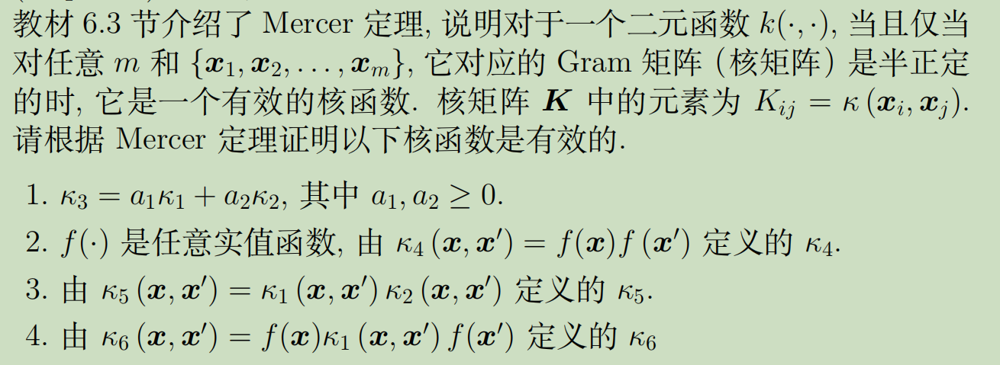

设$\kappa_i$对应的核矩阵为$K_i$

#### (1)

由于$\kappa_1,\kappa_2$是核函数，其核矩阵半正定，即对任意实非零m维向量$x$有：
$$
x^TK_1x≥0,x^TK_2x≥0\\
$$
由于$\kappa_{3}=a_{1} \kappa_{1}+a_{2} \kappa_{2}$， 则对任意$a_1,a_2\ge 0$，满足：
$$
a_1x^TK_1x+a_2x^TK_2x=x^TK_3x≥0\\
$$
所以$K_3$半正定，$\kappa_3$有效

#### (2)

$$
K_4&=&\left(\begin{array}{cccc}
\kappa_{4}\left(\boldsymbol{x}_{1}, \boldsymbol{x}_{1}\right) & \kappa_{4}\left(\boldsymbol{x}_{1}, \boldsymbol{x}_{2}\right) & \cdots & \kappa_{4}\left(\boldsymbol{x}_{1}, \boldsymbol{x}_{m}\right) \\
\kappa_{4}\left(\boldsymbol{x}_{2}, \boldsymbol{x}_{1}\right) & \kappa_{4}\left(\boldsymbol{x}_{2}, \boldsymbol{x}_{2}\right) & \cdots & \kappa_{4}\left(\boldsymbol{x}_{2}, \boldsymbol{x}_{m}\right) \\
\vdots & \vdots & \ddots & \vdots \\
\kappa_{4}\left(\boldsymbol{x}_{m}, \boldsymbol{x}_{1}\right) & \kappa_{4}\left(\boldsymbol{x}_{m}, \boldsymbol{x}_{2}\right) & \cdots & \kappa_{4}\left(\boldsymbol{x}_{m}, \boldsymbol{x}_{m}\right)
\end{array}\right)\\
&=&(f(\boldsymbol{x}_{1}),f(\boldsymbol{x}_{2}),\cdots,f(\boldsymbol{x}_{m}))^T(f(\boldsymbol{x}_{1}),f(\boldsymbol{x}_{2}),\cdots,f(\boldsymbol{x}_{m}))
$$

因此对任意实非零m维向量$x$：
$$
x^TK_4x=x^T(f(\boldsymbol{x}_{1}),f(\boldsymbol{x}_{2}),\cdots,f(\boldsymbol{x}_{m}))^T(f(\boldsymbol{x}_{1}),f(\boldsymbol{x}_{2}),\cdots,f(\boldsymbol{x}_{m}))x\ge 0
$$
所以$K_4$半正定，$\kappa_4$有效

#### (3)

对任意实非零m维向量$y$：
$$
y^TK_5y&=&\sum_{i=1}^{m} \sum_{j=1}^{m} \kappa_{1}\left(x_{i}, x_{i}^{'}\right) \kappa_{2}\left(x_{j}, x_{j}^{'}\right) y_{i} y_{j}\\
&=&tr(\left[\begin{array}{lll}
y_{1} \kappa_{1}\left(x_{1}, x_{1}^{\prime}\right) & y_{1} \kappa_{1}\left(x_{1}, x_{2}^{\prime}\right) &\cdots& y_{1} \kappa_{1}\left(x_{1}, x_{m}^{\prime}\right) \\
y_{2} \kappa_{1}\left(x_{2}, x_{1}^{'}\right) & y_{2} \kappa_{1}\left(x_{2}, x_{2}^{\prime}\right) &\cdots& y_{2} \kappa_{1}\left(x_{2}, x_{m}^{\prime}\right) \\
\vdots & \vdots & \ddots&  \vdots \\ 
y_{m} \kappa_{1}\left(x_{m}, x_{1}^{'}\right) & y_{n} \kappa_{1}\left(x_{m}, x_{2}^{'}\right) &\cdots& y_{n} \kappa_{1}\left(x_{m}, x_{m}^{\prime}\right)
\end{array}\right]
\left[\begin{array}{lll}
y_{1} \kappa_{2}\left(x_{1}, x_{1}^{\prime}\right) & y_{1} \kappa_{2}\left(x_{1}, x_{2}^{\prime}\right) &\cdots& y_{1} \kappa_{2}\left(x_{1}, x_{m}^{\prime}\right) \\
y_{2} \kappa_{2}\left(x_{2}, x_{1}^{'}\right) & y_{2} \kappa_{2}\left(x_{2}, x_{2}^{\prime}\right) &\cdots& y_{2} \kappa_{2}\left(x_{2}, x_{m}^{\prime}\right) \\
\vdots & \vdots & \ddots&  \vdots \\ 
y_{m} \kappa_{2}\left(x_{m}, x_{1}^{'}\right) & y_{n} \kappa_{2}\left(x_{m}, x_{2}^{'}\right) &\cdots& y_{n} \kappa_{1}\left(x_{m}, x_{m}^{\prime}\right)
\end{array}\right])\\
&=&tr\left(\left[\begin{array}{lll}
y_{1} & & \\
& y_{2} & \\
& &\ddots& \\
& & &y_{m}
\end{array}\right] K_{1}\left[\begin{array}{lll}
y_{1} & & \\
& y_{2} & \\
& & \ddots\\
& & &y_{m}
\end{array}\right] K_{2}^{T}\right)
$$
由于$K_1,K_2$是半正定矩阵，所以满足$K_{1}=C^{T} C, \quad K_{2}=D^{T} D$
$$
y^TK_5y&=&tr\left(\left[\begin{array}{lll}
y_{1} & & \\
& y_{2} & \\
& &\ddots& \\
& & &y_{m}
\end{array}\right] C^{T} C\left[\begin{array}{lll}
y_{1} & & \\
& y_{2} & \\
& & \ddots\\
& & &y_{m}
\end{array}\right] D^{T} D\right)\\
&=&tr\left(\left(C\left [\begin{array}{lll}
y_{1} & & \\
& y_{2} & \\
& &\ddots& \\
& & &y_{m}
\end{array}\right] D^{T}\right)^T\left(C\left [\begin{array}{lll}
y_{1} & & \\
& y_{2} & \\
& &\ddots& \\
& & &y_{m}
\end{array}\right] D^{T}\right)\right)\\
&\ge0
$$
所以$K_5$半正定，$\kappa_5$有效

#### (4)

$$
K_6
&=&\left(\begin{array}{ccc}
f\left(\boldsymbol{x}_{1}\right) \kappa_{1}\left(\boldsymbol{x}_{1}, \boldsymbol{x}_{1}\right) f\left(\boldsymbol{x}_{1}\right) & \cdots & f\left(\boldsymbol{x}_{1}\right) \kappa_{1}\left(\boldsymbol{x}_{1}, \boldsymbol{x}_{m}\right) f\left(\boldsymbol{x}_{m}\right) \\
f\left(\boldsymbol{x}_{2}\right) \kappa_{1}\left(\boldsymbol{x}_{2}, \boldsymbol{x}_{1}\right) f\left(\boldsymbol{x}_{1}\right) & \cdots & f\left(\boldsymbol{x}_{2}\right) \kappa_{1}\left(\boldsymbol{x}_{2}, \boldsymbol{x}_{m}\right) f\left(\boldsymbol{x}_{m}\right) \\
\vdots & \ddots & \vdots \\
f\left(\boldsymbol{x}_{m}\right) \kappa_{1}\left(\boldsymbol{x}_{m}, \boldsymbol{x}_{1}\right) f\left(\boldsymbol{x}_{1}\right) & \cdots & f\left(\boldsymbol{x}_{m}\right) \kappa_{1}\left(\boldsymbol{x}_{m}, \boldsymbol{x}_{m}\right) f\left(\boldsymbol{x}_{m}\right)
\end{array}\right)\\
&=&\left(\begin{array}{cccc}
f\left(\boldsymbol{x}_{1}\right) & 0 & \cdots & 0 \\
0 & f\left(\boldsymbol{x}_{2}\right) & \cdots & 0 \\
\vdots & \vdots & \ddots & \vdots \\
0 & 0 & \cdots & f\left(\boldsymbol{x}_{m}\right)
\end{array}\right)^T
\left(\begin{array}{cccc}
\kappa_{1}\left(\boldsymbol{x}_{1}, \boldsymbol{x}_{1}\right) & \kappa_{1}\left(\boldsymbol{x}_{1}, \boldsymbol{x}_{2}\right) & \cdots & \kappa_{1}\left(\boldsymbol{x}_{1}, \boldsymbol{x}_{m}\right) \\
\kappa_{1}\left(\boldsymbol{x}_{2}, \boldsymbol{x}_{1}\right) & \kappa_{1}\left(\boldsymbol{x}_{2}, \boldsymbol{x}_{2}\right) & \cdots & \kappa_{1}\left(\boldsymbol{x}_{2}, \boldsymbol{x}_{m}\right) \\
\vdots & \vdots & \ddots & \vdots \\
\kappa_{1}\left(\boldsymbol{x}_{m}, \boldsymbol{x}_{1}\right) & \kappa_{1}\left(\boldsymbol{x}_{m}, \boldsymbol{x}_{2}\right) & \cdots & \kappa_{1}\left(\boldsymbol{x}_{m}, \boldsymbol{x}_{m}\right)
\end{array}\right)
\left(\begin{array}{cccc}
f\left(\boldsymbol{x}_{1}\right) & 0 & \cdots & 0 \\
0 & f\left(\boldsymbol{x}_{2}\right) & \cdots & 0 \\
\vdots & \vdots & \ddots & \vdots \\
0 & 0 & \cdots & f\left(\boldsymbol{x}_{m}\right)
\end{array}\right)\\
$$
所以$K_6$可被表示为$H^TK_1H$

对任意实非零m维向量$y$：
$$
\boldsymbol{y}^{\mathrm{T}} \boldsymbol{K}_{6} \boldsymbol{y}=\boldsymbol{y}^{\mathrm{T}} \boldsymbol{H}^{\mathrm{T}} \boldsymbol{K}_{1} \boldsymbol{H} \boldsymbol{y}=(\boldsymbol{H} \boldsymbol{y})^{\mathrm{T}} \boldsymbol{K}_{1}(\boldsymbol{H} \boldsymbol{y}) \geq 0
$$

## 五、PCA

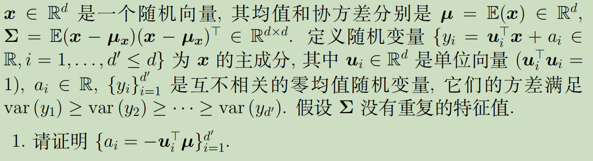

#### (1)

由于$\{y_i\}_{i=1}^{d'}$是互不相关零均值随机变量，则
$$
\sum_{i=1}^{d'}y_i=\sum_{i=1}^{d'}\boldsymbol{u_i}^T\boldsymbol{x}+\sum_{i=1}^{d'}a_i=0\\
\mathbb{E}(y_i)=\boldsymbol{u_i}^T\mathbb{E}(\boldsymbol{x})+a_i=\boldsymbol{u_i}^T\boldsymbol{μ}+a_i=0\\
a_{i}=-\boldsymbol{u}_{i}^{\top} \boldsymbol{\mu}
$$

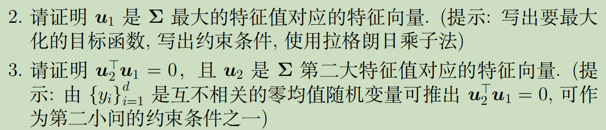

#### (2)最大特征值即最大方差

我们已知最大方差是$var(y_1)$，需要证明最大特征值即是最大方差
$$
var(y_i)&=&\mathbb{E}(y_i^2)-\mathbb{E}(y_i)^2\\
&=&\mathbb{E}((\boldsymbol{u_i}^T(\boldsymbol{x}-\boldsymbol{μ}))^2)\\
&=&\boldsymbol{u_i}^T\mathbb{E}(\boldsymbol{x}-\boldsymbol{μ})(\boldsymbol{x}-\boldsymbol{μ})^T\boldsymbol{u_i}\\
&=&\boldsymbol{u_i}^T\boldsymbol{\Sigma}\boldsymbol{u_i}
$$
因此最大化目标函数为$\sum_{i=1}^{d'}var(y_i)=\sum_{i=1}^{d'}\boldsymbol{u_i}^T\boldsymbol{\Sigma}\boldsymbol{u_i}$， 对应最优化问题和约束条件：
$$
min_\boldsymbol{u_i} \ -\sum_{i=1}^{d'}\boldsymbol{u_i}^T\boldsymbol{\Sigma}\boldsymbol{u_i}\\
s.t.\boldsymbol{u_i}^T\boldsymbol{u_i}=1,i\in[d']
$$
使用拉格朗日乘子法：
$$
\begin{aligned}
L(\boldsymbol{u_i}, \boldsymbolλ)
=& -\sum_{i=1}^{d'}\boldsymbol{u_i}^T\boldsymbol{\Sigma}\boldsymbol{u_i}
\end{aligned}+\boldsymbolλ(\boldsymbol{u_i}^T\boldsymbol{u_i}-1)
$$
对$\boldsymbol{u_i}$求偏导，令其为0：
$$
\boldsymbolλ\boldsymbol{u_i}-\sum_{i=1}^{d'}\boldsymbol{\Sigma}\boldsymbol{u_i}=0\\
即λ_i\boldsymbol{u_i}=\boldsymbol{\Sigma}\boldsymbol{u_i}
$$
所以我们得出$λ_i$是$\boldsymbol{\Sigma}$的特征值，$\boldsymbol{u_i}$是$λ_i$对应的特征向量，因此
$$
var(y_i)
&=&\boldsymbol{u_i}^T\boldsymbol{\Sigma}\boldsymbol{u_i}\\
&=&λ_i\boldsymbol{u_i}^T\boldsymbol{u_i}\\
&=&λ_i
$$
再由于$\operatorname{var}\left(y_{1}\right) \geq \operatorname{var}\left(y_{2}\right) \geq \cdots \geq \operatorname{var}\left(y_{d^{\prime}}\right)$，因此$ λ_1\geq λ_2  \geq \cdots \geq λ_{d^{\prime}}$

因此最大特征值$λ_1$对应的向量是$\boldsymbol{u_1}$

#### (3)特征向量正交

由于$\{y_i\}_{i=1}^{d'}$是互不相关零均值随机变量，则
$$
\mathbb{E}(y_iy_j)=\mathbb{E}(y_i)\mathbb{E}(y_j)=0
$$

$$
\begin{aligned}
\mathbb{E}\left[y_{i} y_{j}\right] &=\mathbb{E}\left[\left(\boldsymbol{u}_{i}^{\mathrm{T}} \boldsymbol{x}+a_{i}\right)\left(\boldsymbol{u}_{j}^{\mathrm{T}} \boldsymbol{x}+a_{j}\right)\right] \\
&=\mathbb{E}\left[\boldsymbol{u}_{i}^{\mathrm{T}}(\boldsymbol{x}-\boldsymbol{\mu})(\boldsymbol{x}-\boldsymbol{\mu})^{\mathrm{T}} \boldsymbol{u}_{j}\right] \\
&=\boldsymbol{u}_{i}^{\mathrm{T}} \mathbb{E}\left[(\boldsymbol{x}-\boldsymbol{\mu})(\boldsymbol{x}-\boldsymbol{\mu})^{\mathrm{T}}\right] \boldsymbol{u}_{j} \\
&=\boldsymbol{u}_{i}^{\mathrm{T}} \boldsymbol{\Sigma} \boldsymbol{u}_{j} \\
&=\lambda_{i} \boldsymbol{u}_{i}^{\mathrm{T}} \boldsymbol{u}_{j} \\
&=\lambda_{j} \boldsymbol{u}_{i}^{\mathrm{T}} \boldsymbol{u}_{j}
\end{aligned}
$$

由于$\boldsymbol{\Sigma}$没有重复特征根，所以对$\forall i,j, \ λ_i\not=λ_j$，所以只能$\boldsymbol{u}_{i}^{\mathrm{T}} \boldsymbol{u}_{j}=0$

在(2)中已经证明：第k大的特征根是$λ_k$，对应的特征向量是$\boldsymbol{u}_{k}$

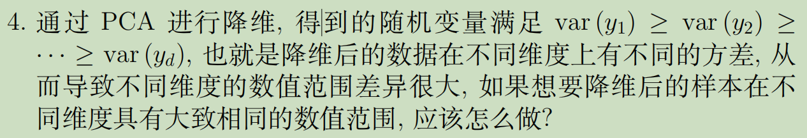

#### (4)标准化

只需要对降维后的随机变量进行标准化操作：
$$
y_{i}^{\prime}=\frac{y_{i}}{\sqrt{\operatorname{var}\left(y_{i}\right)}}=\frac{y_{i}}{\sqrt{\lambda_{i}}}
$$
结果可以保证降维后方差都为1：
$$
\operatorname{var}\left(y_{i}^{\prime}\right)=\left(\frac{1}{\sqrt{\operatorname{var}\left(y_{i}\right)}}\right)^{2} \cdot \operatorname{var}\left(y_{i}\right)=1
$$
