# 
ML-05

201300086史浩男

第三题附代码Iris-Bayes.py

## 一、贝叶斯决策论

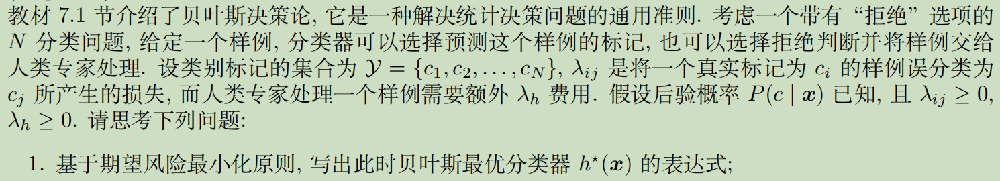

#### (1*)最优分类器

$$
h^{*}(\boldsymbol{x})=\underset{c_i \in \mathcal{Y}}{\arg \min } \sum_{j=1}^{N} \lambda_{i j} P\left(c_{j} \mid \boldsymbol{x}\right)
$$

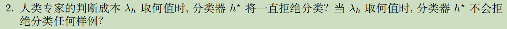

#### (2)代价bound

##### (i)一直拒绝分类：

$$
λ_h\le\min_i  \sum_{j=1}^{N} \lambda_{i j} P\left(c_{j} \mid \boldsymbol{x}\right)
$$

##### (ii)不会拒绝分类：

$$
λ_h\ge\max_i  \sum_{j=1}^{N} \lambda_{i j} P\left(c_{j} \mid \boldsymbol{x}\right)
$$

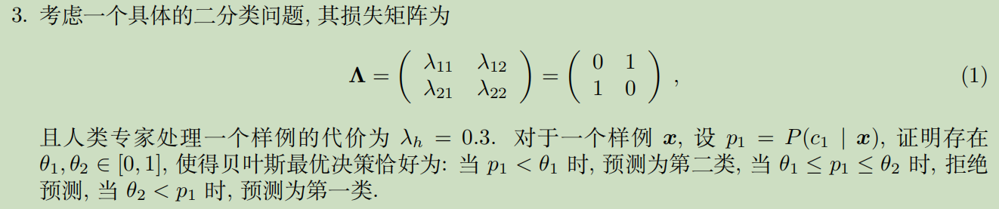

#### (3)

验证当$θ_1=0.3,θ_2=0.7$时满足要求：
$$
R(c_1|x)=λ_{11}P(c_1|x)+λ_{12}P(c_2|x)=P(c_2|x)=1-p_1\\

R(c_2|x)=λ_{21}P(c_1|x)+λ_{22}P(c_2|x)=P(c_1|x)=p_1
$$

- 当$p_1<θ_1$时，$R(c_2|x)=p_1<0.3<1-p_1=R(c_1|x)$，预测为第二类
- 当$θ_1\le p_1\le θ_2$时，$0.3<R(c_2|x),0.3<R(c_1|x)$，拒绝
- 当$θ_2<p_1$时，$R(c_1|x)=1-p_1<0.3<p_1=R(c_2|x)$，预测为第一类

## 二、极大似然估计

#### (1)极大似然估计

设正面朝上概率为$\theta_{c}$

训练集中99个样本的类别都是“正面向上”，所以$\mathcal{θ_c}$对于$D_c$的对数似然为
$$
L L\left(\boldsymbol{\theta}_{c}\right)=\log P\left(D_{c} \mid \boldsymbol{\theta}_{c}\right)=\sum_{\boldsymbol{x} \in D_{c}} \log P\left(\boldsymbol{x} \mid \boldsymbol{\theta}_{c}\right)=99\log\boldsymbol{\theta}_{c}
$$
极大似然估计为
$$
\hat{\boldsymbol{\theta}}_{c}=\underset{\boldsymbol{\theta}_{c}}{\arg \max } L L\left(\boldsymbol{\theta}_{c}\right)
$$
解为：$P\left(1\mid \boldsymbol{\theta}_{c}\right)=1$，即正面向上的概率为1

因此预测第100次正面向上概率为1

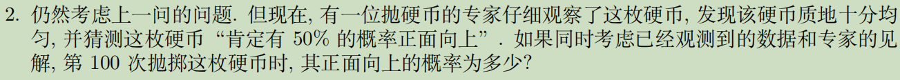

#### (2*)最大后验估计

$$
\begin{aligned}
P(\boldsymbol{\theta}_{c} \mid X) &=\frac{P(X \mid \boldsymbol{\theta}_{c}) P(\boldsymbol{\theta}_{c})}{P(X)} \\
& \propto P(X \mid \boldsymbol{\theta}_{c}) P(\boldsymbol{\theta}_{c})
\end{aligned}
$$

最大后验估计为
$$
\hat{\boldsymbol{\theta}}_{c}&=&\underset{\boldsymbol{\theta}_{c}}{\arg \max } \sum_{\boldsymbol{x} \in D_{c}} \log P\left(\boldsymbol{x} \mid \boldsymbol{\theta}_{c}\right)+logP(\boldsymbol{\theta}_{c})\\
$$
专家的先验P（x）=0.5不连续不可求导，因此也无法准确地计算出$\hat{\boldsymbol{\theta}}_{c}$的值

因此预测第100次正面向上概率为0.5~1.0，无法得到具体值

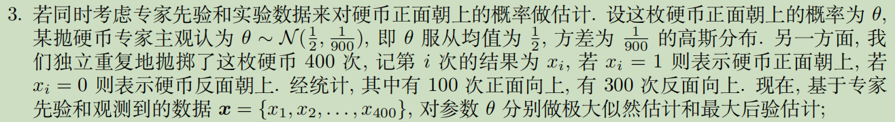

#### (3)

##### 极大似然:

$$
\hat{\boldsymbol{\theta}}&=&\underset{\boldsymbol{\theta}}{\arg \max } L L\left(\boldsymbol{\theta}\right)\\
&=&\underset{\boldsymbol{\theta}}{\arg \max }log(\boldsymbol{\theta}^{100}(1-\boldsymbol{\theta})^{300})\\
&=&\underset{\boldsymbol{\theta}}{\arg \max }100log
\boldsymbol{\theta}+300log(1-\boldsymbol{\theta})
$$

解得$\hat{\boldsymbol{\theta}}=0.25$

##### 最大后验：

$θ$的密度函数：
$$
f(\theta)=\frac{1}{\sqrt{\frac{\pi}{450} }} e^{-\frac{(\theta-0.5)^{2}}{\frac{1}{450}}}
$$
因此最大后验估计：
$$
\hat{\boldsymbol{\theta}}&=&\underset{\boldsymbol{\theta}}{\arg \max }log(\boldsymbol{\theta}^{100}(1-\boldsymbol{\theta})^{300})+log(\frac{1}{\sqrt{\frac{\pi}{450} }} e^{-\frac{(\theta-0.5)^{2}}{\frac{1}{450}}})\\
&=&\underset{\boldsymbol{\theta}}{\arg \max }100log
\boldsymbol{\theta}+300log(1-\boldsymbol{\theta})-450(\theta-0.5)^{2}
$$
求极值，解方程
$$
\frac{d \ln \left[P\left(x_{0}, x_{1}, \ldots, x_{n} \mid \theta\right) \times P(\theta)\right]}{d \theta}=0\\
\frac{100}{\boldsymbol{\theta}}-\frac{300}{1-\boldsymbol{\theta}}-450(2\boldsymbol{\theta}-1)=0\\
18\boldsymbol{\theta}^3-27\boldsymbol{\theta}^2+\boldsymbol{\theta}+2=0
$$
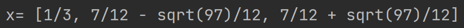

其中符合$[0,1]$范围内的解只有$\hat{\boldsymbol{\theta}}=\frac{1}{3}$

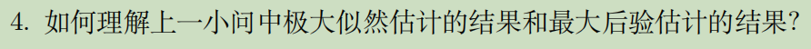

#### (4)

- 极大似然估计MLE是频率主义学派的思想, 认为参数 θ 是一个客观存在的固定值, 可以通过优化似 然函数等准则来确定参数值，只需要看样本的分布，不考虑先验概率，考虑的是可以使得当前抽样结果发生可能性最大的解$θ$，因此直观计算正例占总体样本比例也能算出概率估计值

- 最大后验估计MAP是贝叶斯学派对的估计，必须考虑先验分布的影响，需要引入概率密度函数，求导求最值。由于先验分布的均值表示了概率是0.5，而最大似然求出的概率是0.25，因此最终结果1\3是二者中和的结果

  

## 三、朴素贝叶斯分类器

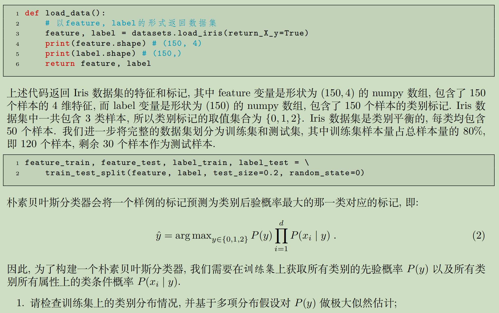

使用`Counter()`函数统计类别分布情况：

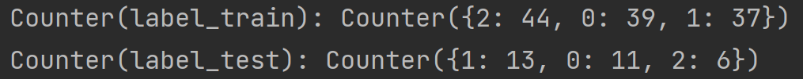

极大似然估计为：
$$
\hat{\boldsymbol{\theta}}_{c}
=\underset{\boldsymbol{\theta}_{c}}{\arg \max } \sum_{\boldsymbol{x} \in D_{c}} \log P\left(\boldsymbol{x} \mid \boldsymbol{\theta}_{c}\right)\\
P(y=0)=\frac{39}{120}=0.325\\
P(y=1)=\frac{37}{120}=0.308\\
P(y=2)=\frac{44}{120}=0.367\\
$$
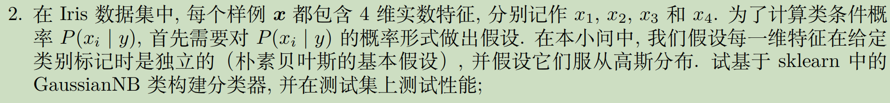

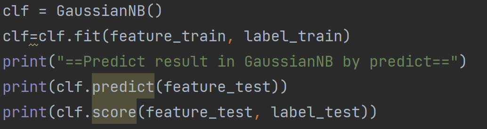

使用`fit`方法训练，使用`predict`方法直接给出测试集的预测类别输出

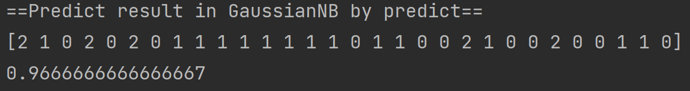

与测试集标记`label_test`对比，发现只有一项不同，准确率`score`为96.7%

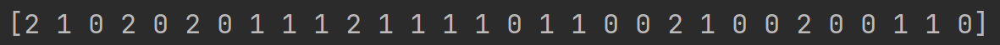

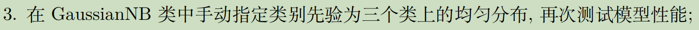

指定类别先验，三类上的均匀分布即每个类都是$\frac{1}{3}$

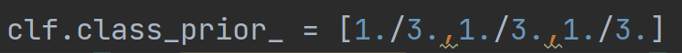

性能结果不变

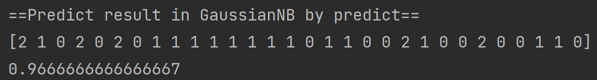

但如果把`predict`方法改为`predict_proba`，即观察更细节的对每个类别估计，可以发现指定类别先验后确实改变了预测结果，只不`predict`方法预测结果过不明显而已：（左图为添加类别先验前，右图为添加后）

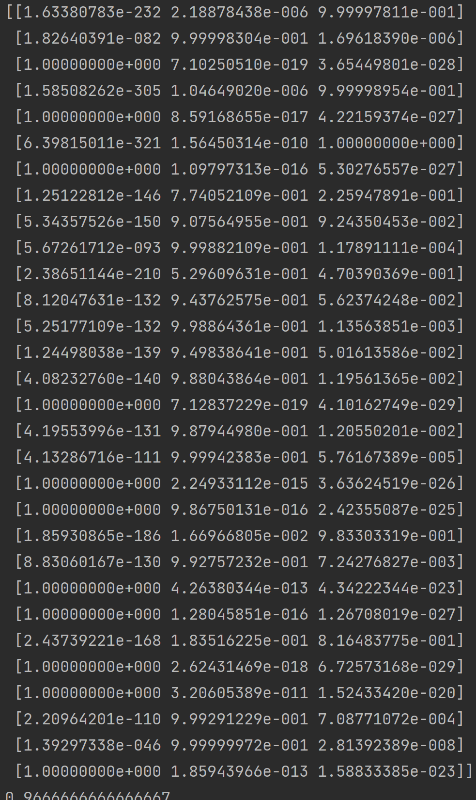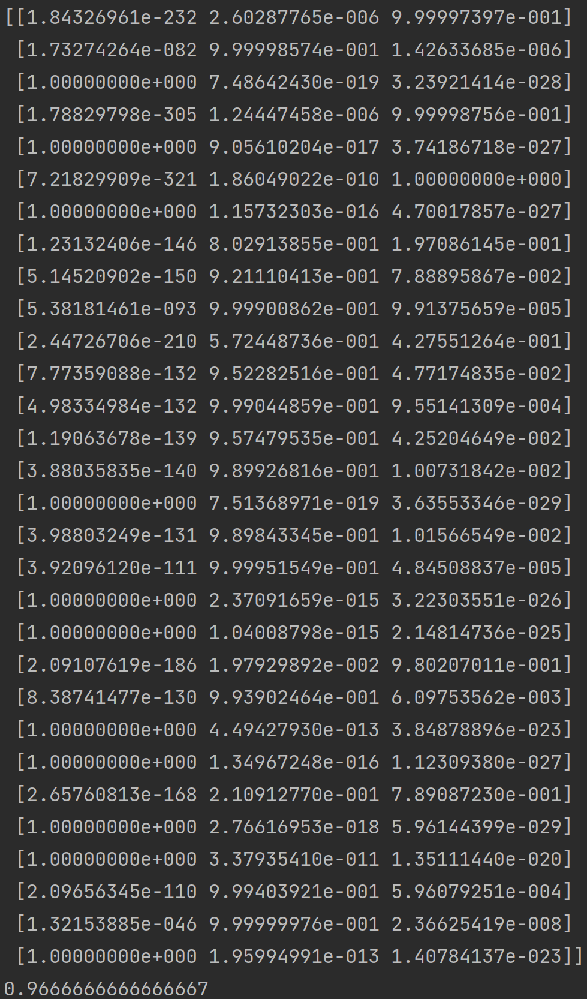

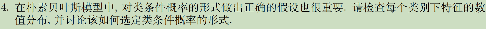

对于训练集中每个类别下每个特征数值分布画出频数直方图

其中$P(x_i|y=j)$表示$j$类别中特征$x_i$的分布

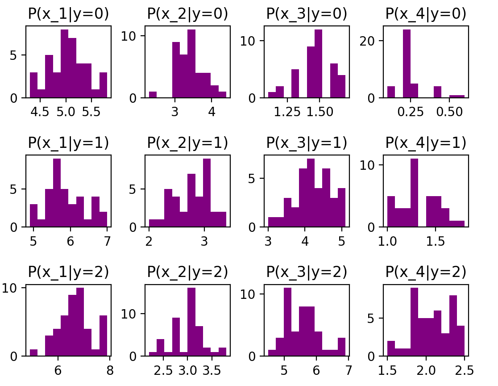

我们发现每个特征的都大致符合高斯分布的特点，即中间高两边低，因此条件概率的形式选择为高斯分布可以增大模型性能

## 四、集成--Boosting

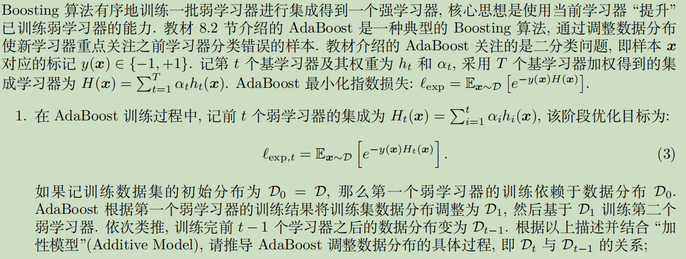
$$
\begin{aligned}
\mathcal{D}_{t}(\boldsymbol{x}) &=\frac{\mathcal{D}(\boldsymbol{x}) e^{-f(\boldsymbol{x}) H_{t-1}(\boldsymbol{x})}}{\mathbb{E}_{\boldsymbol{x} \sim \mathcal{D}}\left[e^{-f(\boldsymbol{x}) H_{t-1}(\boldsymbol{x})}\right]} \\
&=\frac{\mathcal{D}(\boldsymbol{x}) e^{-f(\boldsymbol{x}) H_{t-2}(\boldsymbol{x})} e^{-f(\boldsymbol{x}) \alpha_{t-1} h_{t-1}(\boldsymbol{x})}}{\mathbb{E}_{\boldsymbol{x} \sim \mathcal{D}}\left[e^{-f(\boldsymbol{x}) H_{t-1}(\boldsymbol{x})}\right]} \\
&=\mathcal{D}_{t-1}(\boldsymbol{x}) \cdot e^{-f(\boldsymbol{x}) \alpha_{t-1} h_{t-1}(\boldsymbol{x})} \frac{\mathbb{E}_{\boldsymbol{x} \sim \mathcal{D}}\left[e^{-f(\boldsymbol{x}) H_{t-2}(\boldsymbol{x})}\right]}{\mathbb{E}_{\boldsymbol{x} \sim \mathcal{D}}\left[e^{-f(\boldsymbol{x}) H_{t-1}(\boldsymbol{x})}\right]}
\end{aligned}
$$
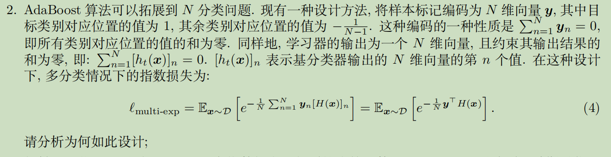

设计优点：

- 指数损失函数$e^{-\frac{1}{N}} \boldsymbol{y}^{\mathrm{T}} H(\boldsymbol{x})$​：预测值  $H(\boldsymbol{x})$  与真实值 $ \boldsymbol{y}  $越接近，$  e^{-\frac{1}{N} \boldsymbol{y}^{\mathrm{T}} H(\boldsymbol{x})} $ 就越小，满足损失函数应有的语义
-  $ [H(\boldsymbol{x})]_{n}=0$ 与 $\sum_{n=1}^{N} \boldsymbol{y}_{n}=0$相统一，起到了去中心化的作用 ，去除均值对结果的影响，使过程和结果更加直观
- $  \frac{1}{N}$  用于标准化损失函数，避免损失函数$e^{-\frac{1}{N}} \boldsymbol{y}^{\mathrm{T}} H(\boldsymbol{x})$ 的值受N的大小的影响

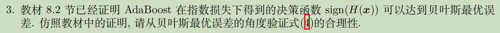

贝叶斯最优分类器：
$$
\arg \max _{\boldsymbol{y}} P(\boldsymbol{y} \mid \boldsymbol{x})
$$
验证指数损失的合理性即要证明：
$$
\arg \min\ell_{\text {multi-exp }}=\arg \max _{\boldsymbol{y}}\left[\boldsymbol{y}^{\mathrm{T}} H(\boldsymbol{x})\right]=\arg \max _{\boldsymbol{y}} P(\boldsymbol{y} \mid \boldsymbol{x})
$$
对$H(\boldsymbol{x})$求偏导：
$$
\begin{aligned}
\frac{\partial \ell_{\text {multi-exp }}}{\partial H(\boldsymbol{x})}&=-\frac{1}{N}  e^{-\frac{1}{N} \boldsymbol{y}^{\mathrm{T}} H(\boldsymbol{x})} \boldsymbol{y}\\ &=-e^{-H(\boldsymbol{x})} P(f(\boldsymbol{x})=1 \mid \boldsymbol{x})+({N-1})e^{\frac{1}{N-1} H(\boldsymbol{x})} P(f(\boldsymbol{x})=-\frac{1}{N-1} \mid \boldsymbol{x})\\&=0
\end{aligned}
$$
解得：
$$
H(\boldsymbol{x})=\frac{N-1}{N} \ln\frac{1}{N-1}\ln \frac{P(f(x)=1 \mid \boldsymbol{x})}{P(f(x)=-\frac{1}{N-1} \mid \boldsymbol{x})}
$$
因此有
$$
\begin{aligned}
\operatorname{sign}(H(\boldsymbol{x})) &=\operatorname{sign}\left(\frac{N-1}{N} \ln\frac{1}{N-1}\ln \frac{P(f(x)=1 \mid \boldsymbol{x})}{P(f(x)=-\frac{1}{N-1} \mid \boldsymbol{x})}\right) \\
&=\left\{\begin{array}{l}
1, \quad P(f(x)=1 \mid \boldsymbol{x})>P(f(x)=-\frac{1}{N-1} \mid \boldsymbol{x}) \\
-1, \quad P(f(x)=1 \mid \boldsymbol{x})<P(f(x)=-\frac{1}{N-1} \mid \boldsymbol{x})
\end{array}\right.\\
&=\underset{y \in\{-\frac{1}{N-1},1\}}{\arg \max } P(f(x)=y \mid \boldsymbol{x}),
\end{aligned}
$$
所以若指数损失函数最小化，则分类错误率也最小化。即指数损失是合理的

## 五、Bagging

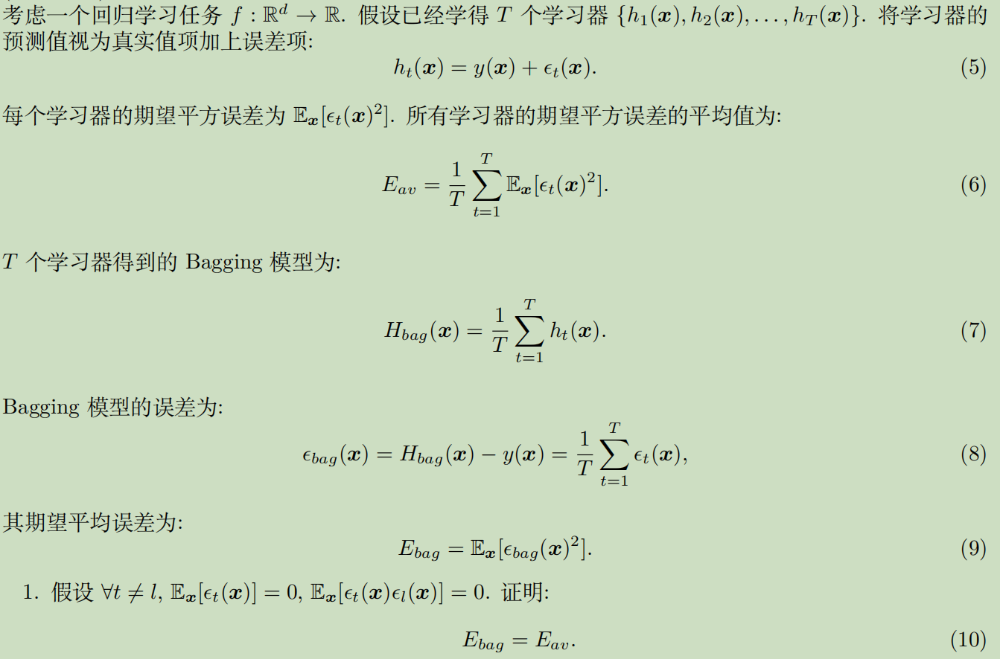

$$
\begin{aligned}
E_{b a g} 
&=\frac{1}{T^{2}} \mathbb{E}_{\boldsymbol{x}}\left[\left(\sum_{t=1}^{T} \epsilon_{t}(\boldsymbol{x})\right)^{2}\right] \\
&=\frac{1}{T^{2}} \mathbb{E}_{\boldsymbol{x}}\left[\sum_{t=1}^{T} \epsilon_{t}(\boldsymbol{x})^{2}+2 \sum_{t<l} \epsilon_{t}(\boldsymbol{x}) \epsilon_{l}(\boldsymbol{x})\right] \\
&=\frac{1}{T^{2}} \sum_{t=1}^{T} \mathbb{E}_{\boldsymbol{x}}\left[\epsilon_{t}(\boldsymbol{x})^{2}\right]+\frac{2}{T^{2}} \sum_{t<l} \mathbb{E}_{\boldsymbol{x}}\left[\epsilon_{t}(\boldsymbol{x}) \epsilon_{l}(\boldsymbol{x})\right] \\
&=\frac{1}{T^{2}} \sum_{t=1}^{T} \mathbb{E}_{\boldsymbol{x}}\left[\epsilon_{t}(\boldsymbol{x})^{2}\right] \\
&=\frac{1}{T} E_{a v}
\end{aligned}
$$

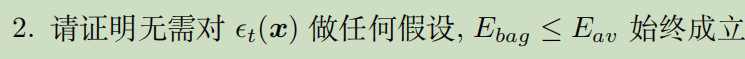
$$
\begin{aligned}
E_{b a g} 
&=\frac{1}{T^{2}} \sum_{t=1}^{T} \mathbb{E}_{\boldsymbol{x}}\left[\epsilon_{t}(\boldsymbol{x})^{2}\right]+\frac{2}{T^{2}} \sum_{t<l} \mathbb{E}_{\boldsymbol{x}}\left[\epsilon_{t}(\boldsymbol{x}) \epsilon_{l}(\boldsymbol{x})\right] \\
&=\frac{1}{T} E_{a v}+\frac{2}{T^{2}} \sum_{t<l} \mathbb{E}_{\boldsymbol{x}}\left[\epsilon_{t}(\boldsymbol{x}) \epsilon_{l}(\boldsymbol{x})\right] \\
&\le\frac{1}{T} E_{a v}+\frac{1}{T^{2}} \sum_{t<l} \mathbb{E}_{\boldsymbol{x}}\left[\epsilon_{t}(\boldsymbol{x})^2+ \epsilon_{l}(\boldsymbol{x})^2\right] \\
&=\frac{1}{T} E_{a v}+\frac{T-1}{T^{2}} \sum_{t=1}^{T}\mathbb{E}_{\boldsymbol{x}}\left[\epsilon_{t}(\boldsymbol{x})^2\right] \\
&= E_{a v}
\end{aligned}
$$

## 六、k-means

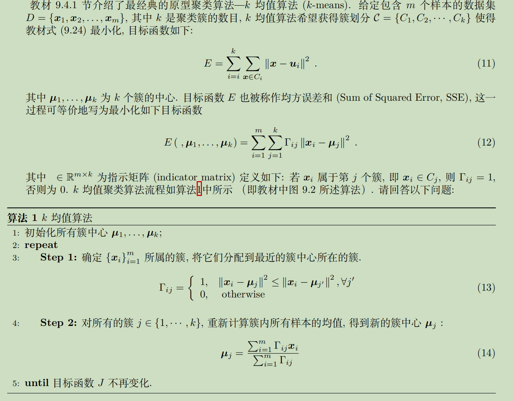

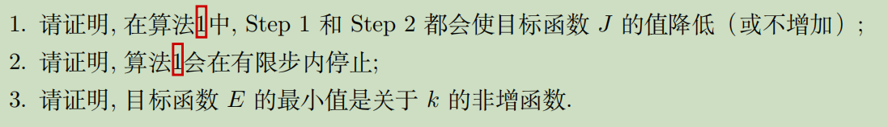

#### (1)目标函数不增

此类证明做差最有说服力

##### Step1

对于新分配的簇中心有新的  $\Gamma^{\prime} $ :

$$
\Gamma_{i j}^{\prime}=\left\{\begin{array}{ll}
1, & \left\|\boldsymbol{x}_{i}-\boldsymbol{\mu}_{j}\right\|^{2} \leq\left\|\boldsymbol{x}_{i}-\boldsymbol{\mu}_{j^{\prime}}\right\|^{2}, \forall j^{\prime} \\
0, & \text { otherwise }
\end{array}\right.
$$
因此

$$
\begin{aligned}
E^{\prime}-E &=\sum_{i=1}^{m} \sum_{j=1}^{k} \Gamma_{i j}^{\prime}\left\|\boldsymbol{x}_{i}-\boldsymbol{\mu}_{j}\right\|^{2}-\sum_{i=1}^{m} \sum_{j=1}^{k} \Gamma_{i j}\left\|\boldsymbol{x}_{i}-\boldsymbol{\mu}_{j}\right\|^{2} \\
&=\sum_{i=1}^{m} \sum_{j=1}^{k}\left(\Gamma_{i j}^{\prime}-\Gamma_{i j}\right)\left\|\boldsymbol{x}_{i}-\boldsymbol{\mu}_{j}\right\|^{2} \\
&=\sum_{i=1}^{m}\left(\left\|\boldsymbol{x}_{i}-\boldsymbol{\mu}_{j}\right\|^{2}-\left\|\boldsymbol{x}_{i}-\boldsymbol{\mu}_{j^{\prime}}\right\|^{2}\right) \\
& \leq 0
\end{aligned}
$$

##### Step2

因为每个点所属的簇不会改变，我们只需要证明在Step2中：
$$
\forall j\in\{1,2,...,k\},\ \sum_{i=1}^{m} \Gamma_{i j}\left\|\boldsymbol{x}_{i}-\boldsymbol{\mu}_{j}\right\|^{2}=\sum_{\boldsymbol{x}\in C_j}^{} \left\|\boldsymbol{x}-\boldsymbol{\mu}_{j}\right\|^{2}不增加
$$
我们有以下几条已知性质：
$$
\boldsymbol{\mu}_{j}^{'}=\frac{\sum_{i=1}^{m} \Gamma_{i j} \boldsymbol{x}_{i}}{\sum_{i=1}^{m} \Gamma_{i j}},\ 
满足\sum_{\boldsymbol{x}\in C_j}^{} (\boldsymbol{x}-\boldsymbol{\mu}_{j}^{'})=0\\
|C_j|=\sum_{i=1}^{m} \Gamma_{i j}\\
\sum_{i=1}^{m} \Gamma_{i j} \boldsymbol{x}_{i}=\boldsymbol{x}_{i}
$$
因此
$$
\begin{aligned}
E_{j}^{\prime}-E_{j} 
&=\sum_{i=1}^{m} \Gamma_{i j}\left(\left\|\boldsymbol{x}_{i}-\boldsymbol{\mu}_{j}^{\prime}\right\|^{2}-\left\|\boldsymbol{x}_{i}-\boldsymbol{\mu}_{j}\right\|^{2}\right) \\
&=\sum_{i=1}^{m} \Gamma_{i j}\left(\boldsymbol{x}_{i}-\boldsymbol{\mu}_{j}^{\prime}+\boldsymbol{x}_{i}-\boldsymbol{\mu}_{j}\right)^{\mathrm{T}}\left(\boldsymbol{x}_{i}-\boldsymbol{\mu}_{j}^{\prime}-\boldsymbol{x}_{i}+\boldsymbol{\mu}_{j}\right) \\
&=\sum_{i=1}^{m} \Gamma_{i j}\left(\boldsymbol{\mu}_{j}-\boldsymbol{\mu}_{j}^{\prime}\right)^{\mathrm{T}}\left(2 \boldsymbol{x}_{i}-\boldsymbol{\mu}_{j}^{\prime}-\boldsymbol{\mu}_{j}\right) \\
&=|C_j|\left(\boldsymbol{\mu}_{j}-\boldsymbol{\mu}_{j}^{\prime}\right)^{\mathrm{T}}\left(2 \frac{\sum_{i=1}^{m} \Gamma_{i j} \boldsymbol{x}_{i}}{\sum_{i=1}^{m} \Gamma_{i j}}-\boldsymbol{\mu}_{j}^{\prime}-\boldsymbol{\mu}_{j}\right) \\
&=|C_j|\left(\boldsymbol{\mu}_{j}-\boldsymbol{\mu}_{j}^{\prime}\right)^{\mathrm{T}}\left(2 \boldsymbol{\mu}_{j}^{\prime}-\boldsymbol{\mu}_{j}^{\prime}-\boldsymbol{\mu}_{j}\right) \\
&=-|C_j|\left(\boldsymbol{\mu}_{j}-\boldsymbol{\mu}_{j}^{\prime}\right)^{\mathrm{T}}\left(\boldsymbol{\mu}_{j}-\boldsymbol{\mu}_{j}^{\prime}\right) \\
& \leq 0
\end{aligned}
$$

#### (2)划分有限--算法有限步截止

反设：算法不会在有限步停止，即目标函数$E$在本算法中每次运行都一定会变小，是严格单调减的

由于$E>0$有下界，所以一定收敛

而每次算法结束得到的$E$都是不一样的，且都一一对应了样本的一种k-划分。由于m是有限的，所以样本的k-划分是有限的，所以算法结束后得到的结果是有限的。

而这与算法不会在有限步内结束矛盾，所以假设不成立，算法会在有限步内结束

#### (3)目标函数关于k不增

反设：当k变成k+1时，$E$的最小值反而更大，即$E_k<E_{k+1}$

下面我们基于使$E_k$最小的聚类结果来构造一个小于$E_{k+1}$的$E_{k+1}^{'}$，并推出矛盾：

由于样本并没有变化，所以我们可在k+1时仍然基于让$E_k$最小的那k个簇中心，划分情况也与$E_k$时完全相同，唯一的区别是，任意的在k个簇中选择一个包含大于一个点的簇，从中分离出一个点作为第k+1个簇，并把这个点设置为第k+1个簇的簇中心。

在这个构造中，只有第k+1个簇中这个点在目标函数中的表达式变成了0，其余点的距离表达式都没有变，因此此时的$E_{k+1}^{'}<E_{k+1}$，与$E_{k+1}$的最小性矛盾

因此假设不成立，目标函数的最小值是关于k的非增函数

