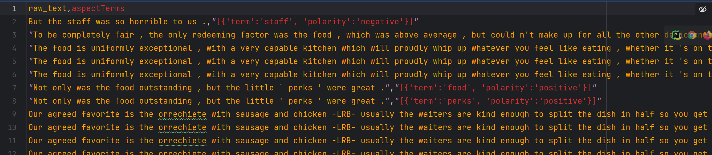

4. ## ABSA(Aspect Based Sentiment Analysis)属性级情感分类

   > 南京大学2023春季自然语言处理课程第二次打榜作业
   
   201300086 史浩男 shi.hn@foxmail.com

   
   
   ### 一、问题重述
   
   
   
   实际上这是一个ABSA问题。
   
   ABSA问题有两个任务：**识别属性词+标记情感极性**。由于每个句子的属性词已标出，本次实验只涉及到了第二个任务。
   
   本次实验没有限制使用预训练模型，因此我选择参考了这篇论文的工作[InstructABSA: Instruction Learning for Aspect Based Sentiment Analysis](https://arxiv.org/pdf/2302.08624v4.pdf)。在相关任务上，这篇论文提出的InstructABSA方法目前达到了SOTA性能：
   
   
   
   预训练模型地址：https://huggingface.co/kevinscaria
   
   
   
   ### 二、代码结构和运行说明
   
   
   
   - `Dataset/`中是训练集、测试集，并用来存储数据处理的中间结果
   - `InstructABSA/`中的复现论文提供的代码，有增，无删
   - `Models/`中存储下载的预训练模型和微调后的模型，共三个
   - `Results/`中存储模型结果和投票集成后的结果
   - `dataset.py`：数据处理
   - `instruction.py`：复现论文提供的代码，没有修改
   - `main.py`：复现本实验结果唯一需要运行的代码
   
   ##### 运行说明：
   
   1. 安装依赖
   
      ```
      pip install -r requirements.txt
      ```
   
   2. 在`main.py`中设置以下内容
   
      ```
      #设置GPU
      os.environ['CUDA_VISIBLE_DEVICES'] = '0'
      TRAINED = True  # 第一次运行必须为True。设置为False时，直接读取结果，不训练不测试
      BATCHSIZE = 32  # 训练时的batchsize
      ```
   
   3. 在`Dataset/`中添加训练集和测试集
   
   4. 运行`main.py`（建议使用GPU）
   
      > 在BATCHSIZE = 32的设置下，训练模型约6min，测试+输出约4min，总计10min
      >
      > 提交版中已经将下载的模型打包，使用SSH运行时无需联网
   
      运行后将会微调，并保存一个模型、直接调用两个预训练模型，共产生三个预测结果，投票集成后输出
   
   
   
   ### 三、工作流程：
   
   1. 查找“面向目标的情感分类”相关领域知识，学习属性级情感分类任务处理范式
   
   2. 找论文，锁定复现目标：InstructABSA
   
   3. 解决环境等适配问题，debug
   
   4. 直接调用预训练模型atsc，每次处理测试集的一行输入（sentence+aspect term），输出一个标记(-1,0,1)（只能cpu跑，20min）
   
   5. 将数据处理成预训练模型joint所需标准形式，通过给训练集标记所在行数，解决模型输出后乱序问题
   
      > 此部分工作详见：4.1、数据与标记处理，5.2模型输出后乱序
   
   6. 使用CPU调用两个预训练模型joint，输入测试集，输出全部标记
   
   7. 部署远程服务器，解决文件同步、环境等问题
   
   8. 使用GPU调用多个预训练模型joint
   
   9. 实现fine-tuning，得到两个微调后的模型
   
   10. 尝试对none和其他异常输出赋予不同标记，测试效果
   
   11. 投票法集成，发现使用第2、3、4个模型集成效果最好
   
   ```python
   # 投票集成
       # 1234：8151
       # 234:8232(best)
       # 123:8098
       # 124:8151
       result = []
       for i in range(len(result2)):
           result.append(vote_3(result2[i], result3[i], result4[i]))
   ```
   
   
   
   ### 四、实现方案
   
   #### 4.1、数据与标记处理
   
   ##### 原数据形式：
   
   3行一组，分别是sentence、aspect term、label
   
   
   
   ##### 处理后数据形式：
   
   处理为预训练模型接受的标准格式
   
   
   
   ##### 标记所在行数，解决模型输出后乱序：
   
   由于预训练模型joint输出的标记是打乱顺序的，为了追踪这个算法”黑盒“种打乱顺序的原理，我test.txt中的标记暂时赋值为所在行数，这样就能在被打乱后根据这个新增的行数标记，对test.txt原有顺序进行还原。
   
   如图：polarity的值被设置为所在行数，保序
   
   
   
   以下函数将预训练模型的输出恢复顺序，并将positive等标记转换为-1，0，1
   
   ```python
   def decode_result_2(pred_labels, labels, a, b):
       num_lst = []
       word_lst = []
       for i in range(len(labels)):
           # 读取每行从第一个冒号到第一个逗号的信息
           tmp = labels[i][labels[i].find(':') + 1:]
           num_lst.append(int(tmp))
           word_lst.append(labels[i][:labels[i].find(':')])
   
       pre_lst = []
       for i in range(len(pred_labels)):
           tmp = pred_labels[i][pred_labels[i].find(word_lst[i]) + len(word_lst[i]) + 1:]
           if tmp.find(',') == -1:
               # 除去tmp中换行符
               tmpp = tmp.replace('\n', '')
               pre_lst.append(label_transform_new(tmpp, a, b))
           else:
               tmpp = tmp[:tmp.find(',')].replace('\n', '')
               pre_lst.append(label_transform_new(tmpp, a, b))
       # 将num_lst和pre_lst组合成字典，并按num_lst的值升序排序
       dic = dict(zip(num_lst, pre_lst))
       dic = sorted(dic.items(), key=lambda x: x[0])
   
       # 提取dic中所有值
       values = []
       for i in range(len(dic)):
           values.append(dic[i][1])
       return values
   ```
   
   
   
   #### 4.2预训练与微调
   
   ```python
   	 #第一个预训练模型
       model_checkpoint1 = 'Models/joint_task/kevinscariajoint_tk-instruct-base-def-pos-neg-neut-combined'
       model_out_path1 = os.path.join(model_checkpoint1, 'train1')
       #第二个预训练模型
       model_checkpoint2 = 'Models/joint_task/kevinscariajoint_tk-instruct-base-def-pos-combined'
       model_out_path2 = os.path.join(model_checkpoint2, 'train2') 
   
       # Train
       Train(id_train_file_path, id_test_file_path, model_checkpoint=model_checkpoint2,model_out_path=model_out_path2)
   
       result2 = model_test(2, model_out_path2, BATCHSIZE, eval=TRAINED)
       result3 = model_joint(1, eval=TRAINED, batch_size=BATCHSIZE,model=model_checkpoint1)
       result4 = model_joint(2, eval=TRAINED, batch_size=BATCHSIZE,model=model_checkpoint2)
   ```
   
   实现微调，保存微调后模型
   
   
   
   #### 4.3特殊标记处理
   
   除了positive、negative、neutral的正常情感极性输出，预训练模型还会给出none或其他输出，而这些极少量的特殊输出应该如何赋值呢？
   
   经过尝试发现，将“其他输出”统一赋值为1，将none统一赋值为0会有最佳的准确率
   
   
   
   
   
   ### 五、踩坑记录：
   
   #### 5.1环境依赖
   
   instruction是代码，不是包...
   
   但偏偏有个包真叫instruction，安装之后说已删除
   
   ```python
   from instructions import InstructionsHandler
   ```
   
   当instructions不报红，但InstructionsHandler报红，就要反思一下instructions到底是不是包
   
   
   
   #### 5.2模型输出后乱序
   
   调用预训练模型，模型输出会把test.txt的顺序打乱、并把相同sentence对应的所有aspect term组合在一起。此时我的应对方案是根据aspect term的数量和值去唯一的定位打乱后的顺序，试图造轮子，但我遇到了如下困难：
   
   - 很多句子中都只有一个food、service，分类结果既有positive、又有negative，打乱顺序后根本分不清
   - 这种对应方法对字符串的标准程度要求很高，如逗号、空格等都会导致对应的准确率降低
   
   最终我放弃了造轮子，而是回去看源码，看原论文是如何解决这个问题的。最终我发现，虽然他并没有解决打乱问题，但提供了同样被打乱的示例一起输出，而这两个被打乱的输出是一一对应的，解决方法如图所示：
   
   
   
   以第一行的aspect term：`falafel`为例。在下图中第一行查找到`falafel`，取出预测的值`positive`；并取出上图中的行号`666`
   
   这代表，test.txt中`第666行`的预测结果为`positive`
   
   
   
   **总结：发生奇奇怪怪问题的时候，不要试图自己造轮子解决，再看看源码，应该会有解决方案的**
   
   
   
   
   
   #### 5.3格式问题
   
   csv文件默认以逗号为分隔符，所以有的句子首尾有双引号，有的没有。但这不影响正常读取数据，只是在观察csv文件时感觉hen'qi'gu
   
   
   
   #### 5.4SSH
   
   使用SSH中遇到的困难
   
   - 设置时，python解释器应该用远端的，并要明确本地代码到远端的映射位置
   - 远端解释器的包可能不全，需要直接设置远端解释器，而不是在终端pip install
   
   
   
   
   
   ### 六、反思总结
   
   1. 复现不出SOTA的原因：对于调用预训练模型的任务，选择大于努力。尝试了一篇论文下的很多预训练模型，又微调、又集成，最后不过是从0.81提升到0.829。选择最合适的模型很重要，我选择的这篇论文声称在SemEval 2014 Task 4 Laptop数据集上的joint任务达到SOTA性能。但实际上本次实验要求的任务是atsk不是joint，而且数据集也有差异。
   2. 复现论文时发生奇奇怪怪问题的时候，不要试图自己造轮子解决，再看看源码，应该会有解决方案的