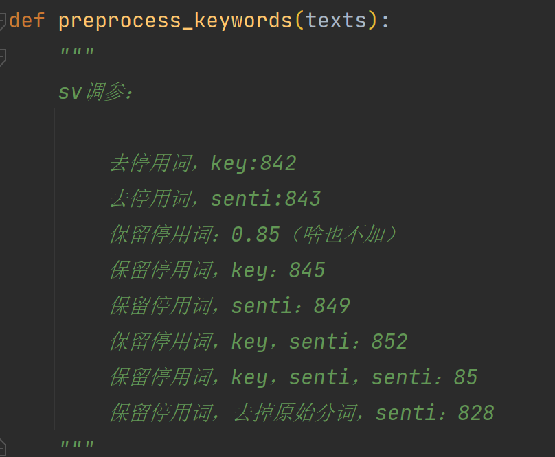
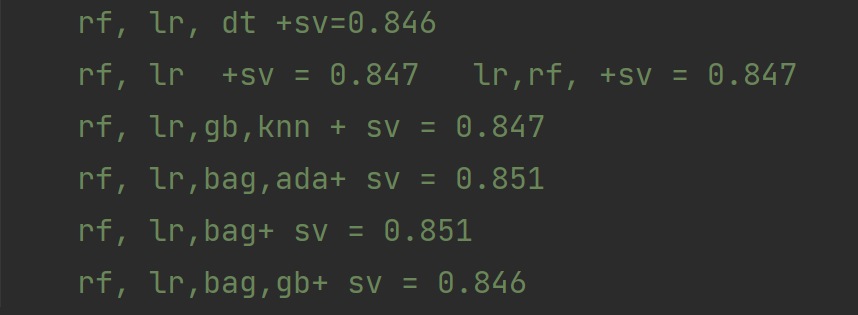
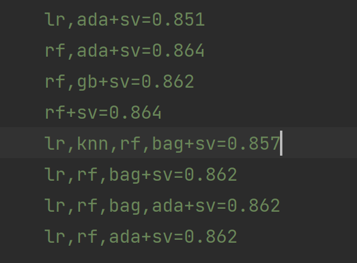

# 使用预训练词向量进行中文情感分类

###### 201300086 史浩男 人工智能学院 201300086@smail.nju.edu.cn


#### 安装依赖项

已保存在文件requirement.txt中

```
torch~=2.0.0
numpy~=1.23.3
sklearn~=0.0
scikit-learn~=1.1.2
jieba~=0.42.1
OpenCC~=1.1.1
pandas~=1.5.0
torchtext~=0.15.1
```


### 复现说明

- 在项目目录导入`train.txt`和`test.txt`
- 运行`main.py`，会输出`201300086.txt`

运行时间约50s，在leaderboard评分如下：0.864


## 一、问题简述

`train.txt`中，每行是一条评论信息和一个情感标记，积极1，消极0

`test.txt`中，每行是一条待分类的评论信息

要求：不使用预训练模型，但可以使用预训练词向量，完成情感分类任务，将`test.txt`中文本分类后的结果提交，评价标准为accuracy


## 二、代码模块功能描述

- `dataset.py`：数据预处理，词向量，文件读写

- `model.py`：多种模型的尝试函数（注释中保留了大量调参痕迹和中间结果）

- `main.py`：主函数

- `stopwords.txt`：网上找的中文停用词文件

- `sgns.weibo.txt`：**语料来自微博**的预训练词向量，经过异常值处理后的文件

  [Embedding/Chinese-Word-Vectors: 100+ Chinese Word Vectors 上百种预训练中文词向量 (github.com)](https://github.com/Embedding/Chinese-Word-Vectors)


## 三、数据预处理&预训练词向量（dataset.py）

#### 1、原数据处理

1. 使用`converter = opencc.OpenCC('t2s.json')`将源文本繁体中文转换为简体中文
2. 按行分出文本数据和标记
3. 去除特殊符号：` '[^\u4e00-\u9fa5a-zA-Z0-9]+'`
4. 使用`jieba`分词
5. 使用`TfidfVectorizer.get_feature_names()`提取特征词，进一步**提取情感关键词**
6. 利用`stopwords.txt`去除停用词
7. 使用`jieba.analyse.extract_tags`提取关键词
8. ==分词结果+关键词+情感关键词==，作为每行文本最终处理后的结果


#### 2、预训练词向量处理

- 原词向量每个都是300维，但读取后出现部分乱码情况，导致301维、302维的出现。因此对词向量进行了清晰，删除了读取错误的词向量
- 使用词向量时，如果在用`torchtext.vocab.Vectors()`读取词向量后找不到，则赋值为0


#### 3、使用预训练词向量

将每行文本处理后的列表对应到词向量矩阵，查找到词向量后计算**每行文本的feature均值**，用于代替这行文本


## 四、方案设计与探索（model.py)

#### 1、词向量的选择

若不使用预训练词向量，即使用`TfidfVectorizer 或 CountVectorizer`，在非神经网络方法的情况下，性能很容易达到瓶颈（低于0.75）

我挑选了基于微博语料的预训练词向量，在不进行任何调参和调试，**仅用最基础的SVM方法也能达到0.842**的性能


#### 2、文本加工



图中显示了在只使用SVM作为训练模型时，尝试**是否使用停用词、是否添加关键词、是否添加情感关键词**的不同种组合得到的性能

- benchmark：基础情况，即使用默认SVM，去除停用词，添加关键词，性能0.842

- 最终我发现，在**不去除停用词，并同时使用关键词和情感关键词**时性能最佳，可以达到**0.852**


#### 3、基学习器的选择


通过查阅资料和review源码，我对**10种**基学习器进行了调参。

- 包括（按顺序）：线性回归，朴素贝叶斯，决策树，随机森林，C-SVM，Nu-SVM，k近邻，bagging方法，adaboost，GBDT

- 每个学习器单独使用时，其最优参数如下：

```python
	lr = LogisticRegression(C=0.3, max_iter=10000, solver='liblinear', penalty='l2', random_state=42)

    nb = MultinomialNB(alpha=2, fit_prior=True)

    dt = DecisionTreeClassifier(random_state=42)  
    
    rf = RandomForestClassifier(n_estimators=300, random_state=42, n_jobs=-1) 
    
    sv = svm.SVC(random_state=42, C=10, gamma=0.1) 
    
    svnu = svm.NuSVC(random_state=42, nu=0.2)

    knn = KNeighborsClassifier(n_jobs=-1)
    
    bag = BaggingClassifier(random_state=42, base_estimator=sv, n_estimators=10, n_jobs=-1)
    
    ada = AdaBoostClassifier(learning_rate=0.9, n_estimators=200, random_state=42)

    gb = GradientBoostingClassifier(random_state=42)  
    
```

我放弃了朴素贝叶斯，因为要求输入的词向量在所有维上非负，而这会影响其他模型的表现，不利于集成学习。

**调参结论：**这10种基学习器中，性能最好的是**C-SVM，rf，lr**


#### 4、集成方法的选择

经过多次实验，**投票法集成的效果弱于Stacking方法集成**。

- 投票法得到的得分永远不会超过最优的基学习器得分，无论是hard投票还是soft
- 将最优基学习器（最后发现是C-SVM）作为Stacking的元学习器，可以显著提高模型性能


#### 5、基学习器的选择

在确定使用Stacking进行集成后，剩下的就只剩尝试

- 最初的尝试：



​			在使用随机森林rf，线性回归lr和bagging作为初级学习器，SVM作为元学习器时，**性能从0.842提升到0.851**

- 在使用4.2中的文本加工调试后（停用词和情感词优化后）：

  

​			在使用随机森林rf作为初级学习器，SVM作为元学习器时，**性能达到了本作业的巅峰成绩0.864**


## 五、最终实现方案（model.py)

- 使用预训练词向量，预处理过程不去除停用词，提取关键词时额外提取情绪关键词
- 将每行文本根据词向量取平均
- 使用**Stacking集成方法**，初级学习器为**随机森林**，元学习器为**支持向量机**
- 随机森林参数：`RandomForestClassifier(n_estimators=300, random_state=42, n_jobs=-1)`

- 支持向量机参数：`svm.SVC(random_state=42, C=10, gamma=0.1)`


## 六、遇到的问题和解决办法

本次并没有使用神经网络模型，因此除了性能瓶颈外没遇到什么大bug

解决性能瓶颈的方法，在于数据的处理，而不是模型的调试

==数据处理果然比模型重要！==

- 在使用预训练词向量后，性能从0.72提升到了0.84
- 在对原文本进行更细致的情感关键词筛选后，性能从0.84提升到了0.85
- 集成学习的贡献在于，使性能从0.85提升到了0.864


## 七、实验总结

1. 这是我第一次实现一个文本分类模型，感受到了NLP的乐趣

2. 数据比模型重要，在数据处理时挖掘出更多易于学习的信息，比调教模型重要

3. 调参经验：

   - 其实调参是没有办法的办法，在这部分的“时间--产出”比着实低

   - ```
     GridSearchCV(clf, param_grid=param_grid, cv=5)#快速寻参
     ```

   ​	

4. 集成学习经验：

   - 投票法集成的效果弱于Stacking方法集成。

   - rf碾压dt，用了随机森林就完全不需要决策树

   - 深度随机森林的包需要python 3.9。。。。。。。。本来还挺想试试的，下次一定

   - bagging和adaboost本质也是随机森林，效果不如单独用一个调参后的rf

   - rf，svm，knn，lr这几个模型的个体差异较大，集成后可能有惊人提升

   - 增大rf的n_estimators可以增加一点点性能表现，但时间开销太大

   - Adaboost的learning_rate和n_estimators是一个`trade-off`关系：

     - learning_rate>1会明显变差

     - n_estimators太大没有意义，后面的模型已经学不到什么有用东西了

     - learning_rate比1稍微小一点比较好，比如0.9，太小的话会迅速衰减，使n_estimators失去意义

       
