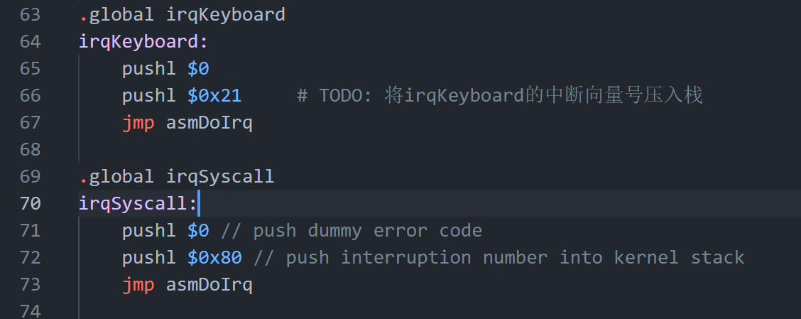
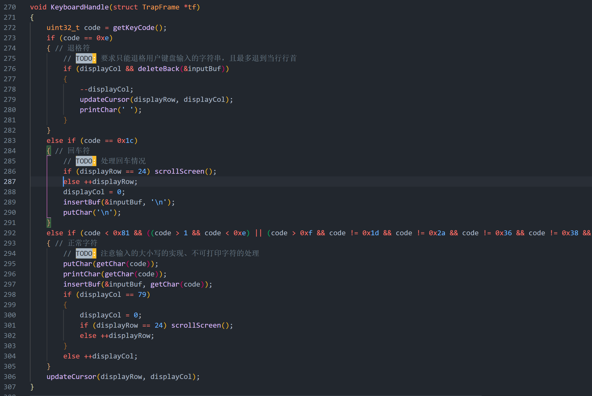
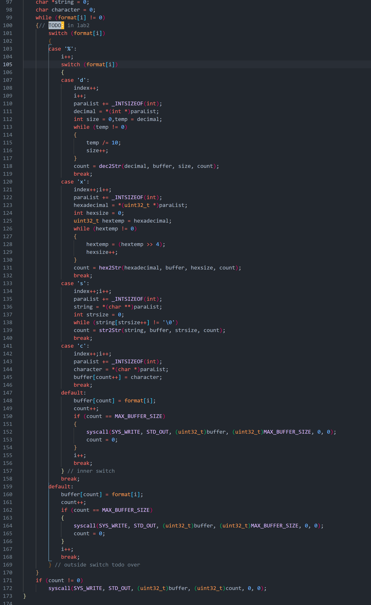
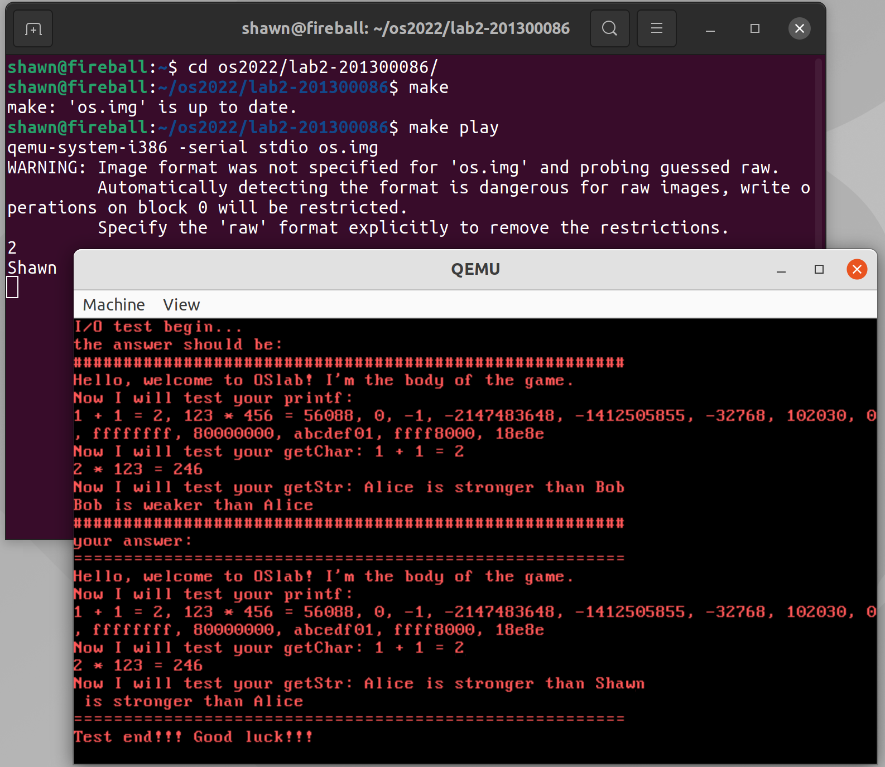
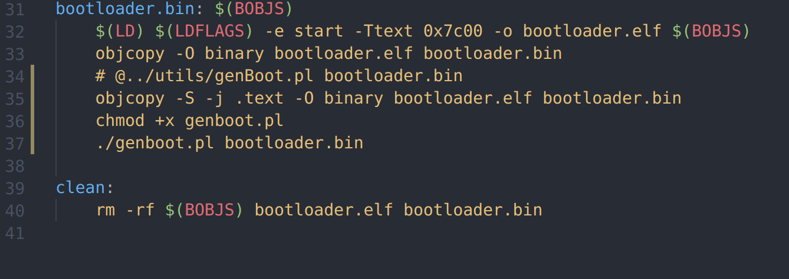

# Lab2实验报告

##### 201300086 史浩男 1306189897@qq.com


## 一、实验进度

我已完成包括思考题在内的所有实验内容


## 二、实验思路

#### 	 1、加载并初始化内核

- `bootloader`与Lab1部分相似，从实模式进入保护模式，加载内核到内存

- elf 文件中的elfheader 指定 `entry point`，`program header` 指定`offset`。将代码和数据段加载到内存 0x100000 处，再跳转至 `entry point` 执行

- `bootMain`函数中只需要添加

- ```
  kMainEntry = (void(*)(void))((struct ELFHeader *)elf)->entry;
  ```

- 框架代码已有：8259A在`i8259.c`中给出，TSS在`kvm.c`中初始化，vga在`vga.c`中

  #### 

  #### 2、设置门描述符


- 根据上述结构设置中断门和陷阱门

- 初始化IDT表
- 键盘和中断系统调用

```c
	setTrap(idt + 0x21, SEG_KCODE, (uint32_t)irqKeyboard, DPL_KERN);
    setIntr(idt + 0x80, SEG_KCODE, (uint32_t)irqSyscall, DPL_USER);
```


#### 		

#### 3、中断

- 阅读代码中对中断处理的框架：各中断服务程序将中断相关信息保存至栈中，统一调用 `asmDoIrq`，保存现场并调用对应的 `irqHandle`
- 
- 通过` TrapFrame` 的数据结构传递保存在通用寄存器内的参数，`irqHandle` 再根据保存的中断号调用对应的中断处理函数。


#### 		

#### 4、按键回显

- 填好键盘中断的`idt`后，按下键盘的按键后最终会执行函数 `KeyboardHandle`
- 单个字符的输出方式已在讲义中给出，这里再封装为`printChar`

- 只需对按键转换后的`ascii`码调用`putChar`和`printChar`即可



#### 		

#### 5、printf

- 基于中断陷入内核，由内核完成在视频映射的显存地址中写入内容，完成字符串的打印
- 框架代码中已经提供系统调用例程`syscallPrint`的实现代码，即将字符串中的内容依次写入到显存当中。我们只需考虑在`printf`函数中如何调用这样的系统服务例程，并根据格式化字符`%`来替换对应的字符,需要根据 4 种格式，调用对应的函数.
- 遍历`format`字符串，普通字符直接存放到要打印的字符串`buffer`里，对于格式化字符`%`则根据其类型，找到相对应的参数，并调用已提供好的辅助函数`dec2Str`、`hex2Str`、`str2Str`来将其转化为字符串并存入到`buffer`中：

- 
- 如果`buffer`在遍历`format`的过程中已经满了，则需通过`syscall`将当前的`buffer`内容先输出到标准输出流中，再清空`buffer`继续操作。
- `format`遍历完成后，检查`buffer`内是否还有数据需要输出，如果有，再进行一次`syscall`打印余下字符。


#### 6、输入字符串

- 在`syscall.c`中实现

```c
char getChar()
{	// 对应SYS_READ STD_IN// TODO: 实现getChar函数，方式不限
	return syscall(SYS_READ, 0, 0, 0, 0, 0);
}

void getStr(char *str, int size)
{	// 对应SYS_READ STD_STR// TODO: 实现getStr函数，方式不限
	syscall(SYS_READ, STD_STR, (uint32_t)str, (uint32_t)size, 0, 0);
	return;
}
```

- 为实现输入的功能，需要维护一个输入缓冲区用于按键时将对应字符加入缓冲区、系统调用输入字符串时将取出的字符从缓冲区中删除。

- 阻塞用户进程，条件是回车：因此可以先开中断再执行 hlt 指令， 直到检测到用户输入回车，再关中断，执行接下来的流程。

- ```c
  void syscallGetChar(struct TrapFrame *tf)
  {
  	InputBuf *buf=&inputBuf;
  	asm volatile("sti");
  	while (!buf->size || buf->buf[buf->size - 1] != '\n')
  		waitForInterrupt();
  	asm volatile("cli");
  	tf->eax= buf->buf[0];
  	buf->size = 0;
  }
  
  void syscallGetStr(struct TrapFrame *tf)
  {
  	char *dst=(char *)tf->edx;
  	InputBuf *buf=&inputBuf;
  	asm volatile("sti");
  	while (!buf->size || buf->buf[buf->size - 1] != '\n')
  		waitForInterrupt();
  	asm volatile("cli");
  	int i = 0;
  	for (; i < buf->size && buf->buf[i] != '\n'; ++i)
  		dst[i] = buf->buf[i];
  	dst[i] = 0;
  	buf->size = 0;
  }
  ```


## 三、实验调试与结果

下面是正确运行格式化输出的结果




##### 修改`Makefile`

由于每次`make`后都要手动使用脚本调整`bootloader.bin`文件，为了简便我修改了`bootloader`文件夹下的`Makefile`。

这样一来每次修改代码就可以直接通过`make clean`---`make`---`make play`来运行




## 四、思考题

##### **Ex1:** **计算机系统的中断机制在内核处理硬件外设的I/O这一过程中发挥了什么作用？**

- 没有中断就不可能实现多道程序，因为进程之间的切换是通过中断来完成的。

- 中断也是设备管理的基础，为了提高处理机的利用率和实现CPU与I/O设备并行执行必需有中断的支持。

- 中断处理程序是I/O系统中最低的一层，是整个I/O系统的基础

  

##### Ex2：提供了4个特权级, 但TSS中只有3个堆栈位置信息, 分别用于ring0, ring1, ring2的堆栈切换。为什么TSS中没有ring3的堆栈信息?

- ​	在从R3进入R0时会把信息压入堆栈，同时自动加载ring0的esp和ss，信息可以从堆栈恢复。
- 从外层到内层即低特权级到高特权级切换时，新堆栈才会从TSS中取得，所以TSS 并没有位于最外层 ring3 的堆栈信息


##### Ex3：我们在使用eax, ecx, edx, ebx, esi, edi前将寄存器的值保存到了栈中，如果去掉保存和恢复的步骤，从内核返回之后会不会产生不可恢复的错误？

-  如果内核用到了这些寄存器，那么值就会发生改变。如果没有备份将可能产生错误

  

## 五、实验心得

1. 增进了对`Makefile`的理解，可以适当修改`Makefile`
2. 理解了键盘回显的实现细节
3. 通过`printf()`,`getchar()`,`getstr()`加深了基于中断实现系统调用全过程的理解

