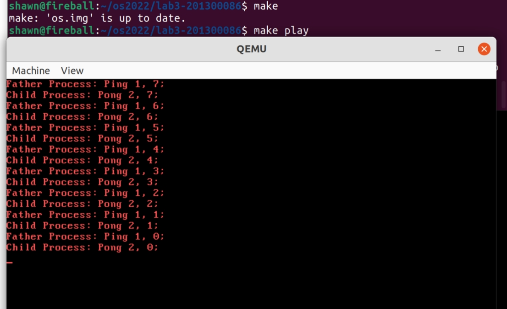

# Lab3实验报告

##### 201300086 史浩男 1306189897@qq.com

 

## 一、实验进度

我完成了所有必做内容和中断嵌套的选作内容


#### 实验结果

 

#### 版本信息

- `Ubuntu 21.10`

- `gcc (Ubuntu 11.2.0-7ubuntu2) 11.2.0`

 

## 二、实验思路

### 1、完成库函数

通过宏选择系统调用类型，传入参数调用`syscall()`

```c
pid_t fork() {
    /*TODO:call syscall*/
	return syscall(SYS_FORK, 0, 0, 0, 0, 0);
}

int sleep(uint32_t time) {
    /*TODO:call syscall*/
	return syscall(SYS_SLEEP, (uint32_t)time, 0, 0, 0, 0);
}

int exit() {
    /*TODO:call syscall*/
	return syscall(SYS_EXIT, 0, 0, 0, 0, 0);
}
```

### 2、时间中断处理

1. 更新`BLOCKED`进程状态

   - 遍历`pcb`，将`BLOCKED`进程的sleeptime减一，对于变为0的设置为`RUNNABLE`

2. 更新当前进程的时间片使用情况

   - 将当前进程的`timeCount`加一

   - 若时间片用完且有其他`RUNNABLE`进程则切换，否则继续

   - ```c
     for (int i = 0; i < MAX_PCB_NUM; ++i)
     	if (pcb[i].state == STATE_BLOCKED && --pcb[i].sleepTime==0)
     		pcb[i].state = STATE_RUNNABLE;
     	if (pcb[current].state != STATE_RUNNING || ++pcb[current].timeCount >= MAX_TIME_COUNT)
     	{
     		int next = 0;
     		for (int i = 1; i < MAX_PCB_NUM; ++i)
     			if (pcb[i].state == STATE_RUNNABLE)
     			{
     				next = i;
     				break;
     			}
     ```

3. 切换进程

   - 对于某个`RUNNABLE`的进程找到`next`并设置为`RUNNING`，`current`进程设置为`RUNNABLE`，并在清空当前进程时间片后把`current`切换到`next`

   - ```c
     pcb[next].state = STATE_RUNNING;
     if (pcb[current].state == STATE_RUNNING)
     	pcb[current].state = STATE_RUNNABLE;
     pcb[current].timeCount = 0;
     current = next;
     ```

   - 其余部分框架代码已给出		


### 3、实现系统调用例程

#### (1)syscallFork

此部分功能为寻找一个空闲的`pcb`作为子进程的进程控制块，将父进程的资源全部复制给子进程，子进程返回0，父进程返回子进程`pid`。但如果没有空闲`pcb`说明`fork`失败，父进程返回-1

1、查找空闲`DEAD`进程

- ```c
  int i = 0;
  for (; i < MAX_PCB_NUM; ++i)
  	if (pcb[i].state == STATE_DEAD)
  		break;
  ```

2、找到后复制内存，把父进程内容拷贝到子进程

- ```c
  for (int j = 0; j < 0x100000; j++){
  		*(uint8_t *)(j + (i + 1) * 0x100000) = *(uint8_t *)(j + (current + 1) * 0x100000);
  		if (!(j % 0x1000))
  			asm volatile("int $0x20");
  	}
  ```

3、拷贝pcb（框架代码已给出）

- 对`processTable`复制
- 设置段寄存器、栈顶指针、设置`RUNNABLE`状态
- 最后设置`eax`

4、无空闲`pcb`，父进程返回-1


#### (2)syscallSleep

- 首先`assert`检测合法参数

- 设置当前状态为`BLOCKED`，设置`sleepTime`

- 利用`int $0x20`模拟时钟中断进行进程切换

```c
void syscallSleep(struct StackFrame *sf){
    assert(sf->ecx > 0);
	pcb[current].state = STATE_BLOCKED;
	pcb[current].sleepTime = sf->ecx;
	asm volatile("int $0x20");
}	
```


#### (3)syscallExit

- 设置当前状态为`DEAD`
- 利用`int $0x20`模拟时钟中断进行进程切换

```c
void syscallExit(struct StackFrame *sf){
    pcb[current].state = STATE_DEAD;
	asm volatile("int $0x20");
}
```


### 4、中断嵌套

用`enableInterrrupt()`开启嵌套中断，`int $0x20`模拟时钟中断

```c
enableInterrupt();
for (int j = 0; j < 0x100000; j++){
	*(uint8_t *)(j + (i + 1) * 0x100000) = *(uint8_t *)(j + (current + 1) * 0x100000);
	if (!(j % 0x1000))
		asm volatile("int $0x20");
}
disableInterrupt();
```

在这里为了提高中断处理的运行速度，设置了每`0x1000`次模拟一个时钟中断

能够准确输出，说明程序支持了中断嵌套


###### 以上为所有必做内容和选作问题的解答思路


## 三、调试与建议

##### 1、架构不同无法make成功

我分别修改了`bootloader`,`app`,`app_print`三处的`Makefile`，主要的添加如下：

```c
objcopy -S -j .text -O binary bootloader.elf bootloader.bin
chmod +x ../utils/genBoot.pl
chmod +x ../utils/genKernel.pl
chmod +x ../utils/genApp.pl
./genBoot.pl bootloader.bin
```

make不再报错，成功生成`os.img`

##### 2、 no bootable device

查找原因，阅读lab3的`bootMain()`后我发现偏移量设置似乎有问题

于是我选择放弃框架，继续使用lab2时自己写的`bootMain()`，boot成功

##### 建议：

建议在框架代码Makefile中加入`objcopy`和运行脚本语句，这样就不会每次make都会`too large`