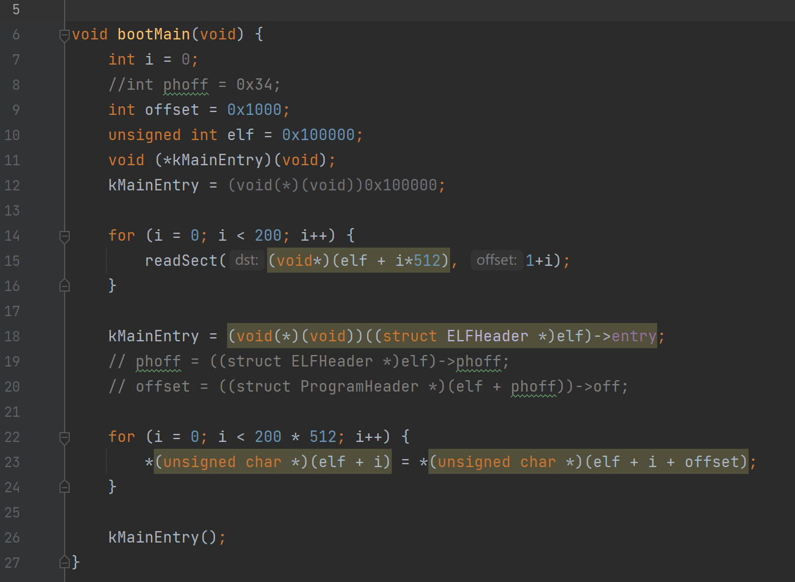
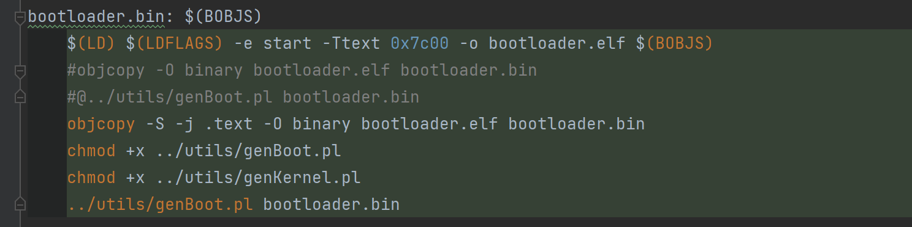
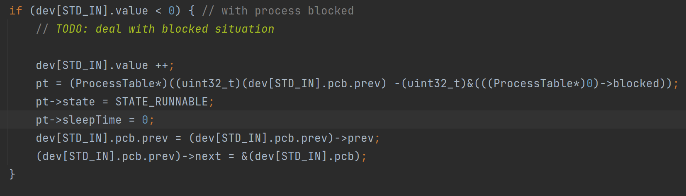
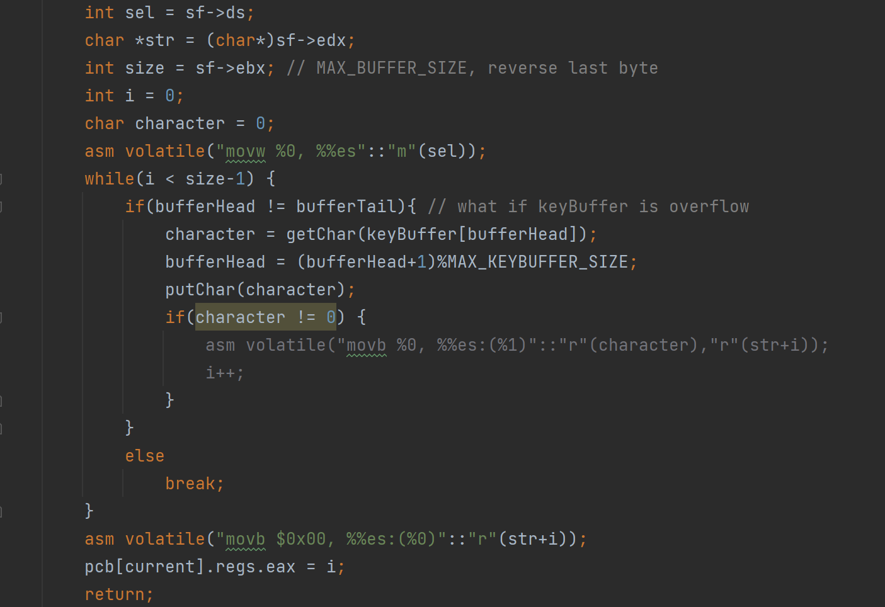
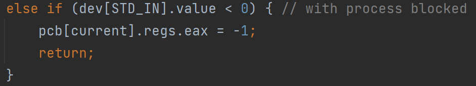
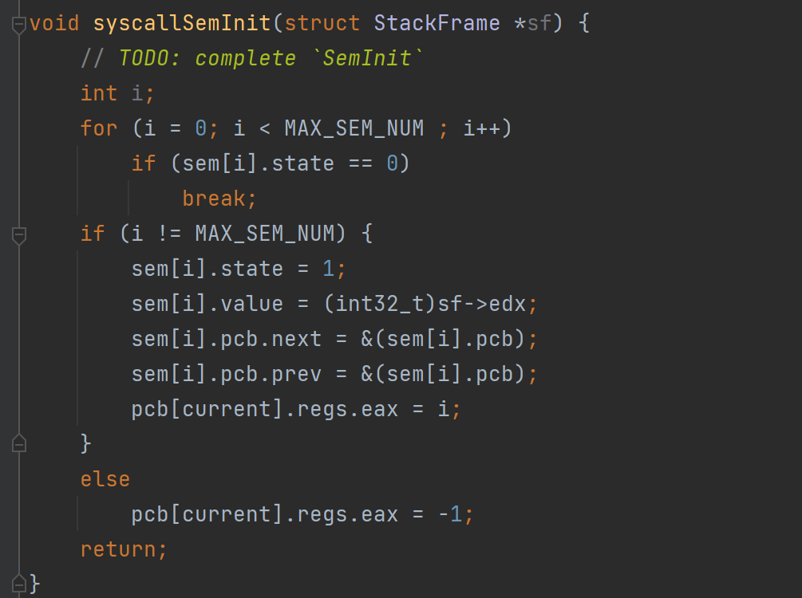
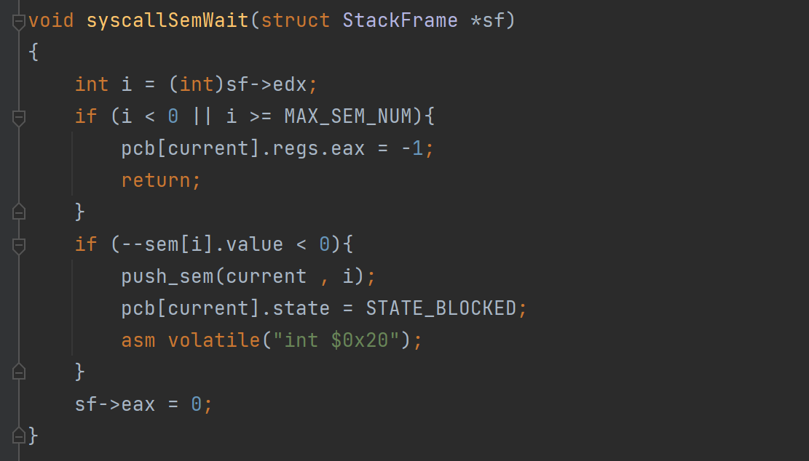
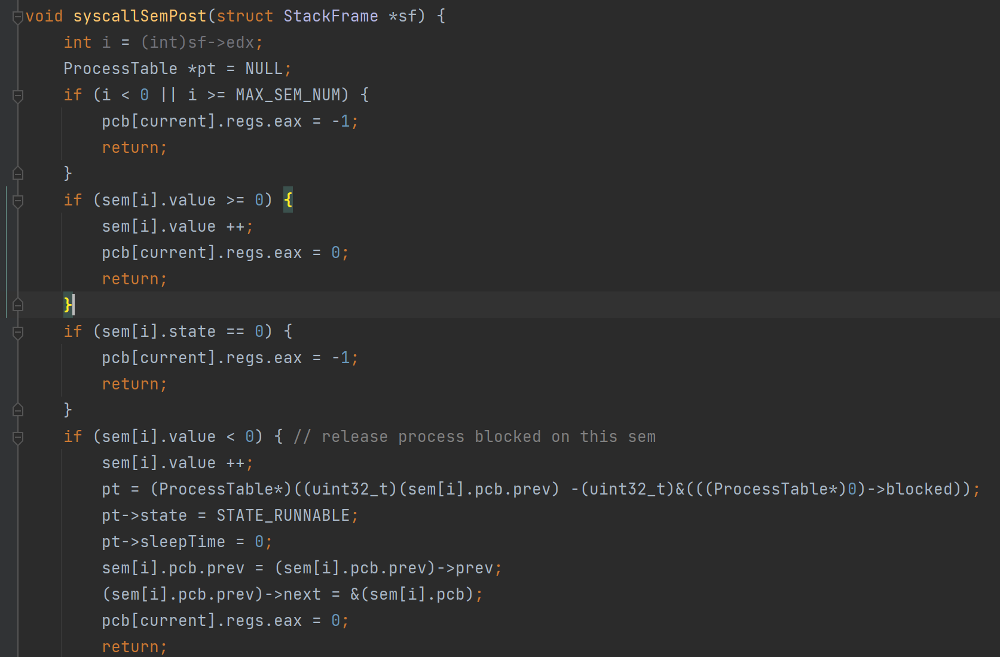
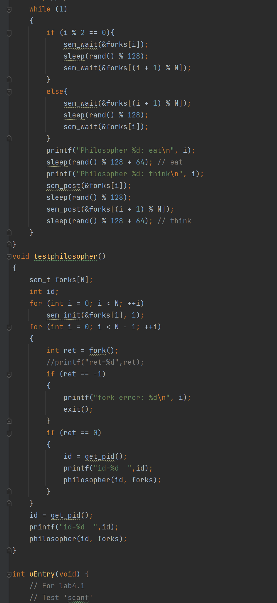
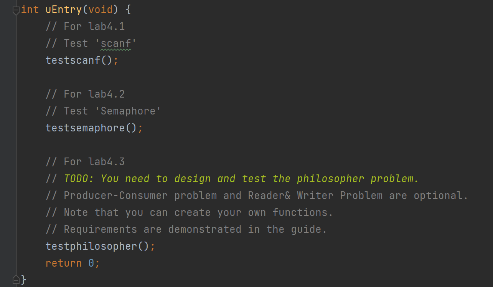

# Lab4实验报告

##### 201300086 史浩男 1306189897@qq.com

 

## 一、实验进度和版本差异

我完成了所有必做内容

#### 版本信息

- `Ubuntu 21.10`

- `gcc (Ubuntu 11.2.0-7ubuntu2) 11.2.0`

#### 修改bootmain

- 需要将框架代码中三行注释掉，才能boot成功



#### 修改../bootloader/Makefile

- 添加如图所示四行，即增加权限、运行脚本、缩小扇区
- 修改之后才能成功一键make




## 二、实验思路


### 4.1、scanf

##### 4.1.1 keyboardHandle

- 本段代码唤醒阻塞在dev[STD_IN]上的一个进程

- 将 `dev[STD_IN].value`++即活跃的进程数加一，修改该进程的` state`、`sleeptime` 来唤醒



##### 4.1.2 syscallReadStdIn

- 如果`dev[STD_IN].value == 0`，将进程阻塞在 `stdin` 上

- 进程被唤醒后，将输入缓冲区拷贝到传入的 buffer。

  

- 如果已经有进程在读，`value < 0`，直接返回-1

  


### 4.2 sem

##### 4.2.1 SEM_INIT

`init`系统调用用于初始化信号量

- 参数 `value` 指定了信号量的初始值，初始化成功返回0，`value `变量通过 `edx` 传入

- 指针 `sem` 指向初始化成功的信号量，否则返回-1 
- 双向链表的初始化模仿了 `initSem() `函数，最后将i通过 `eax` 返回 
- 如果找不到空闲的信号量，返回-1




##### 4.2.2 SEM_WAIT

对应信号量的P操作，使 `sem` 指向的信号量的 `value` 减一，若 `value` 取值小于0，则阻塞自身，否则进程继续执行，若操作成功则返回0，否则返回-1

- `sem` 变量通过 `edx `传入，操作不成功的情况和 `sem_post()` 相同

- 加入列表后将`current`进程的的 `state` 设为阻塞状态， `sleeptime` 设为-1，执行中断 `int 0x80` 完成了对自身的阻塞。



##### 4.2.3 SEM_POST

对应信号量的V操作，使` sem` 指向的信号量的`value`增一，若`value`取值不大于 0，则释放一个阻塞在该信号量上进程（即将该进程设置为就绪态），若操作成功则返回0，否则返回-1

- 但当传入的参数超出了数组的范围，或`state == 0`即指向的信号量不在工作不能操作成功
- 如果 `state == 1` ， `value++` ，通过 `eax` 返回0。如果 `value <= 0` ，则取出一个进程，并且设置 `state`和`sleeptime` 来唤醒它



##### 4.2.4 SEM_DESTROY

用于销毁` sem` 指向的信号量，销毁成功则返回0，否则返回-1，若尚有进程阻塞在该信号量上，可带来未知错误

相比之前三个较为简单，不再赘述。


### 4.3基于信号量解决进程同步问题

**哲学家就餐问题**

1、增加了 `get_pid() `功能，用于获取当前进程的 `pid`。只需在syscall.c中将 `eax = 7` 传入 syscall() 函数

2、之后需要在`irqhandle`中返回 `current` 值

```c
void syscallPid(struct StackFrame *sf) {
	pcb[current].regs.eax = current;
	return;
}
```

3、另外我将 `sleep(128)`改为了每次` sleep(rand() % 128)` ，这里的`rand`采用了固定的`seed`。结果证明这样确实可以避免每次固定的间隔导致有些内容测试不到，测试更加全面。




## 三、实验结果

#### app/main.c修改

- 分别将Lab4的三部分封装起来，测试时注意把其他注释掉




#### 4.1scanf测试


#### 4.2sem测试


#### 4.3哲学家问题


## 四、实验感想

深刻体会到了信号量相关操作的实现 

为了解决处理进程同步的问题，充分阅读了框架代码

了解了scanf的实现原理以及其他相关的部分代码

修改makefile可以快速解决框架版本问题