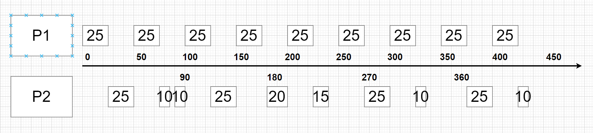

# 期中作业

**201300086 史浩男**


## 一、简答题

#### 1、说明抽象资源和物理资源之间的区别，并举出两个例子。

- 抽象资源：对物理资源的抽象。用软件屏蔽硬件资源的物理特征和实现细节，简化对硬件资源的操作、控制、使用，在硬件接口基础上把底层指令序列和数据结构打包成函数作为高级操作被调用。如IO设备管理、文件管理软件
- 物理资源：计算机硬件。存储类(处理器+内存) + 接口类(外存+外设)
- 物理内存抽象成虚拟内存，磁盘抽象成文件系统，处理器抽象成进程线程


#### 2、操作系统有哪些架构（结构），说明各自的特点。

1. 单体系统

   - 调用单个进程很高效，但系统过于庞大混乱难以理解，任一过程的崩溃都会影响整个系统
   - 功能块之间关系复杂，修改任意功能块导致其他所有功能块都要修改，操作系统设计开发困难
   - 容易造成循环调用，形成死锁，导致操作系统可靠性降低

2. 层次式系统

   - 低层次的功能为紧邻其上的一个层次的功能提供服务
   - 每步设计都是建立在可靠的基础上，每一层仅能使用其提供的功能和服务，这样可使系统的安全和验证都变得更容易
   - 保证了系统正确性，使系统的扩充和维护更加容易

3. 微内核

   - 将操作系统划分为小的、定义良好的模块，只有微内核模块运行在内核态 ，操作系统的所有功能都在内核态下运行
   - 其余模块功能相对弱些，作为普通用户进程运行。
   - 进一步提高了系统的可扩展性；增强了系统的可靠性、安全性；提供了分布式系统的支持；融入了面向对象技术，提高了可移植性

4. 客户端-服务器模式

   - 将进程划分为两类：每个服务器提供某种服务，客户端使用这些服务

5. 虚拟机

   - 通过软件模拟的具有完整硬件系统功能的、运行在一个完全隔离环境中的完整计算机系统。
   - 创建虚拟机时，需要将实体机的部分硬盘和内存容量作为虚拟机的硬盘和内存容量。
   - 每个虚拟机都有独立CMOS、硬盘和OS

   

#### 3、什么是用户态，什么是内核态，这两种状态如何切换？

- 内核态：操作系统运行在内核态，有对所有硬件的完全访问权，可以执行机器能够运行的任何指令

- 用户态：软件的其余部分运行在用户态。在用户态下，只使用了机器指令中的一个子集，只能访问应用程序对应的内存空间，无法访问内核地址空间的状态，特别禁止了那些会影响机器控制或可进行I/O操作的指令

- 用户态切换成内核态：系统调用（TRAP），中断，异常。将CPU的字段改为内核态，将内核段对应的代码地址写入到PC寄存器中

- 内核态切换成用户态：处理完成后，将CPU的字段改为用户态，利用之前写入的信息恢复用户栈的执行

  

#### 4、简要描述什么是策略与机制的分离，举例说明。

**机制：** 实现某一功能的具体执行机构，通常在微内核中
**策略：** 借助算法或参数，利用机制去实现想要的功能。

- 调度机制位于内核，机制寻找最高优先级的进程运行。而策略（赋予进程优先级）可以由用户态中的进程完成

**举例**：

- 比如调度中断是机制，将调度算法的参数可以由用户进程填写是策略

- 桌面加载是机制，各种用户登录是策略

  


#### 5、 什么是进程控制块（PCB），它有哪些主要内容？

**定义**：每个进程在进程表中的表项

**主要内容**：包含了进程状态的重要信息：程序计数器、堆栈指针、内存分配状况、所打开文件的状态、账号和调度信息，以及其他在进程由运行态转换到就绪态或阻塞态时必须保存的信息

**作用**：保证该进程随后能再次启动，就像从未被中断过一样。


#### 6、简述进程的生命周期。

**生命周期包括**：进程创建-进程运行-进程等待-进程唤醒-进程结束

- 创建：系统初始化，用户请求，进程执行中创建
- 等待：等待系统调用、CPU、IO
- 唤醒：等待事件发生，等待资源满足，PCB插入到就绪队列
- 结束：正常，结果不正常，错误强制退出，被杀死

**具体状态**：

- 新生（new）：表示一个进程刚刚被创建出来，未完成初始化，不能被调度运行。
- 预备（ready）：经过初始化后，进程进入预备状态，表示进程可以被调度执行，但还未被调度器选择。
- 运行（running）：在被调度器选择执行后，进程进入运行状态，表示进程正在 CPU 上运行。当一个进程执行一段时间后，调度器可以选择中断它并放回调度队列，进而进入预备状态。如果进程需要等待一些外部事件，例如某个 I/O 请求的完成，就可以放弃 CPU 进入阻塞状态。
- 阻塞（blocked）：该状态表示该进程需要等待外部时间，例如某个 I/O 的完成，暂时无法被调度。当该进程等待的外部事件完成后，就会进入预备状态。
- 终止（terminated）：当进程运行结束，它就会进入终止状态，表示进程已经完成了执行，且不会再被调度


#### 7、什么是系统调用？简述系统调用流程。

**定义**：把应用程序的请求传给内核 ，调用相应的内核函数完成所需的处理，将处理结果返回给应用程序

**流程**：

1. 参数nbytes，&buffer，fd压入栈
2. 调用库函数，如 `printf()`；
3. 把系统调用编号存入寄存器等位置
4. 陷入内核
5. 检查系统调用编号，分派系统调用处理器
6. 系统调用处理器运行
7. 返回调用者
8. 通过 `iret` 这类指令返回用户程序
9. 清除堆栈


#### 8、进程间有哪些通信方式，各自有什么特点？

**通信类型**

- 生产者消费者模式：一个进程的输出作为另一个进程的输入。这样的通信是单向的，生产者只负责写，消费者只负责读。比如管道。
- 客户端服务端模式：允许进程之间的双向通信，一个进程给另一个进程发送信息之后，可以收到回复。比如套接字
- 文件系统模式：进程之间可以通过读写文件的方式来交流信息。可以在时间上分离。

**通信方式**

管道、消息队列、信号量、共享内存、信号机制、套接字机制和文件系统


#### 9、在用户态实现线程的最大优点是什么？最大缺点是什么？

**优点**：效率，不需要陷入内核来切换线程，不需要内核相关的支持，因此兼容大部分内核。更为轻量级

**缺点**：内核不可见，因此功能也受限，如果一个线程阻塞，整个进程都会阻塞

#### 10、内核采取一系列动作以便在两个进程之间进行上下文切换，请描述一下这些过程

1. 将当前处理器的寄存器上下文保存到当前进程的系统级上下文的现场信息中；
2. 将新进程系统级上下文中的现场信息作为新的寄存器上下文恢复到处理器的各个寄存器中；
3. 将控制转移到新进程执行。

#### 11、最短作业优先算法在什么情况下是最优的？怎么证明？

在所有作业都可同时运行的情况下，且优化目标是平均周转时间时，最短作业优先算法是最优的

考虑有4个作业的情况，其运行时间分别为a,b,c,d。第一个作业在时间a结束，第二个在时间b结束，以此类推。

平均周转时间为$\frac{4a+ 3b + 2c + d}{4}$ 

 显然a对平均值影响最大，所以它应是最短作业。如果a这个位置不安排最短的作业，那么一定可以把这个位置的作业与最短作业互换位置，使得时间更少


#### 12、简述实时系统中调度问题的单调速率算法。

**定义**：用于调度周期任务的静态优先级实时调度算法。

速率：任务周期（已知）的倒数，即 $1 / T$。

- 该调度算法根据周期静态地为每个任务分配一个优先级，任务的周期越短，意味着其截止时间要求越迫切，其优先级越高。

- 单调速率算法还支持抢占调度，高优先级的任务可以抢占低优先级的任务执行

  

#### 13、怎么解决多级反馈队列调度算法中的饿死问题？

**饥饿**：指系统不能保证某个进程的等待时间上界，使该进程长时间等待，当等待时间给进程推进和响应带来明显影响时，称进程饥饿。

**饿死**：当饥饿到一定程度的进程所赋予的任务即使完成也不再具有实际意义时，称该进程被饿死

**解决方法**：定时将所有任务优先级提升到最高。因为在一个长任务被分配到最低优先级之后，如没有一种机制提高任务优先级，且此时一直有短任务要调度，那么这个长任务就不会有被执行的机会，进而造成饿死


#### 14、什么是虚拟地址（空间）和物理地址（空间）？ 

**物理地址**：在地址总线以电子形式存在，使数据总线可访问主存的某个特定存储单元的内存地址。可以将物理内存看成一个大数组，其中每个字节都可以通过与之唯一对应的物理地址进行访问

**虚拟地址**：并不真实存在于计算机中。每个进程都分配有自己的虚拟空间，而且只能访问自己被分配使用的空间。应用程序使用虚拟地址访问存储在内存中的数据与代码，在程序执行中，CPU 会使用内存管理单元 MMU 将虚拟地址转为物理地址。


#### 15、请简述分页式存储管理的基本实现原理。

- 虚拟地址空间划分成连续的、等长的被称为页面 (page)的若干单元，并且程序地址空间中所有的页从 0 开始顺序编号。相应地，内存物理地址空间也按同样方式划分成与页大小相同的区域，每个区域称为物理块或页框
- 给每个进程赋予相应的页表，即每个进程的虚拟页到物理页的映射关系表
- 在为程序分配内存时，以页为单位将程序的各个页分别装入内存中相邻或不相邻的物理块中。RAM和磁盘之间的交换总是以整个页面为单元进行的。
- 在具体的地址翻译过程中，MMU 首先解析虚拟地址中的虚拟页号，并通过虚拟页号找到页表中对应的条目，取出其中存储的物理页的地址，在加上虚拟地址中的页内偏移量得到最终的物理地址。


#### 16、假设物理内存足够大，虚拟内存是否还有存在的必要？如果不使用虚拟内存抽象，只使用物理内存寻址，会对操作系统的内存管理带来哪些改变？

- 即使物理内存足够大，虚拟内存依然有存在的必要

**改变**：

- 无法保证不同程序物理内存之间的隔离

- 无法保证应用程序可用的地址空间是连续和统一的，增加了程序编写及编译的复杂性。

- 如果启用了大量的进程，物理内存必然会很紧张

  

#### 17、什么是优先级反转问题？怎么解决？

**定义**：低优先级的线程占据了CPU，妨碍了高优先级线程的执行。高优先级进程无法离开临界区，永远忙等待下去。

**解决**：优先级继承：当发现高优先级的任务因为低优先级任务占用资源而阻塞时，就将低优先级任务的优先级提升到等待它所占有的资源的最高优先级任务的优先级，使其先完成并释放锁


#### 18、简述下管程中的Brinch Hansen、Hoare、Mesa语义区别。

**Brinch** **Hansen**：`signal` 会把一个线程唤醒，将其放入准备队列中。执行 `signal `的进程必须立即退出管程，即  `signal `语句必须是一个管程过程的最后一条语句。概念上更简单，并且更容易实现

**Hoare**：`signal` 立刻执行进程切换，让新唤醒的进程运行，而挂起另一个进程。

**Mesa**：让发信号的当前进程继续运行，`signal` 会把一个线程唤醒，将其放入准备队列中，只有在发信号者退出管程之后，才允许等待的进程开始运行


#### 19、简要说明Peterson算法的原理，Peterson算法符合safety和liveness性质吗？说明理由。

**原理**

- 临界资源是能够被多个线程共享的资源，临界区是对临界资源进行操作的那一段代码。在进入其临界区之前，各个进程使用其进程号0或1作为参数来调用 `enter_region` 。
- 维持全局数组 `flag`，0 和 1 代表每个线程是否尝试进入临界区，初始化为0
- 维持全局变量 `turn`，如果两个线程都申请进入临界区，那么 `turn` 将决定最终能够进入临界区的线程编号
- 进程将等待直到能安全地进入临界区。安全即其他线程`flag=0`或`turn`决定选择此进程
- 在完成对共享变量的操作之后，进程将调用`leave_region`，表示操作已完成，此时其他希望进入临界区的进程可以进入。

**算法符合 safety 性质理由**：

**safety**：程序运行中不会进入非预期的状态

- 竞争时只会有一个进程进入临界区，因为`turn`的值只能为0或1，不可能有两个值。
- 线程i在临界区时，始终有` flag[i]==1 `和` turn==i `，其他线程被阻止进入

**算法符合  liveness 性质理由**：

**liveness**：程序运行中预期状态一定会到达

- 线程i在离开临界区时，会设置` flag[i]==0 `，表示不再占有临界区，因此其他线程可以进入临界区

  

#### 20、简要说明信号量、互斥锁、条件变量的区别和联系。

**信号量**：使用一个整型变量来累计唤醒次数，若该值为0则进程将睡眠

**互斥锁**：布尔变量，判断线程能够获得锁或释放锁。任意时刻只有一个线程能够执行临界区的代码，实现多线程之间的互斥

**条件变量**：是检查某一条件满足之后，才会继续执行

**联系**：

可以使用信号量来实现互斥锁或条件变量。设置信号量初始值为 `1`，就能成为一个锁；设置信号量初始值为 `0`，就能成为一个条件变量


## 二、应用题

### 1、

**在一个具有一个中央处理器（CPU）、一台输入设备（I）和一台输出设备（O）的计算机系统上同时运行两个计算任务（分别为Job1和Job2），其执行内容如下： Job1：计算(10ms)，输入(20ms)，计算(10ms)，输出(10ms)； Job2: 计算(5ms)，输出(5ms)，计算(15ms)，输出(5ms)。 设中央处理器与输入/输出设备可并行工作，Job1的优先级高于Job2，高优先级计算任务可抢占低优先级计算任务，每次中断处理花费1ms，每次调度程序执行花费1ms，画出各计算任务和操作系统内核（简称OS）之间的时间关系图。**

####       

**思路**：尽量利用job1的IO时间进行job2的操作，每次切换前都要中断，每次计算前都要调度

<font color='cornflowerblue'>特别地，输出和计算可以同时中断，但两个Job的连续输出需要两个中断</font>


### 2、


**`fork()`**：子进程会拷贝父进程所有页面，将其加载并分配一片独立内存。耗时，且未必所有的拷贝都有用

**`CreateProcess()`**：创建进程，从磁盘加载正确程序装入新进程

##### (a)fork合适

 Shell 中创建的进程都来自同一个用户，可以共享很多状态如共享文件描述符，更改输入和输出对应的文件描述符。借此能够实现类似于 `ls > newfile.txt` 的输出重定向效果。

##### (b)CreateProcess合适

Web 服务器场景中会为每一个请求单独创建一个进程，对于大量的请求 `fork` 将难以处理，因为`fork`将拷贝过多的不需要的信息影响了速度。所以选择用`CreateProcess`

##### (c)fork合适

匿名管道通信时，父进程首先通过 `pipe` 创建好对应的管道两端，然后通过 `fork` 创建出子进程。由于子进程可继承文件描述符，因此同时也完成了一次 IPC 权限的分发。在完成继承后，父子都会有管道两端，需要关闭多余的端口，而后父子进程就可以通过管道通信


### 3、


子程序会得到父程序的一份拷贝，其中也包括下一条指令指针

第一个 `fork()` 之后，进程变为了 2 个，两个进程再分别都进行了第二个 `fork()`，进程变为了 4 个。

**特别地，n个连续`fork()`将创建$2^n$个进程**

本题共4个


### 4、


#### (a)甘特图

##### FCFS（先来先服务）：按请求CPU顺序，阻塞的排到队尾


##### SJF（最短作业优先）：当前最短的优先


##### 非抢占式优先级：挑选优先级最高进程运行直至被阻塞或自动释放CPU

<font color='cornflowerblue'>（优先级按越小越高计算）</font>


##### RR=2：允许该进程在该时间段中运行，超时则剥夺并分配给另一个进程，在时间片结束前阻塞或结束则立即进行切换。

<font color='cornflowerblue'>（按照请求顺序，不考虑优先级）</font>


#### (b)周转时间

**定义**：从一个批处理作业提交时刻开始直到该作业完成时刻为止的统计平均时间

- FCFS： $\bar{T} = (2 + 3 + 11 + 15 + 20) / 5 = 10.2 \text{ ms}$
- SJF： $\bar{T} = (1 + 3 + 7 + 12 + 20) / 5 = 8.6 \text{ ms}$
- 非抢占式优先级： $\bar{T} = (1 + 3 + 7 + 12 + 20) / 5 = 8.6 \text{ ms}$
- RR： $\bar{T} = (2 + 3 + 13 + 18 + 20) / 5 = 11.2 \text{ ms}$

#### (c)平均等待时间

- FCFS： $\bar{T} = (0 + 2 + 3 + 11 + 15) / 5 = 6.2 \text{ ms}$
- SJF： $\bar{T} = (0 + 1 + 3 + 7 + 12) / 5 = 4.6 \text{ ms}$
- 非抢占式优先级： $\bar{T} = (0 + 1 + 3 + 7 + 12) / 5 = 4.6 \text{ ms}$
- RR： $\bar{T} = (0 + 2 + 12 + 13+9) / 5 = 7.2 \text{ ms}$

平均等待时间最短的算法为 SJF 和非抢占式优先级算法


### 5、

**现在运行20个I/O密集型任务和1个CPU密集型任务。假设I/O密集型任务每1ms的CPU计算就进行一次I/O操作，并且每个I/O操作需要10ms来完成。另假设上下文切换开销为0.1ms，所有的进程都是长时间运行的任务，请讨论在下列条件下轮转调度程序的CPU利用率。**

**a）时间片为1ms**

**b)   时间片为5ms**


<font color='cornflowerblue'>（IO操作不用相互等待）</font>

<font color='blue'>（假设：长期执行时，CPU利用率按照每个任务只轮一次算）</font>

##### **(a)**时间片为 1 ms 

由于是长期执行，只需考虑一个循环内的利用率

因为有 20 个 I/O 密集型任务，所以可以保证CPU除了上下文切换的时间都在运行

一共执行了 I/O 密集型任务对应的 20 个 1 ms 的时间片和CPU 密集型的 1 个 1 ms 的时间片，每个任务占用CPU都是1ms

一共21个CPU时间片，上下文切换 21 次， CPU 利用率为 $\displaystyle \frac{20 \times 1 + 1 \times 1}{21 \times 0.1 + 20 \times 1 + 1 \times 1} = 90.91\%$

##### **(b)**时间片为 5 ms

 一共执行了 I/O 密集型任务对应的 20 个 1 ms 的时间片和CPU 密集型的 1 个 5ms 的时间片

一共21个CPU时间片，上下文切换 21次，CPU 利用率为  $\displaystyle \frac{20 \times 1 + 1 \times 5}{21 \times 0.1 + 20 \times 1 + 1 \times 5} = 92.3\%$


### 6、

**考虑两个实时任务P1 和P2，其中P1的周期50ms，而P2是90ms，P1的处理时间是25ms，而P2是35ms，P1和P2的截止时间都是在下个迭代来临之前。如果使用单调速率算法，给出其最终成功或失败的原因**


**单调速率算法**：任务的周期越短，优先级越高，且支持抢占调度



**结果：成功，分析如下**：

P1周期更短因此优先级高

- 每个P1周期到来时，若空闲则直接运行P1，若P2正在运行则中断并抢占运行P1。
- 每个P2周期到来时，若空闲则运行P2直到P1周期到来，若P1正在运行则等P1结束后运行P2
- 在 P1 和 P2 的周期最小公倍数 450 ms 内，单调速率算法能够成功执行正确，因此永远成功


### 7、

**假设一个支持分页的计算机系统有36位的虚拟地址，页面大小为8KB，每个页表项占用4 Bytes**

**a) 虚拟地址空间中共有多少个页面？** 

**b) 该系统可访问的最大物理地址空间为多少？** 

**c) 如果进程的平均大小为8GB，此时应选择一级、二级还是三级页表？为什么？在你选择的方案下，页表的平均大小是多少？**


**(a)**

8 KB =$2^{13}$ 位，因此虚拟页号位数为 36 - 13 = 23 位，共有 $2^{23}$ 个页面。

**(b)**

页大小对应了偏移量，13位

页表项占用 4 Bytes，即32 位，全部用来存放物理页号，再加上 13 位的页内偏移量，共45 位。

则最大的物理地址为 0x1FFF FFFF FFFF

**(c)**

进程的平均大小为$2^{33}=$ 8GB，每个进程共 $2^{20}$ 个页面，每页有$2^{11}$个页表项

**只使用一级页表：**页表占用 $2^{33-11}=2^{22}$的空间，即 4 MB($2^{20}\times4B$)

**使用二级页表：**把一级页表看成4MB新程序，新程序分成$2^{22-13}$页，即$2^{9}$个二级页表，页表占用 $2^{9}\times4B(页表)+2^{13}(页目录)=5\times2^{11}$，即 10 KB 

**使用三级页表：**顶级页1页，总空间与二级页表基本相同

**结论：选用二级页表**

- 优于三级原因：空间大小类似，地址翻译速度快于三级页表。
- 优于一级原因：页表大小为 10KB，远小于一级页表，可以使用一页来存放页目录项，页表项存放在内存中的其他位置，不用保证页目录项和页表项连续。

**页表平均大小**：页表平均大小一定是8KB，但如果本题想问的是二级页表占用的空间大小，则为10KB


### 8、


**FIFO（先进先出）**：置换最早进入的页面3

**第二次机会**：页面2是R位为0中最早进入的，置换

**NRU（最近未使用）**：页面 2 的R和M位均为0，置换

**LRU（最近最少使用）**：页面1最近一次最晚，不用管R和M位，置换


#### 9、

**将课上所实现的强制轮转法（严格轮换法）扩展到可以处理多个进程。**


若共有 `n` 个进程，对于第 `i` 个进程来说，对应的强制轮转法代码为：

```c
while (TRUE) {
  while (turn != i);
  critical_section();
  turn = (i + 1) % n;
  noncritical_section();
}
```


#### 10、

**将课上所述利用条件变量解决生产者-消费者的算法扩展到多个生产者和多个消费者的情形下。**


**算法思路**：当缓冲区已满且生产者还想放入新数据项，让生产者睡眠，待消费者从缓冲区中取出数据项时再唤醒。同样当消费者试图从缓冲区中取数据而发现缓冲区为空时，消费者睡眠，直到生产者放入数据，再将其唤醒。


```c
#define N 100 //缓冲区槽总数
int count = 0;//缓冲区数据项数目
Condition empty;//设置条件变量
Condition full;
int mutex = 0;//初始化互斥量

void producer(void) {
  int item;
  while (TRUE) {
    item=produce_item();//产生下一新数据项
    mutex_lock(mutex);//互斥量访问临界区
    while (count == N)
      wait(full, mutex); //阻塞调用线程直到另一线程向它发信号
    insert_item(item);//新数据项放入缓冲区
    count++;
    if(count==1)  
    	signal(empty);//唤醒消费者
    mutex_unlock(mutex);//释放缓冲区
  }
}

void consumer(void) {
  int item;
  while (TRUE) {
    mutex_lock(mutex);
    while (count == 0)
      wait(empty, mutex); //阻塞调用线程直到另一线程向它发信号
    item=remove_item();//缓冲区取出数据项
    count--;
    if(count==N)
    	signal(full);//唤醒生产者
    mutex_unlock(mutex);
    consume_item(item);//处理数据项
  }
}
```

