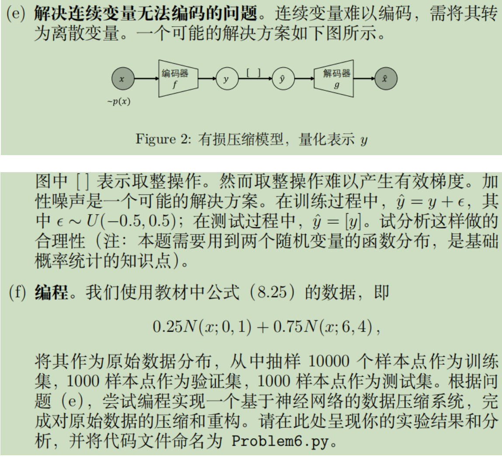

# README



代码见`Problem6.py`

保存的模型为`'autoencoder1.pth'`

#### 实验设置：

- 使用自编码器AE，encoding_dim=1
- 在forward部分**完成噪声添加和取整**

```python
    def forward(self, x,flag=0):
        encoded = self.encoder(x)
        if flag=="train":
            # 编码结果添加噪声
            noise = torch.rand(encoded.shape) - 0.5
            encoded = encoded + noise
        else:
            # 测试阶段取整
            encoded = encoded.round()
        decoded = self.decoder(encoded)
        return decoded, encoded
```

- 损失函数：`MSE+L1+码率`，并将系数l1_factor和bitrate_factor设置为0.01


```
loss = mse_loss + l1_factor * l1_loss + bitrate_factor * bitrate
```

- 码率的计算方法：编码的平均比特数，即编码后数据的平均长度来得到码率。

  ```python
  total_bits += torch.sum(encoded_data.view(-1).int()).item()
  total_samples += encoded_data.size(0)
  bitrate = total_bits / total_samples
  ```

- epoch上限：500，早停容忍次数：20

  


#### 实验结果与分析

```python
plt.hist(test_data.numpy(),bins=50, label='Original Data', alpha=0.5,rwidth=2)
plt.hist(decoded_data,bins=50, label='Decoded Data', alpha=0.5,rwidth=2)
```

数据重构后对比：（和原始混合高斯分布很相近，说明编码解码效果不错）


编码分布图：（取整后）


测试集MSE：0.042

原数据、还原后数据、整数编码仅展示前五个数据点：


#### 反思：本题走过的弯路（已纠正）

- 错误地将每个数据编码成16、32等高维向量，虽然这样近乎无损，但不是压缩

- 错误地理解原题中混合高斯的含义，错误的采样方法：

- ```
  train_data = np.random.normal(0, 1, 10000) * 0.25 + np.random.normal(6, 4, 10000) * 0.75
  ```

- 写代码前没能深刻理解加性噪声的神来之笔作用。本题看上去并没有做什么压缩，因为数据还是那么多个，但本题的压缩角度是**从连续实数到离散整数**的跨越