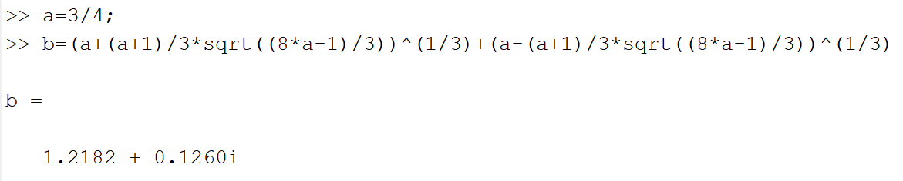

# 模式识别第一次作业

###### 201300086 史浩男 人工智能学院

### 一、教材习题1.1

#### (a)

为了使表达式只出现实数，a必须限制范围：
$$
8a-1\ge0,a\ge\frac{1}{8}
$$

#### (b)

$$
a=1/8时，表达式=2a^{\frac{1}{3}}=1
$$

#### (c)

$a=1/2$也是特殊样例，此时公式值为1

想法：此公式的值恒为1

#### (d)求这条命令的返回值：

#### (e)

返回值错误原因：matlab对负数开三次根得到三个解，默认输出第一个解而不是默认输出我们需要的实数解

解决办法：更改代码中开根方式

#### (f)

准确描述想法：
$$
当b=\frac{(a+1)^2(8a-1)}{27}且a\ge\frac{1}{8}时，\sqrt[3]{a+\sqrt{b}}+\sqrt[3]{a-\sqrt{b}}=1恒成立
$$
严谨证明：
$$
令x=\sqrt[3]{a+\sqrt{b}},y=\sqrt[3]{a-\sqrt{b}},x+y=z\\
则x^3+y^3=2a\\xy=\sqrt[3]{a^2-b}=\sqrt[3]{a^2-\frac{(a+1)^2(8a-1)}{27}}=\frac{-2a+1}{3}
$$

$$
\begin{aligned}
x^3+y^3
&=(x+y)((x+y)^2-3xy)\\
&=z^3-3xyz\\
\end{aligned}\\
$$

$$
得到方程z^3+(2a-1)z-2a=0\\
方程有唯一实数解z=1，即x+y有唯一实数取值1，恒为1成立
$$

#### (g)

对应上述定理中$a=2,b=5$，因此表达式值=1

#### (h)理解与原公式与卡丹方法的联系

卡丹方法：
$$
若Δ=\frac{q^2}{4}+{p^3}{27}>0，则方程z^3+pz+q=0有实根：\\
\sqrt[3]{-\frac{q}{2}+\sqrt{Δ}}+\sqrt[3]{-\frac{q}{2}-\sqrt{Δ}}
$$
在本题原公式中，$q=-2a,Δ=b$，因此原公式$\sqrt[3]{a+\sqrt{b}}+\sqrt[3]{a-\sqrt{b}}=1$就是方程$z^3+(2a-1)z-2a=0$的实根

### 二、正态分布估计

$$
\begin{aligned}
P(X \geqslant \epsilon) & =\int_{\epsilon}^{+\infty} \frac{1}{\sqrt{2 \pi}} e^{-t^{2} / 2} d t\\
&=\int_{0}^{+\infty} \frac{1}{\sqrt{2 \pi}} e^{-(x+\epsilon)^{2} / 2} dx\\
& = e^{-\epsilon^{2} / 2} \int_{0}^{+\infty} \frac{1}{\sqrt{2 \pi}} e^{-x^{2} / 2}e^{-xε} d x\\
& \leqslant e^{-\epsilon^{2} / 2} \int_{0}^{+\infty} \frac{1}{\sqrt{2 \pi}} e^{-x^{2} / 2} d x\\
& =\frac{1}{2} e^{-\epsilon^{2} / 2} \int_{-\infty}^{+\infty} \frac{1}{\sqrt{2 \pi}} e^{-x^{2} / 2} d x（正态分布的规范性）\\
&=\frac{1}{2} e^{-\epsilon^{2} / 2}
\end{aligned}
$$

#### Mill不等式

$$
\begin{aligned}
P(|X| \geqslant \epsilon) & =2 \int_{\epsilon}^{+\infty} f(t) d t=2 \int_{\epsilon}^{+\infty} \frac{t f(t)}{t} d t \\
& \leqslant 2 \int_{\epsilon}^{+\infty} \frac{t f(t)}{\epsilon} d t=-2 \int_{\epsilon}^{+\infty} \frac{f^{\prime}(t)}{\epsilon} d t\\
&=-\frac{2}{\epsilon}[f(t)]_{\epsilon}^{+\infty}\\
&=\frac{2}{\epsilon}\frac{1}{\sqrt{2 \pi} } e^{-\epsilon^{2} / 2}=\sqrt{\frac{2}{{ \pi}} } \frac{e^{-\epsilon^{2} / 2}}{ε}
\end{aligned}
$$

### 三、

#### (a)

$$
-f^*(0)=-sup_{x}(-f(x))=inf_xf(x)
$$

#### (b)

对于$x\in \text{dom} (f)$：
$$
f^*(y)=sup_x(y^Tx-f(x))\ge x^Ty-f(x)
$$
对于$x\not\in \text{dom} (f)$：
$$
f(x)=\infty\ge x^Ty-f^*(y)
$$

#### (c)

$$
\begin{aligned}
f^{**}(x)&=sup_y(x^Ty-f^*(y))\\
&=sup_y(x^Ty-sup_z(z^Ty-f^*(z)))\\
&\le sup_y(x^Ty-(x^Ty-f(x)))\\
&=sup_y(f(x))=f(x)
\end{aligned}
$$

### 四、

#### (a)两种预处理方式

1、maxpooling最大池化，把400x400划分为100x100个4x4，对每个4x4做步长为4的最大池化

2、平均池化：把400x400划分为100x100个4x4，对每个4x4做平均池化

#### (b)降低存储开销

对每个2x2做步长为2的平均池化，能把存储开销降低至1/4

#### (c)准确率

$acc_{train}=99\%,acc_{test}=50\%$

#### (d)micro&macro区别

是多分类问题中不同的取平均方式，在c)中使用的是micro

micro：考虑到了每个类别的数量，所以适用于**数据分布不平衡**的情况。$acc=\frac{\sum_{i=1}^{n} \mathrm{TP}_{i}}{\sum_{i=1}^{n} \mathrm{TP}_{i}+\sum_{i=1}^{n} \mathrm{FP}_{i}}$

macro：没有考虑到数据的数量，所以会平等的看待每一类。$acc=\frac{1}{n}\sum_{i=1}^{n} \mathrm{P}_{i}$

#### (e)设计针对性训练方法

应该采用PR或ROC曲线来分析

针对性训练方法：

1. 重采样的方法：对A类样本欠采样，对B类样本过采样。但可能与真实分布不符，导致训练出的模型泛化能力差
2. 错误非均等代价：更改损失函数计算方式，按数据不平衡的程度，加大把小类别数据分类错误的惩罚

### 五、

#### (a)1-NN计算示例

与$z_1$最近的是$x_3$，因此分类为A。与$z_2$最近的是$x_7$，因此分类为A。

#### (b)3-NN计算示例

与$z_1$最近的3个是$x_1,x_3,x_4$，因此分类为A。与$z_2$最近的3个是$x_7,x_8,x_9$，因此分类为B。

#### (c)

结果不同因为最近邻分类中要取邻居中占比更多的那个类别，1-NN只考虑了一个邻居，结果比较片面不准确，在3-NN中有两个邻居都是B，占了大多数，因此最终分类为B

#### (d)

$x_7$极有可能属于类别B

k-NN优势在于考虑了更多邻居的信息，可以对抗样本标记中的噪声，得到更可靠的分类结果

### 六、感想与收获

1、KNN不需要训练，训练过程只是单纯保存数据而已

2、验证集使用后确定了超参数，此时扩大训练集重新训练这一思路给了我启发。我突然理解了在其他项目中遇到的训练集和测试机划分时故意重叠的设置，原来重叠的部分是验证集，设置成重叠也是为了最后训练时更方便。

3、k折的划分使用random.shuffle真是神来之笔！之前写其他算法时，一直苦于没有找到一种简介的划分写法，甚至有时还将k折交叉验证错写成了蒙特卡洛交叉验证，导致偏差增大，方差减小，无偏估计也变成了一致估计。

